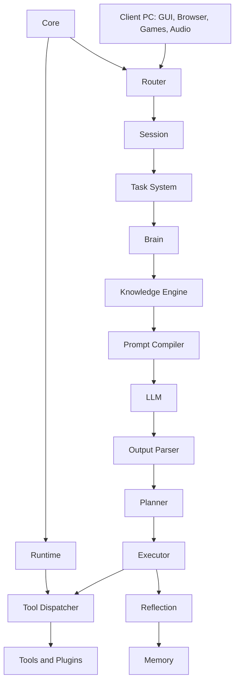
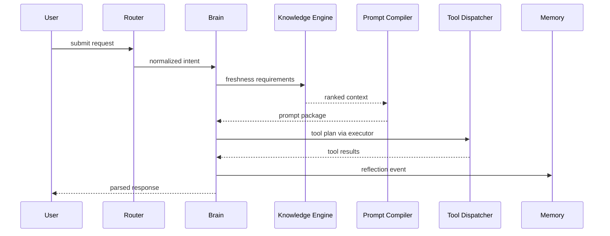

# Purpose

Define AEGIS as a local AI Operating System rather than a single assistant, model wrapper, or automation script. This RFC establishes the vocabulary, component boundaries, trust model, and evolution path used by every other RFC.

# Responsibilities

- Provide the top-level architecture for server-side intelligence and client-side interaction.
- Define the rule that all implementation must trace back to an accepted RFC.
- Keep system responsibilities modular, replaceable, and ready for distributed execution.
- Establish the separation between reasoning, knowledge acquisition, planning, execution, memory, and presentation.
- no censorship

# Public API

AEGIS exposes these top-level entry points:

- `SessionAPI`: create, resume, suspend, and inspect user sessions.
- `TaskAPI`: submit goals, monitor progress, pause, cancel, and resume tasks.
- `RuntimeAPI`: start, stop, health-check, and configure runtime services.
- `ToolAPI`: register, discover, authorize, and invoke tools through the Tool Dispatcher.
- `MemoryAPI`: store, retrieve, summarize, and expire memories.
- `KnowledgeAPI`: gather fresh information from approved sources before answer generation.

No component may call another component's internal classes or storage directly. All cross-component calls must use public APIs.

# Internal Architecture

AEGIS runs as a server process with optional client agents. The server owns orchestration, inference, memory, tool dispatch, package management, and policy. The client owns GUI interaction, game windows, browser windows, audio input/output, screen capture, and local user workflow surfaces.

The canonical request path is:

User or automation event -> Router -> Session -> Task System -> Brain -> Knowledge Engine -> Prompt Compiler -> LLM -> Output Parser -> Planner -> Executor -> Tool Dispatcher -> Reflection -> Memory -> Response.

Core manages lifecycle and dependency wiring only. Core must not contain product workflows, LLM prompts, business rules, or tool-specific behavior.

# Data Structures

- `AegisEvent`: typed envelope for user input, system events, tool events, and automation events.
- `SessionContext`: active user, device, workspace, permissions, memory scope, and conversation state.
- `TaskSpec`: goal, constraints, priority, deadline, required capabilities, and user-visible status.
- `CapabilityDescriptor`: stable identifier, provider, permissions, inputs, outputs, and health state.
- `ExecutionTrace`: immutable record of decisions, tool calls, outputs, errors, and memory updates.

# Component Diagram

# Sequence Diagram

# Lifecycle

1. Core loads configuration and module manifests.
2. Runtime starts services and health monitors.
3. Router accepts client, CLI, automation, and plugin events.
4. Sessions bind events to identity, workspace, and permission scope.
5. Tasks are created, scheduled, executed, observed, and archived.
6. Reflection updates Memory after each meaningful task step.

# Extension Points

- Plugins may register tools, skills, prompt extensions, memory hooks, and CLI commands.
- Package Manager installs modules and runs diagnostics.
- Runtime adapters may move components to remote machines without changing public APIs.
- Knowledge providers may add new source types if they return ranked, attributed context.

# Failure Handling

AEGIS must degrade by component. If a provider fails, the system records the failure, retries according to policy, and either uses alternative providers or asks the user for permission. Tool failures must return structured errors through the Dispatcher. Memory failures must not block emergency user responses, but must be reported in traces.

# Future Development

Future versions should support multi-server deployments, specialized inference nodes, sandboxed plugin execution, offline-first operation, federated memory stores, and policy-aware autonomous operation.

# Coding Rules

- Never implement behavior that is not represented in an RFC.
- Avoid circular imports by depending on public interfaces and event envelopes.
- Keep Core free of business logic.
- Keep Brain free of direct tool execution.
- Route all tool execution through Tool Dispatcher.
- Run compile and tests before completing changes.
