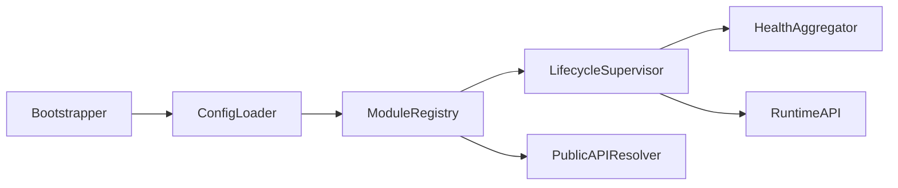
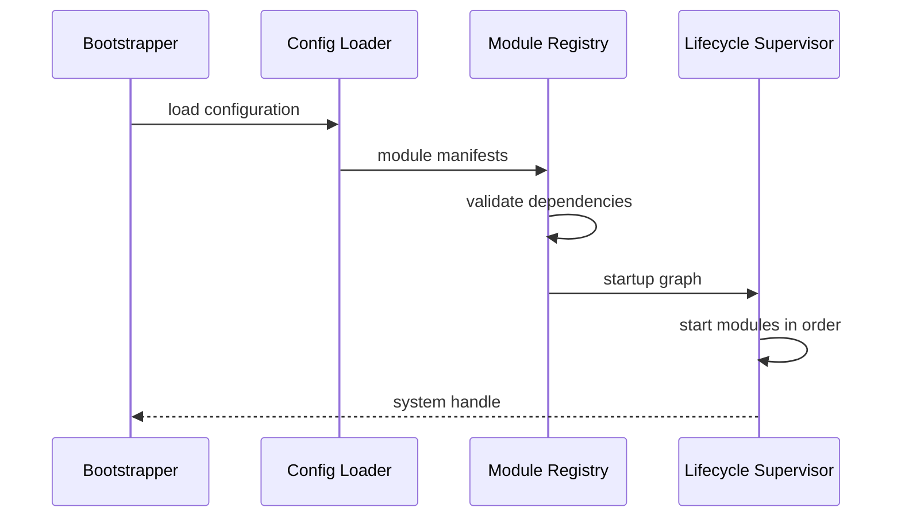

# Purpose

Define Core as the minimal kernel-like layer that boots AEGIS, wires modules, owns configuration loading, and supervises lifecycle without embedding product behavior.

# Responsibilities

- Load configuration, manifests, module descriptors, and policy defaults.
- Start, stop, restart, and health-check Runtime services.
- Provide dependency injection for public component APIs.
- Maintain global system state such as version, node identity, and feature flags.
- Enforce architectural boundaries during module registration.

# Public API

- `Core.start(config_ref) -> SystemHandle`
- `Core.stop(reason) -> ShutdownReport`
- `Core.status() -> SystemStatus`
- `Core.register_module(module_descriptor) -> RegistrationResult`
- `Core.resolve(api_name, version) -> PublicAPIHandle`
- `Core.emit(event) -> EventReceipt`

# Internal Architecture

Core consists of a bootstrapper, module registry, configuration loader, lifecycle supervisor, health aggregator, and event bus adapter. It does not know how to answer users, browse websites, play games, or run tools. It only coordinates the modules that do.

# Data Structures

- `ModuleDescriptor`: id, version, public APIs, dependencies, permissions, startup order, and diagnostics.
- `SystemHandle`: references to public APIs and lifecycle controls.
- `SystemStatus`: boot state, module health, degraded services, and active incidents.
- `CoreConfig`: paths, service ports, feature flags, policy references, and runtime profile.

# Component Diagram

# Sequence Diagram

# Lifecycle

Core begins in `created`, transitions to `configuring`, then `starting`, then `running`. During shutdown it transitions to `draining`, `stopping`, and `stopped`. Failed startup enters `failed` with a diagnostic bundle.

# Extension Points

- New modules register through `ModuleDescriptor`.
- New runtime profiles may define different startup graphs.
- Policy packs may add validation rules without changing Core internals.

# Failure Handling

Core must stop startup if required modules fail validation. Optional modules may be marked degraded. Startup order cycles are fatal and must produce a readable dependency graph. Core must never silently skip a required module.

# Future Development

Core should later support hot module reload, distributed node discovery, signed module manifests, and formal architectural conformance checks.

# Coding Rules

- Core imports interfaces and descriptors, not concrete business modules.
- Core must not call LLMs or tools.
- Core must not store user memories.
- Core changes require RFC updates when lifecycle, dependency rules, or public APIs change.
