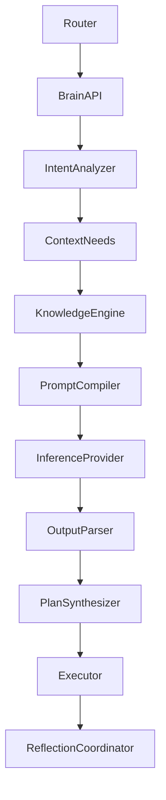
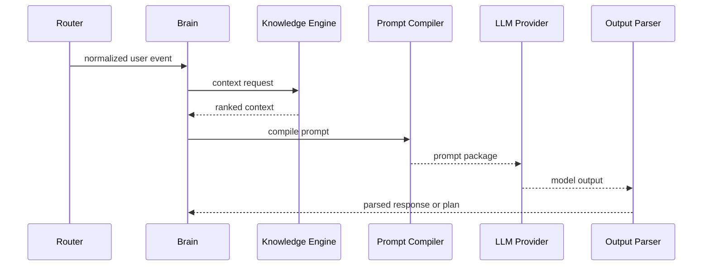

# Purpose

Define Brain as the reasoning and decision layer of AEGIS. Brain interprets intent, requests fresh knowledge, selects reasoning strategies, produces plans, and delegates execution without directly running tools.

# Responsibilities

- Transform normalized user intent into reasoning tasks.
- Decide when more information is needed.
- Invoke Knowledge Engine before answering when freshness, attribution, or uncertainty requires it.
- Coordinate Prompt Compiler and Output Parser.
- Produce plans for Executor instead of calling tools directly.
- Trigger Reflection after task execution.

# Public API

- `Brain.respond(session_context, user_event) -> ResponseEnvelope`
- `Brain.plan(task_spec) -> Plan`
- `Brain.evaluate(result_bundle) -> Evaluation`
- `Brain.reflect(execution_trace) -> ReflectionRequest`
- `Brain.explain(trace_id) -> ReasoningSummary`

# Internal Architecture

Brain is composed of intent analysis, reasoning strategy selection, context requirement analysis, prompt orchestration, plan synthesis, result evaluation, and reflection coordination. Model-specific calls are abstracted behind inference providers.

# Data Structures

- `IntentFrame`: user goal, entities, constraints, urgency, confidence, and ambiguity.
- `ContextRequest`: required freshness, sources, memory scope, workspace scope, and citation policy.
- `PromptPackage`: system instructions, context blocks, tool schemas, memory snippets, and response contract.
- `Plan`: ordered steps, required capabilities, risk level, checkpoints, and rollback notes.
- `ResponseEnvelope`: parsed output, citations, follow-up tasks, and user-facing status.

# Component Diagram

# Sequence Diagram

# Lifecycle

Brain loads policies, model routing profiles, prompt contracts, and parser contracts during Runtime startup. Per request, Brain creates a reasoning context, resolves knowledge needs, requests inference, parses output, and records trace metadata.

# Extension Points

- New reasoning strategies can be added behind a strategy registry.
- New model providers can be added behind inference adapters.
- Prompt extensions can be registered by plugins through Prompt Compiler.
- Memory hooks can influence context selection but not mutate memory directly.

# Failure Handling

If inference fails, Brain retries according to model policy or falls back to another provider. If parsing fails, Brain requests repair from Output Parser. If knowledge is unavailable, Brain must disclose uncertainty or ask permission to proceed without fresh context.

# Future Development

Brain should support multi-agent deliberation, local specialist models, confidence calibration, long-horizon autonomous planning, and formal plan verification.

# Coding Rules

- Brain never imports tool implementations.
- Brain never executes side effects directly.
- Brain must call Knowledge Engine when answers depend on recent or external facts.
- Brain output must pass through Output Parser before reaching the user.
