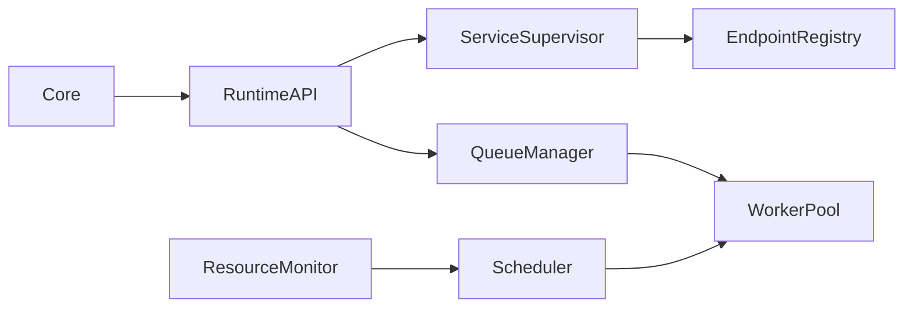
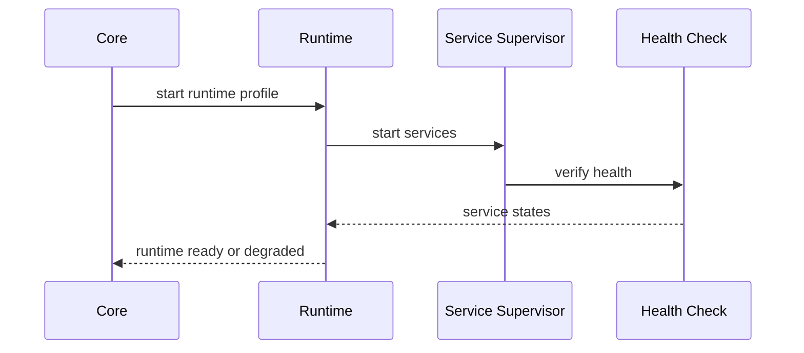

# Purpose

Define Runtime as the process and service manager that hosts AEGIS components, schedules work, manages resources, and prepares the system for local or distributed execution.

# Responsibilities

- Host long-running services and background workers.
- Manage process pools, model servers, queues, and adapters.
- Track CPU, GPU, memory, disk, network, and device availability.
- Provide service discovery and health reporting.
- Isolate workloads by permission, user, and task risk.

# Public API

- `Runtime.start_service(service_id) -> ServiceHandle`
- `Runtime.stop_service(service_id, mode) -> ServiceStopReport`
- `Runtime.schedule(job_spec) -> JobHandle`
- `Runtime.resources() -> ResourceSnapshot`
- `Runtime.health() -> RuntimeHealth`
- `Runtime.locate(capability_id) -> EndpointRef`

# Internal Architecture

Runtime includes a service supervisor, worker scheduler, queue manager, resource monitor, endpoint registry, and sandbox adapter. It may run all services on one server initially, but all interfaces must assume future remote placement.

# Data Structures

- `ServiceSpec`: service id, command, dependencies, health checks, restart policy, and resource limits.
- `JobSpec`: task id, priority, capability, timeout, isolation profile, and retry policy.
- `EndpointRef`: protocol, address, auth scope, version, and health score.
- `ResourceSnapshot`: CPU, GPU, RAM, VRAM, disk, network, and device locks.

# Component Diagram

# Sequence Diagram

# Lifecycle

Runtime starts after Core validates modules. It initializes queues, starts required services, registers endpoints, and begins monitoring. During shutdown it drains queues, cancels or persists jobs, stops services in dependency order, and emits shutdown traces.

# Extension Points

- New worker backends may support local processes, containers, remote machines, or cloud bursts.
- New resource monitors may track GPUs, audio devices, displays, or game capture APIs.
- New isolation profiles may be added for risky tools.

# Failure Handling

Runtime restarts services according to policy. Repeated failures open an incident and mark capabilities unavailable. Jobs must be idempotent or explicitly marked non-retryable. Queue state must survive controlled restarts.

# Future Development

Runtime should support distributed clusters, model placement optimization, workload migration, service mesh integration, and real-time latency budgeting.

# Coding Rules

- Runtime owns execution environment concerns, not reasoning.
- Runtime does not decide what the user wants.
- Services expose health checks before being considered ready.
- Public APIs must not assume local-only execution.
