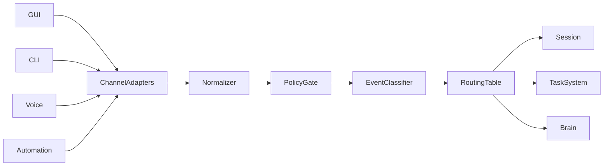
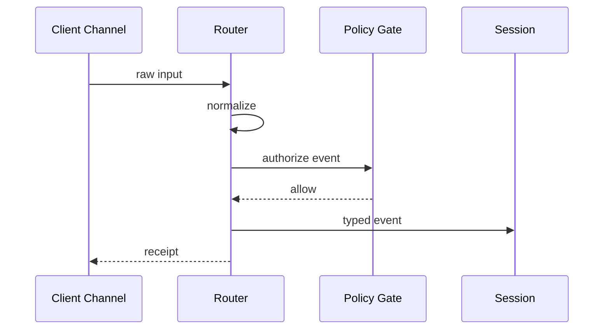

# Purpose

Define Router as the ingress and dispatch layer that normalizes events from users, clients, automations, plugins, and internal services into typed AEGIS events.

# Responsibilities

- Accept input from GUI, CLI, voice, browser, game overlay, automation, and plugin channels.
- Authenticate and attach identity, session, device, and workspace metadata.
- Route events to Session, Task System, Brain, or Runtime based on type and policy.
- Preserve event ordering where required.

# Public API

- `Router.accept(raw_input, channel_ref) -> EventReceipt`
- `Router.subscribe(event_filter, handler_ref) -> Subscription`
- `Router.route(aegis_event) -> RouteDecision`
- `Router.pause(channel_ref) -> PauseReceipt`
- `Router.resume(channel_ref) -> ResumeReceipt`

# Internal Architecture

Router has channel adapters, normalizers, policy gates, event classifier, routing table, and delivery manager. It must be transport-agnostic and should support HTTP, WebSocket, local IPC, CLI, and future message bus transports.

# Data Structures

- `ChannelRef`: type, client id, user id, trust level, and transport.
- `RawInput`: payload, media refs, timestamps, and channel metadata.
- `RouteDecision`: destination API, priority, delivery mode, and policy notes.
- `EventReceipt`: event id, accepted status, rejection reason, and trace id.

# Component Diagram

# Sequence Diagram

# Lifecycle

Router starts after Runtime networking is available. It registers channel adapters, loads routing policy, accepts events, and drains in-flight deliveries during shutdown.

# Extension Points

- Plugins may add channel adapters only through approved Router extension contracts.
- New event types require schema registration.
- Routing policies may be extended per workspace or user profile.

# Failure Handling

Malformed events are rejected with structured errors. Unauthorized events are logged without exposing sensitive policy details. Delivery failures are retried for idempotent events and surfaced to the originating channel when user action is required.

# Future Development

Router should support priority lanes, distributed event buses, event replay, offline client buffering, and multi-user routing isolation.

# Coding Rules

- Router normalizes and routes; it does not reason.
- Router must not mutate Memory directly.
- Event schemas must be versioned.
- Routing must use public APIs only.
