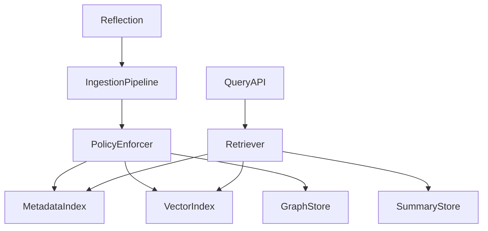
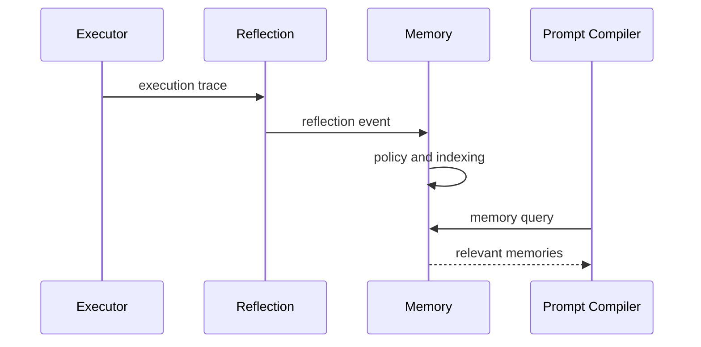

# Purpose

Define Memory as the durable and retrievable context system for user preferences, task history, facts, skills, reflections, and long-term personalization.

# Responsibilities

- Store memories with scope, provenance, confidence, expiry, and privacy metadata.
- Retrieve relevant memories for Prompt Compiler and Brain.
- Accept updates from Reflection after execution.
- Summarize, decay, archive, and delete memories according to policy.
- Separate user memory, workspace memory, session memory, and system memory.

# Public API

- `Memory.write(memory_record) -> MemoryReceipt`
- `Memory.query(memory_query) -> MemoryResultSet`
- `Memory.summarize(scope_ref) -> SummaryRecord`
- `Memory.delete(memory_id, reason) -> DeleteReceipt`
- `Memory.audit(scope_ref) -> MemoryAuditReport`

# Internal Architecture

Memory contains an ingestion pipeline, metadata index, vector index, graph relations, summary store, retention manager, and privacy policy enforcer. Storage backends must be replaceable.

# Data Structures

- `MemoryRecord`: id, content, type, scope, provenance, confidence, sensitivity, timestamps, and expiry.
- `MemoryQuery`: scope, semantic query, filters, recency bias, limit, and required provenance.
- `MemoryResult`: record, relevance score, confidence, and usage restrictions.
- `ReflectionEvent`: execution trace id, learned fact, preference, skill update, or correction.

# Component Diagram

# Sequence Diagram

# Lifecycle

Memory initializes storage, migrations, indexes, retention policies, and encryption keys at startup. During operation it accepts writes, updates indexes, serves queries, and periodically compacts summaries. Shutdown flushes indexes and persists pending writes.

# Extension Points

- Plugins may register memory hooks, but hooks cannot bypass policy.
- Storage backends may be local files, databases, vector stores, or remote services.
- New memory types may be added with schemas and retention rules.

# Failure Handling

Write failures must return structured receipts and queue retryable records. Query failures should degrade to available indexes. Privacy policy failures must block access. Corrupt records must be quarantined.

# Future Development

Memory should support user-editable memories, cross-device synchronization, semantic timelines, contradiction detection, and privacy-preserving federation.

# Coding Rules

- Memory updates come from Reflection or explicit user commands.
- No component may write directly to Memory storage.
- All memory access must include scope.
- Sensitive memory must carry policy metadata.
