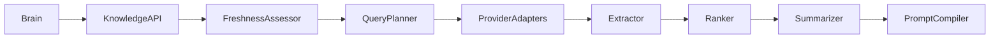
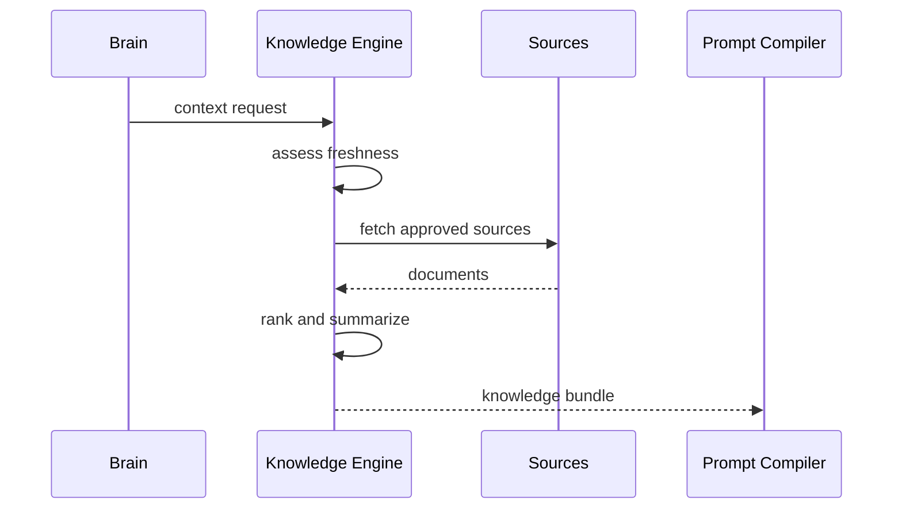

# Purpose

Define Knowledge Engine as the system that decides whether stored or model knowledge is sufficient and obtains fresh, ranked, attributed information when needed.

# Responsibilities

- Detect freshness, citation, uncertainty, and source requirements.
- Query approved providers: Internet, GitHub, Hugging Face, Wikipedia, official documentation, workspace, memory, and user documents.
- Rank, deduplicate, summarize, and attribute retrieved information.
- Provide context to Prompt Compiler without directly answering the user.

# Public API

- `Knowledge.assess(context_request) -> KnowledgePlan`
- `Knowledge.gather(knowledge_plan) -> KnowledgeBundle`
- `Knowledge.refresh(source_ref) -> RefreshReport`
- `Knowledge.providers() -> ProviderCatalog`

# Internal Architecture

Knowledge Engine contains source policy, provider adapters, query planner, fetcher, content extractor, ranker, summarizer, citation builder, and cache. It must prefer authoritative sources when tasks involve software docs, laws, prices, schedules, or current facts.

# Data Structures

- `KnowledgePlan`: queries, providers, freshness window, authority preference, and budget.
- `SourceDocument`: source id, URL or file ref, title, author, timestamp, content chunks, and license notes.
- `RankedContext`: chunk, score, source, timestamp, confidence, and summary.
- `KnowledgeBundle`: ranked contexts, citations, gaps, and freshness report.

# Component Diagram

# Sequence Diagram

# Lifecycle

At startup, Knowledge Engine registers providers and cache policy. For each request, it evaluates whether retrieval is required, gathers sources, ranks evidence, summarizes safely, and reports gaps.

# Extension Points

- New providers can be added behind provider adapters.
- Domain rankers can prioritize official docs, academic papers, package registries, or local files.
- Summarizers can be swapped for local or remote models.

# Failure Handling

Provider failures must be isolated. If all providers fail and freshness is required, Brain must be told that the answer is blocked or uncertain. Stale cache use must be labeled.

# Future Development

Knowledge Engine should support continuous monitors, source reputation learning, document diffing, research notebooks, and signed evidence bundles.

# Coding Rules

- Knowledge Engine retrieves and summarizes; it does not produce final user answers.
- Fresh information must be obtained before answers that depend on current external facts.
- Every external context item must retain provenance.
- Provider credentials must never leak into prompts.
