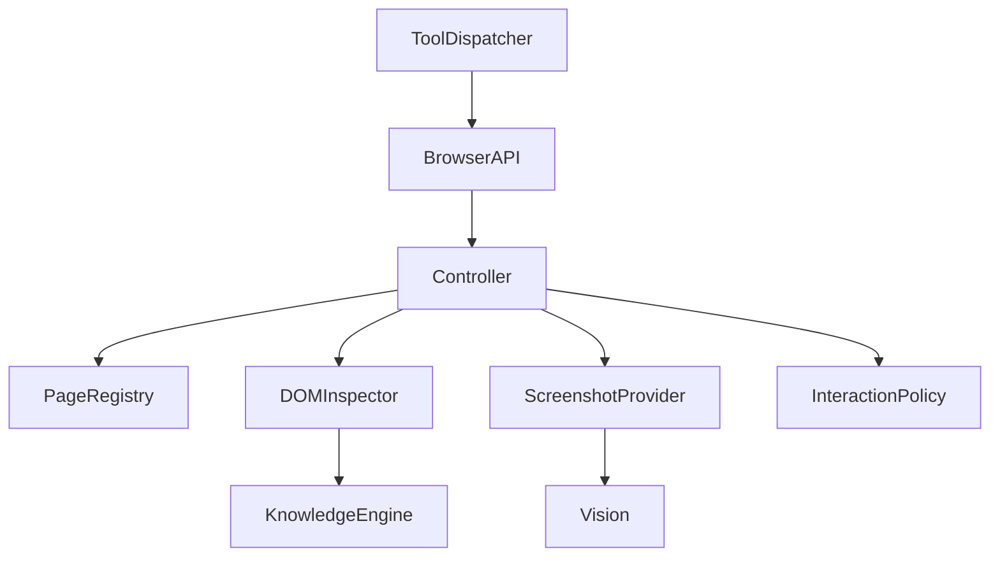
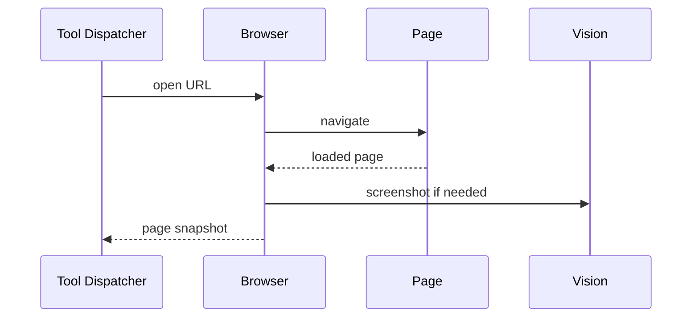

# Purpose

Define Browser as the client-side and server-coordinated capability for web navigation, inspection, automation, extraction, and user-visible browsing.

# Responsibilities

- Open, navigate, inspect, and interact with web pages under user or task control.
- Provide structured page state to Vision, OCR, Knowledge Engine, and tools.
- Support user-visible and headless modes.
- Enforce permissions for form entry, purchases, account actions, and downloads.

# Public API

- `Browser.open(url, mode, session_ref) -> PageHandle`
- `Browser.snapshot(page_handle) -> PageSnapshot`
- `Browser.click(page_handle, target_ref) -> InteractionResult`
- `Browser.type(page_handle, target_ref, text) -> InteractionResult`
- `Browser.extract(page_handle, schema) -> ExtractResult`
- `Browser.close(page_handle) -> CloseReceipt`

# Internal Architecture

Browser has a controller, page registry, DOM inspector, screenshot provider, download manager, credential boundary, and interaction policy. It integrates with Vision for visual page understanding and OCR for text in images.

# Data Structures

- `PageHandle`: browser instance, page id, URL, mode, owner task, and permissions.
- `PageSnapshot`: DOM summary, accessibility tree, screenshot ref, network state, and timestamp.
- `TargetRef`: selector, accessible name, coordinates, or visual match.
- `InteractionResult`: success, page changes, warnings, and required confirmation.

# Component Diagram

# Sequence Diagram

# Lifecycle

Browser instances are created per session or task, reused when policy allows, and closed on task completion or timeout. Downloads and credentials are scoped to the active workspace and user.

# Extension Points

- Browser engines can be swapped behind the controller interface.
- Plugins may register extraction schemas.
- Client overlays may expose browser state to the user.

# Failure Handling

Navigation timeouts, captchas, login walls, and permission prompts must be surfaced as structured blockers. Destructive actions require explicit policy approval and may require user confirmation.

# Future Development

Browser should support remote client control, multimodal page understanding, authenticated research sessions, replayable browsing traces, and safe transactional workflows.

# Coding Rules

- Browser actions are tools and must be invoked through Tool Dispatcher.
- Browser must not bypass Router or session permissions.
- Page snapshots must avoid leaking secrets into logs or prompts.
- User-visible actions require traceability.
