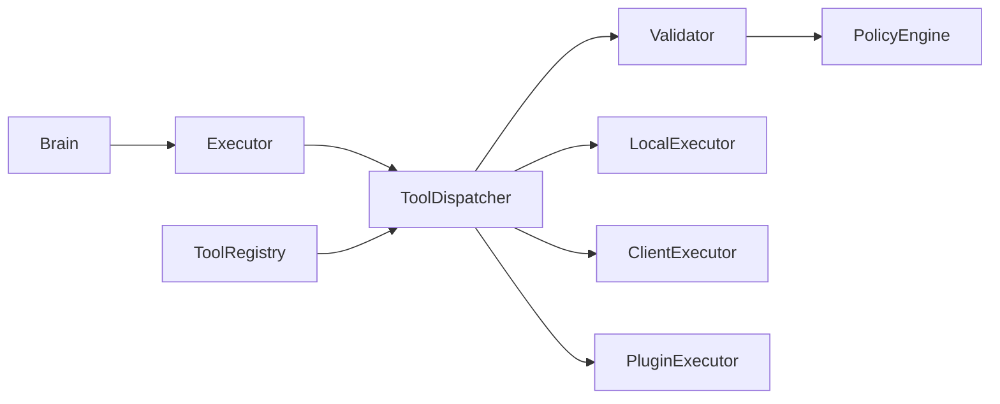
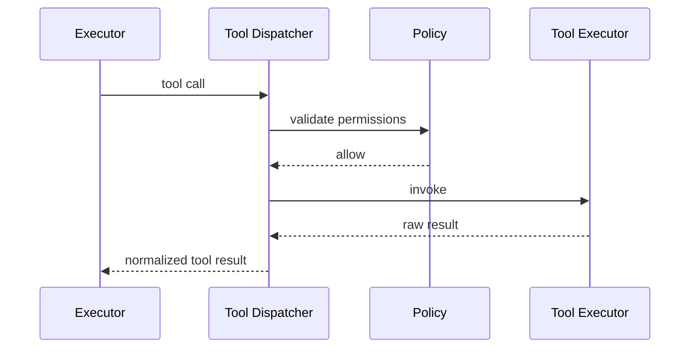

# Purpose

Define the Tool Registry and Tool Dispatcher architecture. Tools are the only sanctioned way for AEGIS to perform external actions.

# Responsibilities

- Register tools with schemas, permissions, health checks, and ownership.
- Validate tool calls before execution.
- Dispatch tool calls to local, plugin, client, or remote executors.
- Return structured results, errors, logs, and artifacts.
- Enforce policy, rate limits, confirmations, and audit trails.

# Public API

- `ToolRegistry.register(tool_descriptor) -> RegistrationResult`
- `ToolRegistry.list(filter) -> ToolCatalog`
- `ToolDispatcher.invoke(tool_call, execution_context) -> ToolResult`
- `ToolDispatcher.validate(tool_call, execution_context) -> ValidationResult`
- `ToolDispatcher.cancel(invocation_id) -> CancelReceipt`

# Internal Architecture

Tool Registry stores descriptors. Tool Dispatcher owns validation, authorization, routing, execution, timeout, result normalization, and audit logging. Executors provide implementation-specific adapters but do not control policy.

# Data Structures

- `ToolDescriptor`: id, version, schema, permissions, side-effect class, owner, and health check.
- `ToolCall`: tool id, arguments, caller, task id, timeout, and confirmation token.
- `ToolResult`: status, payload, artifacts, warnings, error, and trace id.
- `ExecutionContext`: user, session, workspace, permissions, risk level, and cancellation token.

# Component Diagram

# Sequence Diagram

# Lifecycle

Tools register during module or plugin startup. Dispatcher validates health before use. Invocations are traced from request to result. Tools may be disabled, upgraded, or unregistered while preserving descriptor history.

# Extension Points

- Plugins may register tools.
- Package Manager may install tool providers.
- New executor types may support containers, remote machines, or client-side agents.

# Failure Handling

Validation failures block execution. Runtime failures return structured errors. Timeouts cancel execution when possible. Partial side effects must be reported. Dangerous actions require confirmation according to policy.

# Future Development

Tools should support formal contracts, deterministic replay, sandbox attestations, marketplace trust scores, and delegated execution across machines.

# Coding Rules

- Brain never calls tool implementations.
- All side effects go through Tool Dispatcher.
- Tool schemas must be versioned and validated.
- Tool results must be structured, not free-form logs only.
