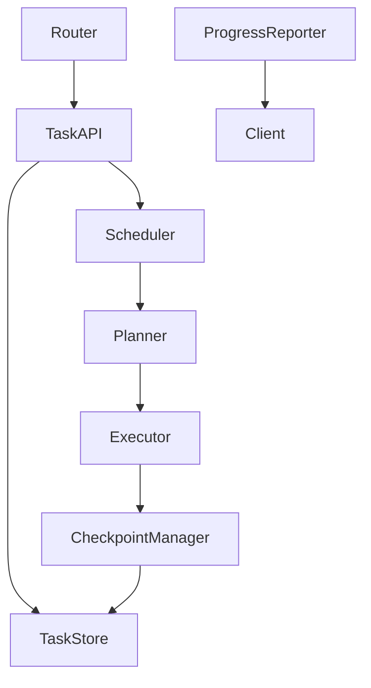
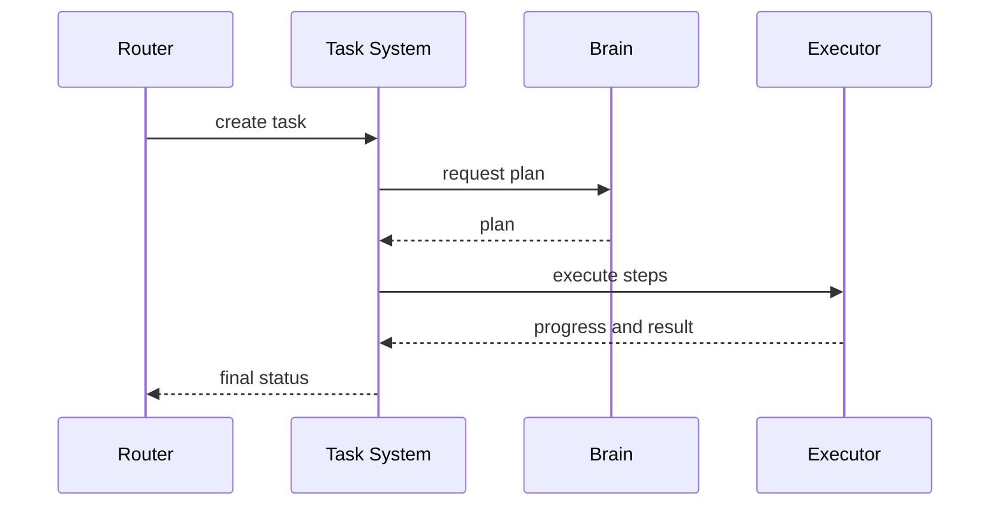

# Purpose

Define the Task System that turns goals into tracked units of work with status, scheduling, progress, cancellation, and auditability.

# Responsibilities

- Create tasks from user goals, automation events, or internal follow-ups.
- Track state, priority, ownership, deadlines, and dependencies.
- Coordinate Planner and Executor.
- Provide user-visible progress and resumability.
- Archive execution traces and outcomes.

# Public API

- `Task.create(task_spec) -> TaskHandle`
- `Task.status(task_id) -> TaskStatus`
- `Task.pause(task_id) -> PauseReceipt`
- `Task.resume(task_id) -> ResumeReceipt`
- `Task.cancel(task_id, reason) -> CancelReceipt`
- `Task.list(filter) -> TaskList`

# Internal Architecture

Task System includes task store, scheduler, dependency manager, progress reporter, checkpoint manager, and archive writer. It owns state transitions but delegates reasoning to Brain and execution to Executor.

# Data Structures

- `TaskSpec`: goal, initiator, scope, priority, constraints, and success criteria.
- `TaskState`: pending, planning, waiting, running, paused, completed, failed, or canceled.
- `Checkpoint`: task id, step, state snapshot, artifacts, and resume token.
- `ProgressEvent`: task id, message, percent if known, current step, and timestamp.

# Component Diagram

# Sequence Diagram

# Lifecycle

Tasks are created, validated, scheduled, planned, executed, checkpointed, completed, and archived. Paused tasks retain enough state to resume. Failed tasks retain diagnostics and recovery recommendations.

# Extension Points

- New schedulers may optimize for latency, GPU availability, or user priority.
- Plugins may create task templates.
- Automation systems may subscribe to task state changes.

# Failure Handling

Task failures must distinguish planning failure, execution failure, permission failure, user cancellation, and external dependency failure. Retriable tasks may resume from checkpoints.

# Future Development

The Task System should support recurring tasks, collaborative multi-agent tasks, SLA policies, visual timelines, and cross-device continuation.

# Coding Rules

- Task state transitions must be explicit.
- Task System must not execute tools directly.
- Progress events must be user-safe and concise.
- Completed tasks must preserve trace links.
