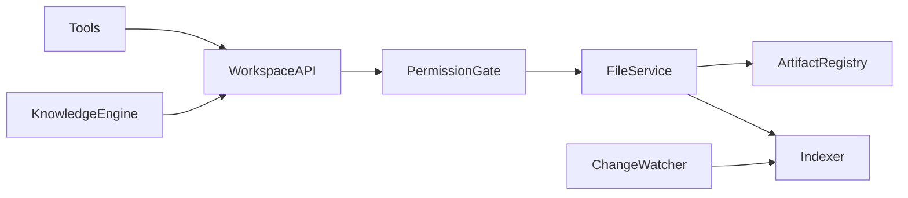
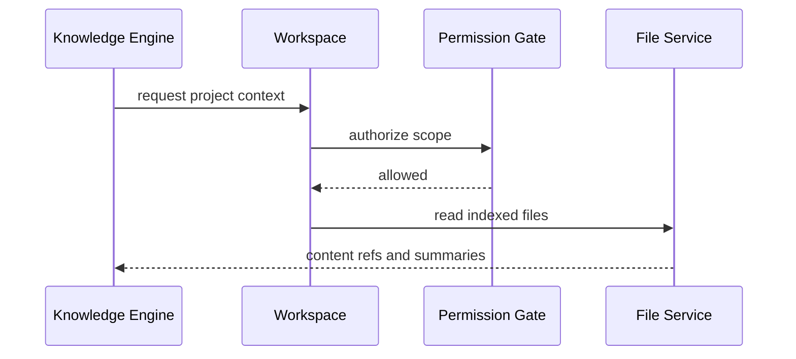

# Purpose

Define Workspace as the boundary for files, documents, code, artifacts, settings, and project-local context used by AEGIS.

# Responsibilities

- Represent working directories, project metadata, file permissions, and artifact locations.
- Provide safe file access abstractions to tools and agents.
- Index workspace content for Knowledge Engine.
- Track generated artifacts and task outputs.
- Prevent unintended access outside allowed roots.

# Public API

- `Workspace.open(path_ref, mode) -> FileHandle`
- `Workspace.list(query) -> FileList`
- `Workspace.read(file_ref) -> FileContent`
- `Workspace.write(file_ref, content, policy) -> WriteReceipt`
- `Workspace.index(scope) -> IndexReport`
- `Workspace.artifacts(task_id) -> ArtifactList`

# Internal Architecture

Workspace contains root resolver, permission gate, file service, artifact registry, indexer, metadata store, and change watcher. It must support local folders first and remote/shared workspaces later.

# Data Structures

- `WorkspaceRef`: id, root, owner, trust level, and active policy.
- `FileRef`: workspace id, normalized path, type, size, hash, and timestamps.
- `ArtifactRef`: task id, file ref, media type, purpose, and retention rule.
- `WorkspaceIndexEntry`: file ref, extracted text, symbols, embeddings, and freshness.

# Component Diagram

# Sequence Diagram

# Lifecycle

Workspace is mounted per session or task. It validates roots, loads metadata, starts watchers, serves reads and writes, registers artifacts, and flushes indexes at shutdown.

# Extension Points

- New file parsers can extract content for Knowledge Engine.
- Cloud workspace adapters may be added.
- Version-control integrations can provide diffs and blame context.

# Failure Handling

Unauthorized paths are rejected. File conflicts require merge or overwrite policy. Indexing failures are recorded without blocking direct file operations unless the task requires indexed context.

# Future Development

Workspace should support snapshots, branching, remote mounts, encrypted project stores, and semantic project maps.

# Coding Rules

- All file access must be scoped to a workspace.
- Path normalization must happen before authorization.
- Tools must receive file handles or refs, not unrestricted paths.
- Generated artifacts must be registered.
