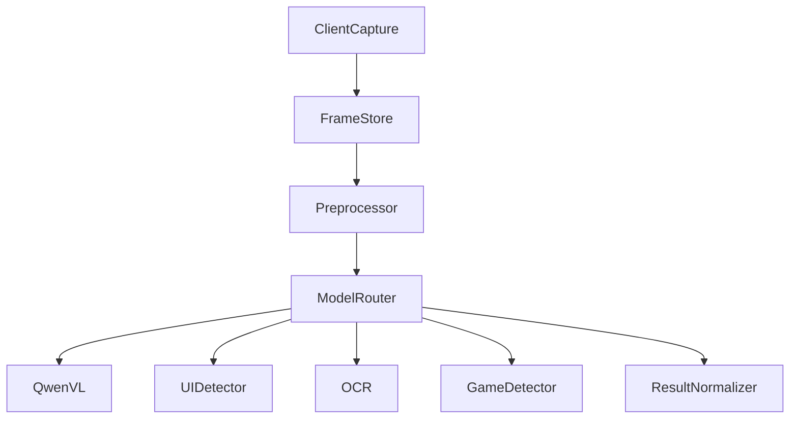
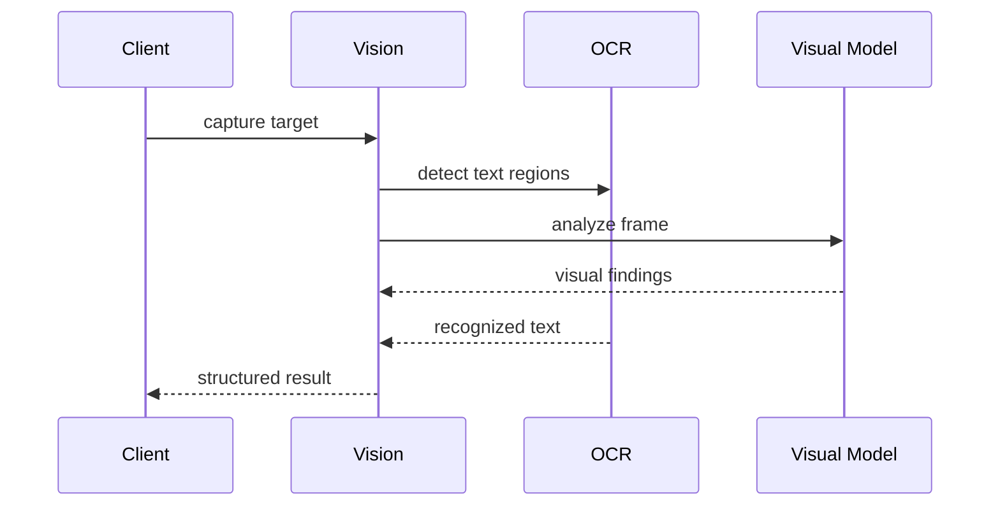

# Purpose

Define Vision as the visual understanding layer for desktop, windows, games, documents, browser pages, and images.

# Responsibilities

- Capture and analyze screens, windows, regions, images, and video frames.
- Provide object, layout, text-region, state, and UI element understanding.
- Use OCR and multimodal models where appropriate.
- Supply structured observations to Browser, Game Companion, Brain, and tools.

# Public API

- `Vision.capture(target_ref) -> ImageFrame`
- `Vision.analyze(frame_ref, analysis_spec) -> VisionResult`
- `Vision.track(target_ref, tracking_spec) -> TrackingHandle`
- `Vision.describe(frame_ref, audience) -> Description`
- `Vision.locate(frame_ref, query) -> RegionList`

# Internal Architecture

Vision includes capture adapters, frame store, preprocessing, model router, OCR bridge, UI detector, game-state detector, document analyzer, and result normalizer. It should support Qwen VL and other local visual models.

# Data Structures

- `ImageFrame`: frame id, source, dimensions, timestamp, color space, and storage ref.
- `AnalysisSpec`: requested detections, model preference, latency budget, and confidence threshold.
- `VisionResult`: regions, labels, text refs, relationships, confidence, and model provenance.
- `Region`: coordinates, role, label, state, and confidence.

# Component Diagram

# Sequence Diagram

# Lifecycle

Vision starts capture adapters and model availability checks. It processes frames on demand or as tracked streams. Frame retention follows privacy and task policy.

# Extension Points

- New visual models can be added behind model adapters.
- Domain detectors can specialize for games, IDEs, forms, or documents.
- Capture providers can support OS APIs, browser screenshots, and remote clients.

# Failure Handling

If a model is unavailable, Vision falls back to lower-capability analysis and reports confidence. Capture failures must identify target, permission, and device state. Low confidence results must be labeled.

# Future Development

Vision should support real-time desktop understanding, multi-monitor context, action grounding, visual memory, and learned UI affordances.

# Coding Rules

- Vision returns observations, not direct actions.
- Visual results must include confidence and provenance.
- Sensitive frames must follow retention policy.
- OCR should be used for text-bearing visuals.
