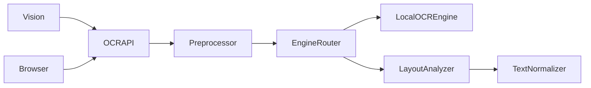
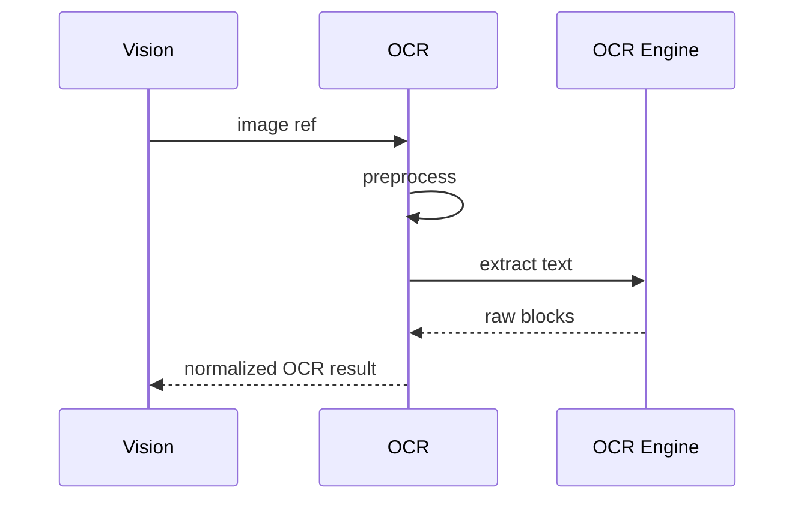

# Purpose

Define OCR as the text extraction layer for screenshots, windows, documents, browser images, game overlays, and scanned files.

# Responsibilities

- Extract text with layout, coordinates, confidence, and language metadata.
- Support unlimited OCR workflows through batching and caching.
- Feed Vision, Knowledge Engine, Browser, and document tools.
- Preserve source references for citations and traceability.

# Public API

- `OCR.extract(image_ref, options) -> OCRResult`
- `OCR.batch(image_refs, options) -> OCRBatchResult`
- `OCR.languages() -> LanguageSupport`
- `OCR.locate_text(image_ref, query) -> TextRegionList`

# Internal Architecture

OCR includes image preprocessing, engine router, layout analyzer, language detector, text normalizer, confidence scorer, and cache. Engines may include local OCR models and cloud-free document OCR.

# Data Structures

- `OCRResult`: text blocks, reading order, confidence, language, source frame, and warnings.
- `TextBlock`: text, bounding box, role, line grouping, and confidence.
- `OCROptions`: language hints, layout mode, table mode, handwriting mode, and quality budget.

# Component Diagram

# Sequence Diagram

# Lifecycle

OCR loads engine capabilities at startup, warms optional models, processes extraction requests, caches results by image hash and options, and clears cache according to privacy policy.

# Extension Points

- New OCR engines may be added.
- Domain-specific layout analyzers may support tables, receipts, subtitles, or code editors.
- Language packs may be installed through Package Manager.

# Failure Handling

Low-quality images return warnings and confidence scores. Unsupported languages produce explicit errors. Engine failures fall back where possible and preserve source refs for manual inspection.

# Future Development

OCR should support handwriting, mathematical notation, dense tables, live subtitles, and multi-frame text stabilization.

# Coding Rules

- OCR results must retain bounding boxes where available.
- OCR must not invent missing text.
- Cached OCR must be scoped by privacy policy.
- Callers must handle confidence, not assume perfect extraction.
