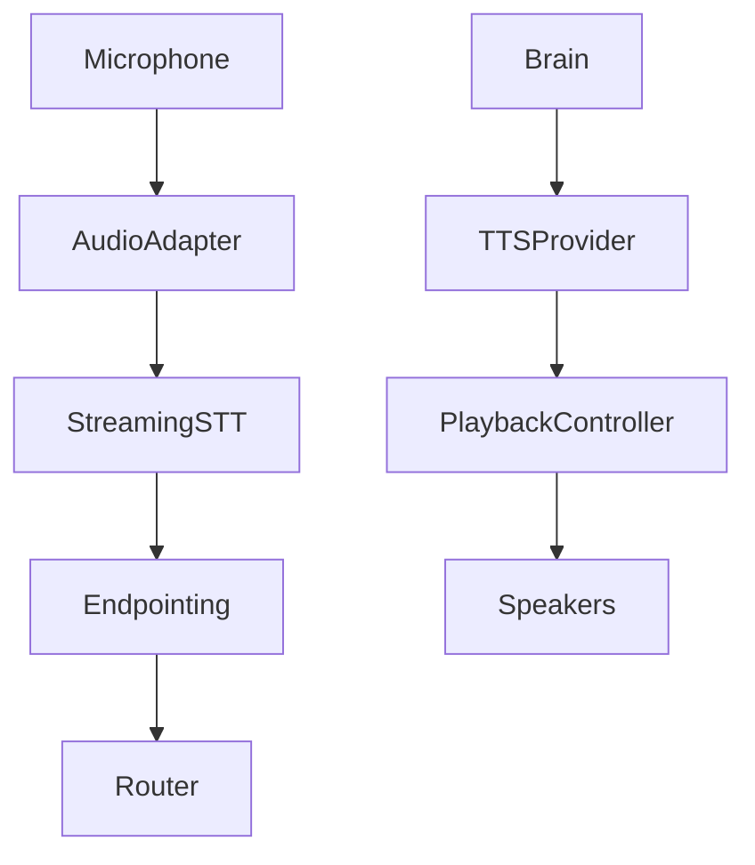
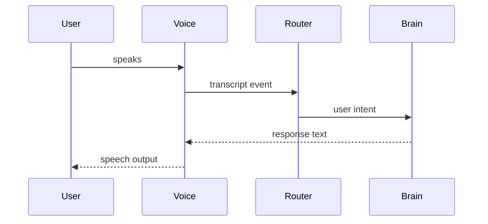

# Purpose

Define Voice as the streaming speech input and output system for conversational interaction, interruptions, memory-aware dialogue, and companion modes.

# Responsibilities

- Provide streaming speech-to-text and text-to-speech.
- Support barge-in interruptions and low-latency turn taking.
- Attach speaker, device, session, and confidence metadata.
- Support voice companion use cases, including games and desktop work.

# Public API

- `Voice.listen(session_ref, options) -> StreamHandle`
- `Voice.transcribe(audio_stream, options) -> TranscriptStream`
- `Voice.speak(text, voice_options) -> PlaybackHandle`
- `Voice.stop(playback_handle) -> StopReceipt`
- `Voice.devices() -> AudioDeviceList`

# Internal Architecture

Voice contains audio device adapters, streaming STT, endpointing, interruption detector, TTS provider, playback controller, and conversation bridge. Voice events enter AEGIS through Router.

# Data Structures

- `AudioFrame`: device, timestamp, sample rate, channel count, and audio ref.
- `TranscriptChunk`: text, partial/final flag, confidence, language, and timing.
- `VoiceProfile`: voice id, style, speed, language, and interruption behavior.
- `PlaybackState`: queued, speaking, interrupted, completed, or failed.

# Component Diagram

# Sequence Diagram

# Lifecycle

Voice initializes devices, opens streams on demand, sends partial transcripts to Router, handles interruptions, and closes devices when sessions end.

# Extension Points

- STT and TTS providers can be swapped.
- Plugins may add wake words or voice commands.
- Voice profiles can customize personality and latency tradeoffs.

# Failure Handling

Device failures must surface as actionable status. STT uncertainty should be visible to Brain. TTS failures should fall back to text response. Interruptions must cancel playback cleanly.

# Future Development

Voice should support speaker identification, emotional prosody, multilingual switching, local voice cloning with consent, and audio scene understanding.

# Coding Rules

- Voice transcripts enter through Router.
- Voice must not directly mutate Memory.
- Audio capture requires explicit session permissions.
- Partial transcripts must be marked as partial.
