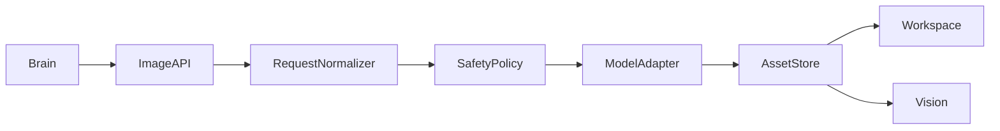
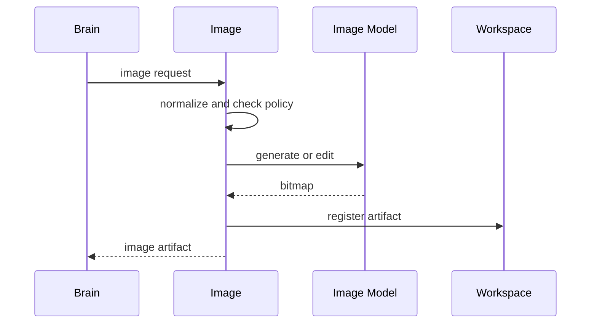

# Purpose

Define Image as the generation, editing, inspection, and asset-management capability for raster visual outputs.

# Responsibilities

- Generate and edit bitmap images for user workflows.
- Store image artifacts with provenance and prompts.
- Provide thumbnails, metadata, and safety status.
- Coordinate with Vision for inspection and OCR where needed.

# Public API

- `Image.generate(image_request) -> ImageArtifact`
- `Image.edit(edit_request) -> ImageArtifact`
- `Image.inspect(image_ref) -> ImageInspection`
- `Image.variants(image_ref, variant_spec) -> ImageArtifactList`

# Internal Architecture

Image includes request normalizer, model provider adapter, safety policy, asset store, metadata writer, and inspection bridge. It does not replace code-native SVG or UI assets when those are better represented as source code.

# Data Structures

- `ImageRequest`: prompt, size, style, references, transparency, safety scope, and output purpose.
- `EditRequest`: source image, mask, instructions, constraints, and output format.
- `ImageArtifact`: file ref, metadata, prompt trace, model provenance, and retention rule.
- `ImageInspection`: dimensions, content labels, OCR refs, quality notes, and warnings.

# Component Diagram

# Sequence Diagram

# Lifecycle

Image providers are registered at startup. Requests create artifacts in Workspace, attach metadata, and optionally trigger Vision inspection before user delivery.

# Extension Points

- New generation or editing providers may be registered.
- Style packs and templates may be installed.
- Asset post-processors may resize, compress, or remove backgrounds.

# Failure Handling

Provider failures return structured errors and leave no half-registered artifact. Unsafe or unsupported requests are refused with alternatives where possible. Corrupt outputs are rejected by inspection.

# Future Development

Image should support local model pipelines, layered editing, animation frames, visual brand kits, and dataset-aware asset generation.

# Production Status

Status: Production Ready

Implemented:

- ImageGenerationRuntime.
- Provider API.
- Stub Provider.
- ComfyUI Provider.
- LAN HTTP client handling with `trust_env=False`.
- Workflow Library.
- Image Model Catalog.
- API workflow loading.
- prompt/negative prompt/seed/size injection.
- `POST /prompt`.
- history polling.
- image download through `/view`.
- output persistence.
- artifact registration.
- events.
- image doctor.
- workflow validation.
- acceptance test.

Workflow Library status: production foundation complete for cataloging, selection, listing, scanning, and validation of txt2img ComfyUI workflows.

Image Model Catalog status: production foundation complete for catalog entries, installed-state tracking, search, and detection. Catalog roadmap entries such as AnyLoRA and DreamShaper XL are not treated as installed unless their catalog `installed` value is true.

Known production limitations:

- The production-ready boundary is txt2img through ComfyUI.
- AnyLoRA and DreamShaper XL installation remains planned when catalog state is `installed=false`.
- img2img, inpainting, ControlNet, IP-Adapter, upscale, tattoo presets, and model/workflow installer remain future expansion.
- The stub provider remains available for tests and non-production fallback, but must not mask ComfyUI production failures.

# Coding Rules

- Generated images must be registered as artifacts.
- Prompt and model provenance must be stored.
- Image must respect safety and copyright policy.
- Prefer source-native assets when editing code-based UI systems.
