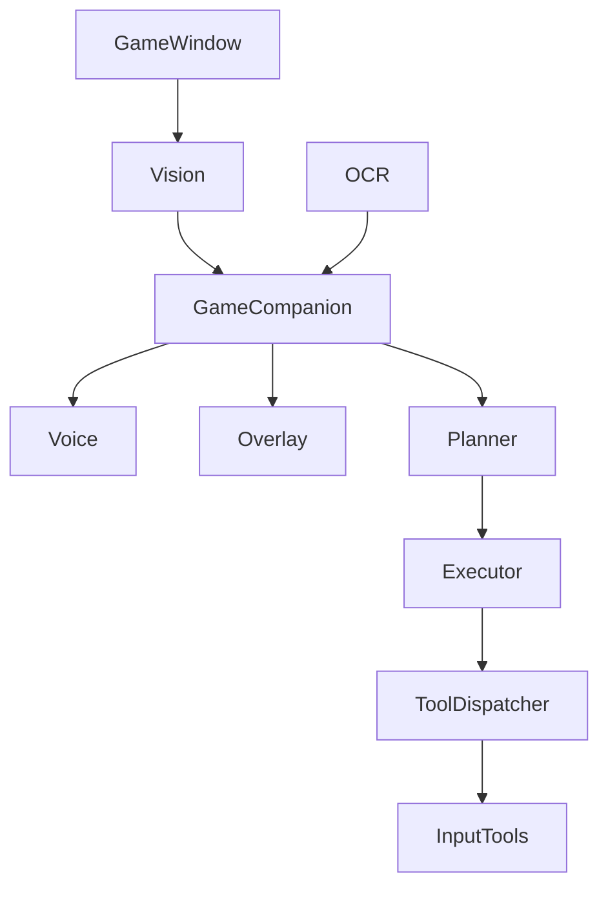
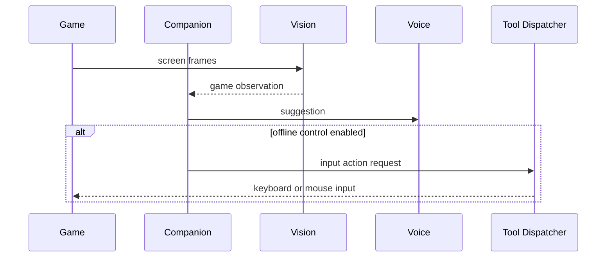

# Purpose

Define Game Companion as the AEGIS mode for assisting users while playing games, with separate online and offline behavior.

# Responsibilities

- Online mode: provide voice companionship, screen analysis, tactical suggestions, overlay, and memory without controlling the game.
- Offline mode: optionally control keyboard, mouse, vision, planning, and automation where permitted.
- Maintain game-specific context, preferences, and session memory.
- Respect game rules, anti-cheat boundaries, and user consent.

# Public API

- `GameCompanion.start(game_ref, mode, session_ref) -> CompanionSession`
- `GameCompanion.observe(target_ref) -> GameObservation`
- `GameCompanion.suggest(observation, goal) -> Suggestion`
- `GameCompanion.control(action_plan) -> ControlResult`
- `GameCompanion.stop(session_id) -> StopReceipt`

# Internal Architecture

Game Companion coordinates Vision, OCR, Voice, Overlay, Planner, Executor, and Tool Dispatcher. Online mode disables control capabilities by policy. Offline mode may enable input tools through Dispatcher after explicit permission.

# Data Structures

- `GameRef`: title, process, window, platform, mode policy, and capture method.
- `GameObservation`: screen state, UI text, detected objects, player state, and confidence.
- `Suggestion`: tactical advice, urgency, evidence, and delivery mode.
- `ControlAction`: input type, target, duration, risk, and rollback expectation.

# Component Diagram

# Sequence Diagram

# Lifecycle

Companion starts by identifying the game, selecting online or offline mode, opening capture and voice streams, loading memory, and beginning observation. It stops by closing streams, saving reflection, and clearing volatile frame data.

# Extension Points

- Game profiles may add detectors, vocabulary, overlays, and tactical heuristics.
- Plugins may add offline automation modules.
- Voice personas may be customized per game.

# Failure Handling

Capture failures pause suggestions. Low-confidence observations must not produce strong claims. Online mode control attempts are blocked. Offline control failures must stop automation and report state.

# Future Development

Game Companion should support per-game skill packs, replay analysis, coaching timelines, spectator modes, and safe offline automation laboratories.

# Coding Rules

- Online mode never controls the game.
- Offline control still goes through Tool Dispatcher.
- Game observations require confidence labels.
- Anti-cheat and platform boundaries must be respected.
