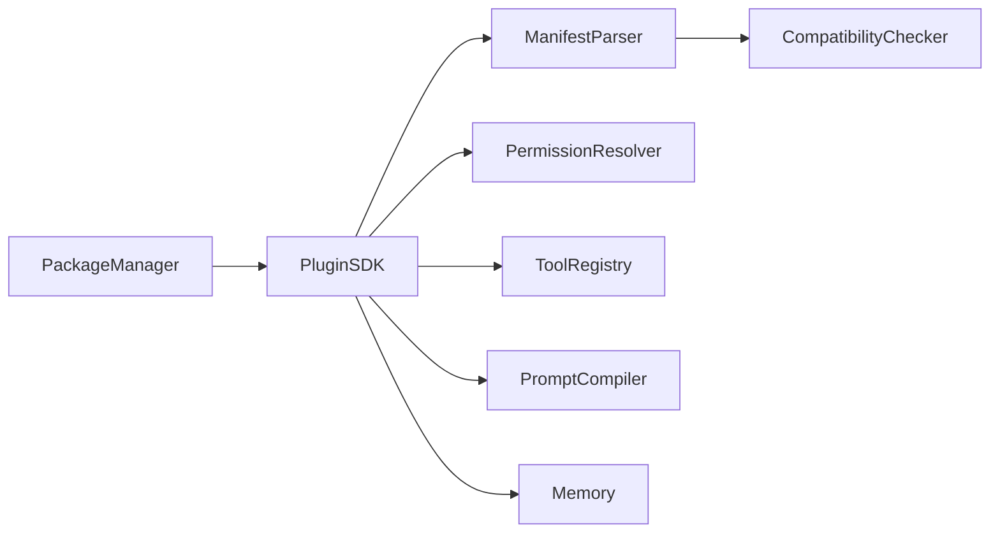
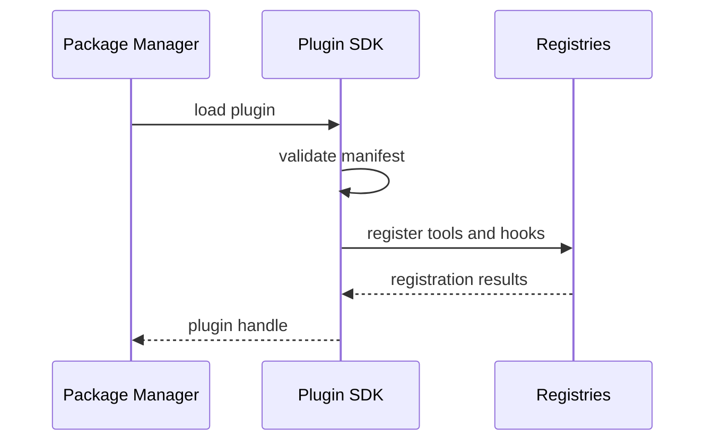

# Purpose

Define Plugin SDK as the contract for extending AEGIS with tools, skills, capabilities, prompt extensions, memory hooks, CLI commands, and optional UI surfaces.

# Responsibilities

- Provide stable plugin manifests and registration APIs.
- Isolate plugin code and permissions.
- Validate tool schemas, capability descriptors, and hooks.
- Support plugin diagnostics, versioning, and removal.

# Public API

- `PluginSDK.load(plugin_manifest) -> PluginHandle`
- `PluginSDK.register_tool(tool_descriptor) -> RegistrationResult`
- `PluginSDK.register_skill(skill_descriptor) -> RegistrationResult`
- `PluginSDK.register_prompt_extension(extension_descriptor) -> RegistrationResult`
- `PluginSDK.register_memory_hook(hook_descriptor) -> RegistrationResult`
- `PluginSDK.diagnostics(plugin_id) -> DiagnosticReport`

# Internal Architecture

Plugin SDK includes manifest parser, compatibility checker, permission resolver, registration bridge, sandbox adapter, diagnostics runner, and lifecycle hooks. Plugins never receive unrestricted Core access.

# Data Structures

- `PluginManifest`: id, name, version, entrypoints, permissions, dependencies, and compatibility range.
- `SkillDescriptor`: id, description, trigger rules, required tools, and documentation refs.
- `CapabilityDescriptor`: id, provider, input contract, output contract, and health check.
- `HookDescriptor`: hook point, schema, permissions, and timeout.

# Component Diagram

# Sequence Diagram

# Lifecycle

Plugins are discovered, validated, loaded, registered, health-checked, enabled, disabled, upgraded, or removed. Hook execution is bounded by timeout and permission policy.

# Extension Points

- Plugin types may add tools, skills, prompt extensions, memory hooks, CLI commands, and UI contributions.
- Sandbox backends may change without changing plugin manifests.
- Registries may add new descriptor types.

# Failure Handling

Invalid manifests fail installation. Plugin runtime failures disable the failing capability, not the whole system, unless the plugin is marked required. Hook failures are logged and isolated.

# Future Development

Plugin SDK should support signed packages, marketplace distribution, semantic version negotiation, remote plugins, and formal certification.

# Coding Rules

- Plugins communicate through public APIs only.
- Plugin permissions must be explicit.
- Plugin hooks must be bounded and observable.
- Plugin failures must not crash Core.
