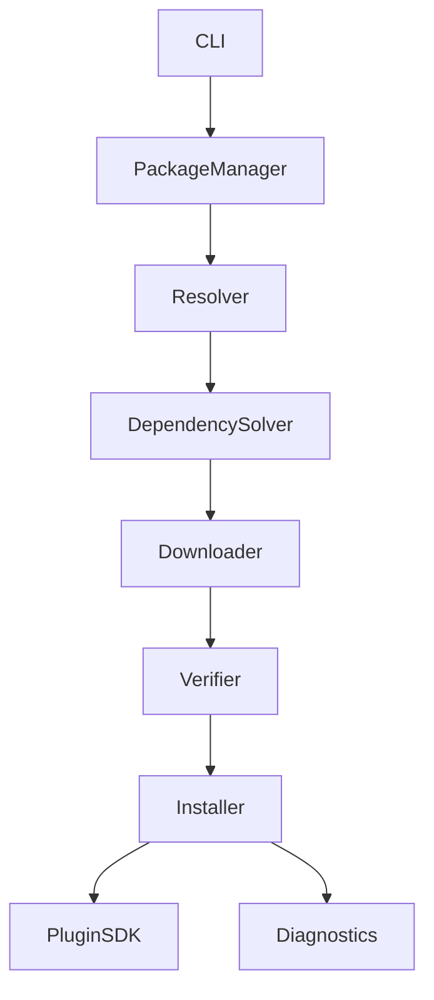
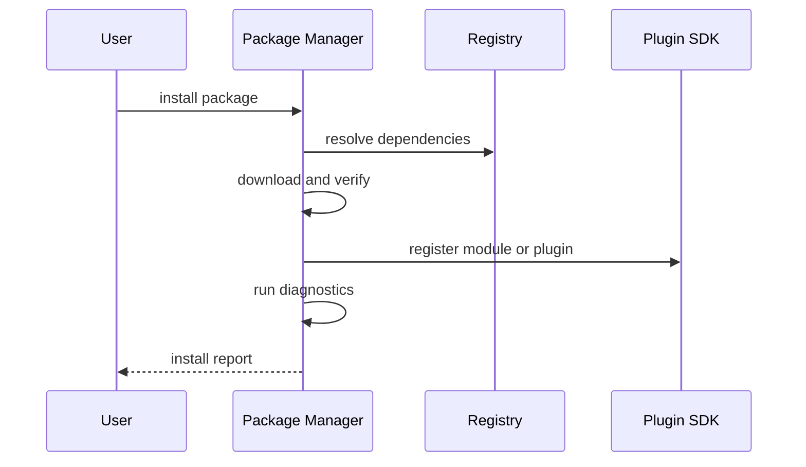

# Purpose

Define Package Manager as the installer, updater, remover, and diagnostic runner for AEGIS modules, plugins, models, language packs, and capability bundles.

# Responsibilities

- Resolve packages and dependencies.
- Download, verify, install, configure, and register modules.
- Run diagnostics after installation.
- Support commands such as `aegis install browser`.
- Preserve rollback metadata.

# Public API

- `PackageManager.install(package_ref, options) -> InstallReport`
- `PackageManager.remove(package_id, options) -> RemoveReport`
- `PackageManager.update(package_id, options) -> UpdateReport`
- `PackageManager.list(filter) -> PackageList`
- `PackageManager.diagnose(package_id) -> DiagnosticReport`

# Internal Architecture

Package Manager includes package resolver, dependency solver, downloader, verifier, installer, configuration writer, registry updater, diagnostics runner, and rollback manager.

# Data Structures

- `PackageRef`: name, version constraint, source, trust policy, and profile.
- `PackageManifest`: files, dependencies, capabilities, post-install diagnostics, and rollback plan.
- `InstallReport`: installed items, registrations, diagnostics, warnings, and next steps.
- `RollbackRecord`: previous versions, file refs, config refs, and restore commands.

# Component Diagram

# Sequence Diagram

# Lifecycle

Packages are resolved, staged, verified, installed, registered, diagnosed, and activated. Updates create rollback records. Removal disables capabilities before deleting files.

# Extension Points

- New package sources may include local folders, registries, Git repositories, or offline bundles.
- New diagnostics can be provided by packages.
- Trust policies can require signatures or checksums.

# Failure Handling

Failed installation rolls back staged changes. Failed diagnostics mark the package installed but inactive unless policy allows degraded activation. Dependency conflicts require an explicit resolution report.

# Future Development

Package Manager should support signed marketplaces, binary model distribution, reproducible installs, offline mirrors, and environment snapshots.

# Implementation

The implementation lives in `aegis.installer` and exposes the lifecycle API plus
the root CLI commands `install`, `remove`, `update`, `bootstrap`, `registry`,
`doctor`, `list`, `search`, and `rollback`.

Package manifests are YAML files in `aegis/installer/manifests` (or the directory
selected by `AEGIS_PACKAGE_REGISTRY`). Installed state and rollback journals live
under `${AEGIS_WORKSPACE}/.aegis/installer`; their location can be overridden with
`AEGIS_INSTALLER_STATE`. The workspace itself is derived from the central services
configuration when `AEGIS_WORKSPACE` is not set.

The component catalog and installed-state journal do not replace Provider, Model,
Workflow, Capability, or Service registries. Manifests declare those registrations
and the installer delegates activation to the existing runtimes and configuration.

# Coding Rules

- Packages must declare capabilities and permissions.
- Installers must be idempotent where possible.
- Activation requires successful registration.
- Rollback metadata is required for updates.
