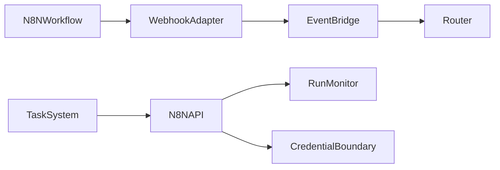
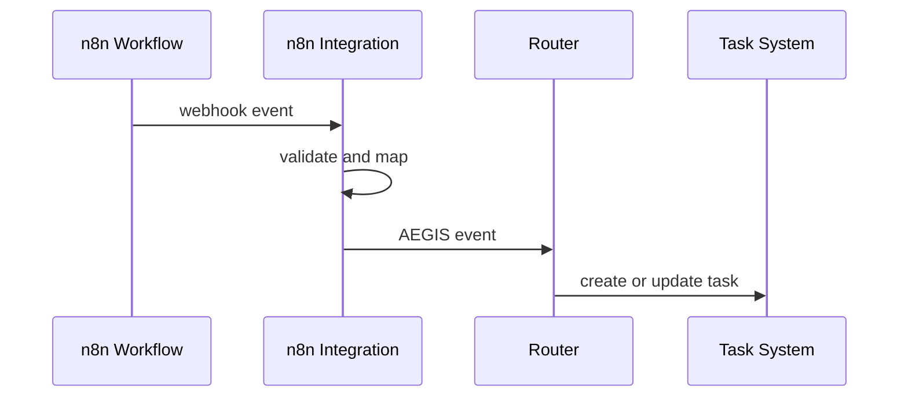

# Purpose

Define the n8n integration as the bridge between AEGIS and visual workflow automation.

# Responsibilities

- Trigger AEGIS tasks from n8n workflows.
- Allow AEGIS to start, monitor, and receive results from n8n workflows.
- Map workflow credentials and permissions safely.
- Convert workflow events into typed AEGIS events.

# Public API

- `N8N.trigger(workflow_ref, input_payload) -> WorkflowRun`
- `N8N.status(run_id) -> WorkflowStatus`
- `N8N.cancel(run_id) -> CancelReceipt`
- `N8N.register_webhook(webhook_spec) -> WebhookRegistration`
- `N8N.map_event(raw_event) -> AegisEvent`

# Internal Architecture

The integration contains workflow registry, webhook adapter, credential boundary, payload mapper, run monitor, and event bridge. It should treat n8n as an automation provider, not as the central brain.

# Data Structures

- `WorkflowRef`: workflow id, environment, version, and permission scope.
- `WorkflowRun`: run id, workflow ref, input hash, status, timestamps, and output refs.
- `WebhookSpec`: route, schema, authentication, event mapping, and replay policy.
- `PayloadMapping`: source fields, target schema, validation, and redaction rules.

# Component Diagram

# Sequence Diagram

# Lifecycle

The integration registers workflows and webhooks, validates credentials, listens for events, monitors active runs, and cleans up stale registrations during shutdown.

# Extension Points

- New workflow templates may be installed by Package Manager.
- New payload mappers may support common SaaS tools.
- Automation policies may define confirmation requirements.

# Failure Handling

Webhook validation failures are rejected. Workflow failures are represented as task failures or external dependency blockers. Credential errors must not expose secrets in traces.

# Future Development

n8n support should include workflow marketplace templates, bidirectional visual task editing, dry-run simulation, and automated recovery workflows.

# Coding Rules

- n8n events enter through Router.
- n8n actions initiated by AEGIS go through Tool Dispatcher or integration API with policy checks.
- Credentials must stay outside prompts.
- Workflow runs must be traceable.
