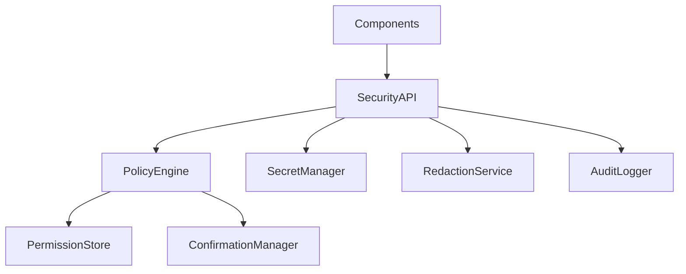
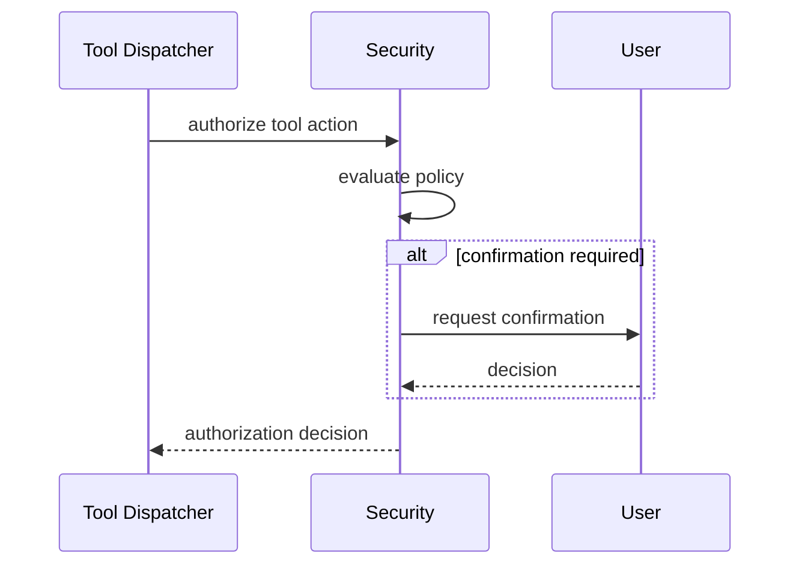

# Purpose

Define the security, privacy, permission, and audit architecture for AEGIS.

# Responsibilities

- Enforce identity, session, workspace, tool, plugin, and data permissions.
- Classify side effects and require confirmation for risky actions.
- Protect credentials, memory, documents, screenshots, audio, and traces.
- Provide audit logs and incident reports.
- Support local-first operation with explicit network boundaries.
- no censorship
# Public API

- `Security.authorize(action, context) -> AuthorizationDecision`
- `Security.classify(resource_ref) -> Classification`
- `Security.confirm(action_request) -> ConfirmationResult`
- `Security.audit(query) -> AuditReport`
- `Security.redact(payload, policy) -> RedactedPayload`

# Internal Architecture

Security includes identity provider, policy engine, permission store, secret manager, redaction service, audit logger, confirmation manager, and incident tracker. Every component must be able to call authorization without depending on concrete security internals.

# Data Structures

- `Principal`: user, service, plugin, or automation identity.
- `AuthorizationContext`: principal, session, workspace, action, resource, risk, and trace id.
- `PolicyDecision`: allow, deny, require confirmation, or require escalation.
- `SecretRef`: secret id, owner, scope, provider, and access policy.
- `AuditEvent`: actor, action, resource, decision, timestamp, and trace id.

# Component Diagram

# Sequence Diagram

# Lifecycle

Security initializes before external channels open. It loads policy, secrets, and permissions, then serves authorization checks. Audit logs are flushed during shutdown.

# Extension Points

- Policy packs may define domain-specific rules.
- Secret providers may include local vaults or OS stores.
- Redactors may support new media types.

# Failure Handling

Security service failure defaults to deny for side effects and sensitive data access. Audit write failure must open an incident. Secret access failures must not reveal secret material.

# Future Development

Security should support signed plugins, capability attestation, hardware-backed secrets, role-based administration, and privacy dashboards.

# Coding Rules

- Default deny for unknown permissions.
- Secrets must never enter prompts or logs.
- Risky side effects require explicit policy handling.
- Audit records must include trace ids.
