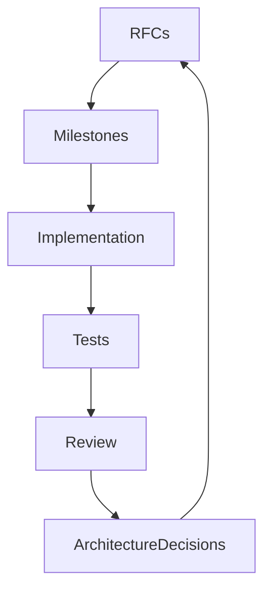
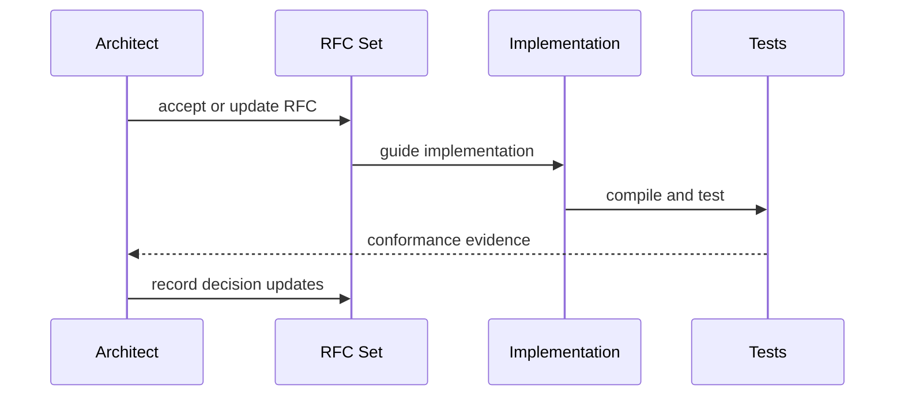

# Purpose

Define the staged development roadmap for AEGIS so implementation proceeds from stable architecture to increasingly autonomous capabilities.

# Responsibilities

- Sequence work so foundational APIs exist before dependent modules.
- Identify milestones, acceptance criteria, and architectural gates.
- Prevent feature work from bypassing RFC-defined boundaries.
- Preserve a path toward distributed, multimodal, plugin-based operation.

# Public API

Roadmap does not expose runtime APIs. It defines governance APIs for project work:

- `RFC.accept(rfc_id) -> ArchitectureDecision`
- `Milestone.start(milestone_id) -> MilestonePlan`
- `Milestone.review(milestone_id) -> ReviewReport`
- `Architecture.check(change_set) -> ConformanceReport`

# Internal Architecture

Roadmap organizes development into phases:

1. Foundation: Core, Runtime, Router, Workspace, Security, Task System, and Tool Dispatcher.
2. Intelligence: Brain, Prompt Compiler, Output Parser, Knowledge Engine, and Memory.
3. Interaction: Browser, Vision, OCR, Voice, Image, and client surfaces.
4. Extension: Plugin SDK, Package Manager, n8n, and capability packs.
5. Companion and autonomy: Game Companion, long-running agents, distributed execution, and advanced reflection.

# Data Structures

- `Milestone`: id, goal, included RFCs, dependencies, deliverables, tests, and exit criteria.
- `ArchitectureDecision`: decision id, RFC refs, status, rationale, and consequences.
- `ConformanceReport`: changed modules, violated boundaries, missing RFCs, and required follow-up.

# Component Diagram

# Sequence Diagram

# Lifecycle

Each milestone starts with RFC review, then implementation planning, then coding, tests, diagnostics, documentation updates, and architecture conformance review. No milestone closes while public APIs are undocumented.

# Extension Points

- New modules require new RFCs or updates to existing RFCs.
- New milestones may be inserted when risk or dependencies change.
- Architecture checks may become automated in CI.

# Failure Handling

If implementation reveals an RFC gap, work pauses for an RFC update. If tests fail, the milestone remains open. If a boundary violation is discovered, the architecture decision record must describe the correction.

# Future Development

Future roadmap phases should include distributed clusters, autonomous research teams, user-programmable agents, signed plugin marketplaces, multimodal memory, and formal verification for high-risk automation.

# Current Near-Term Status

1. Image Generation finalization - completed.
2. OCR Platform - active.

Image Generation is completed / production ready for the txt2img production boundary:

- ImageGenerationRuntime.
- ComfyUI Provider.
- Workflow Library.
- Image Model Catalog.
- image doctor diagnostics.
- output persistence.
- artifact registration.
- external-gated acceptance test.

Future image expansion remains planned and is not marked completed: AnyLoRA installation, DreamShaper XL installation, img2img, inpainting, ControlNet, IP-Adapter, upscale, tattoo workflow presets, and model/workflow installer.

OCR Platform is active for Foundation only:

- OCR Runtime.
- Provider API.
- Provider Registry.
- Stub Provider.
- Provider-neutral `OCRResult`.
- OCR events.
- OCR artifact registration through the existing project artifact API.
- OCR CLI diagnostics.
- Future provider registration path for UnlimitedOCRProvider, PaddleOCRProvider, and TesseractProvider without Runtime changes.

OCR Platform Foundation excludes production OCR models, UnlimitedOCRProvider implementation, PaddleOCRProvider implementation, TesseractProvider implementation, Vision Language Models, Qwen-VL, UI Graph, Memory, and Companion changes.

# Coding Rules

- Implementation follows accepted RFCs.
- Foundation modules must land before dependent feature modules.
- Every milestone requires compile and test evidence.
- Roadmap changes must document architectural consequences.
