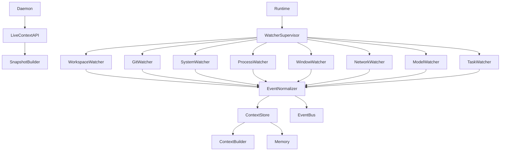
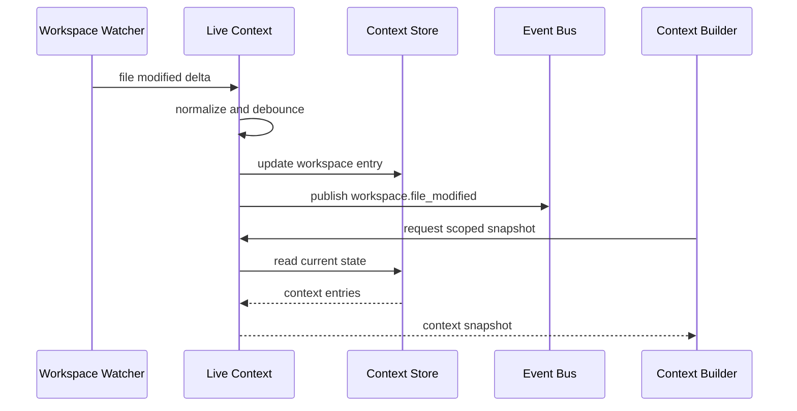

# Purpose

Define Live Context Engine as the continuously updated context layer that observes the local environment, normalizes changes into events, and keeps a queryable context store fresh for Brain, Context Builder, Memory, and user-facing surfaces.

# Responsibilities

- Maintain a current view of the user's workspace, git state, processes, windows, system resources, network state, model state, and active tasks.
- Run watcher services that detect changes without owning downstream reasoning.
- Publish typed events to the Event Bus for other modules to consume.
- Update the context store with recent state snapshots and deltas.
- Provide Context Builder with fresh, scoped environmental context.
- Coordinate with Daemon lifecycle and Runtime health monitoring.

Live Context Engine must not call Brain directly. It publishes events and updates context store only.

# Public API

- `LiveContext.start(scope_ref) -> ContextEngineHandle`
- `LiveContext.stop(reason) -> ContextStopReport`
- `LiveContext.snapshot(query) -> ContextSnapshot`
- `LiveContext.subscribe(context_filter, handler_ref) -> Subscription`
- `LiveContext.watchers() -> WatcherStatusList`
- `LiveContext.health() -> LiveContextHealth`

# Internal Architecture

Live Context Engine contains a watcher supervisor, event normalizer, debounce policy, context store, snapshot builder, and Event Bus publisher. Each watcher owns one observation domain and emits normalized deltas. The engine merges deltas into scoped context state and forwards events to the Event Bus.

Watchers include:

- `WorkspaceWatcher`: file creation, modification, deletion, and workspace root changes.
- `GitWatcher`: working tree status, branch changes, and repository metadata changes.
- `SystemWatcher`: CPU, RAM, disk, GPU, VRAM, battery, and device state changes.
- `ProcessWatcher`: process start, stop, restart, and resource usage changes.
- `WindowWatcher`: active application, focused window, and display topology changes.
- `NetworkWatcher`: connectivity, interface, latency, and degraded network changes.
- `ModelWatcher`: loaded models, unloaded models, endpoint readiness, and model resource use.
- `TaskWatcher`: active task progress, state changes, and current user-visible work.

# Data Structures

- `ContextSnapshot`: scope, timestamp, workspace state, git state, system resources, active processes, active window, network state, model state, task state, and freshness metadata.
- `ContextDelta`: source watcher, scope, changed fields, previous hash, current hash, timestamp, and confidence.
- `WatcherDescriptor`: watcher id, domain, permissions, debounce policy, health check, and event schemas.
- `WatcherStatus`: watcher id, state, last event time, lag, error count, and degraded reason.
- `ContextStoreEntry`: key, scope, value, provenance, update time, expiry, sensitivity, and source watcher.
- `LiveContextEvent`: event type, scope, payload, timestamp, trace id, and causality refs.

Standard events:

- `workspace.file_created`
- `workspace.file_modified`
- `workspace.file_deleted`
- `git.modified`
- `git.branch_changed`
- `process.started`
- `process.stopped`
- `system.resource_changed`
- `model.loaded`
- `model.unloaded`
- `task.updated`

# Component Diagram

# Sequence Diagram

# Lifecycle

Live Context starts after Daemon, Runtime, Workspace, Event Bus, and Security are available. It loads watcher descriptors, authorizes observation scopes, starts watchers in dependency order, and begins publishing events. During shutdown it stops watchers, flushes pending context deltas, records final watcher status, and closes subscriptions.

# Extension Points

- Plugins may register new watchers through watcher descriptors.
- New event schemas may be added with versioned payloads.
- Context Store backends may support in-memory, embedded database, or distributed storage.
- Debounce policies may be customized per watcher and workspace.
- Context Builder may define context filters without depending on watcher internals.

# Failure Handling

Watcher failure must mark only that watcher degraded. Live Context should continue serving stale snapshots with freshness metadata when possible. Event publication failures are retried according to Event Bus policy. Permission failures disable affected observation scopes. Excessive event volume must trigger debounce or sampling without dropping final state.

# Future Development

Future versions should support cross-device context synchronization, semantic window understanding, process intent inference, low-latency game context streams, distributed watcher placement, context replay, and privacy dashboards for observed state.

# Coding Rules

- Live Context must not directly call Brain.
- Watchers publish events and update context store through Live Context APIs only.
- Watchers must not mutate Workspace, Memory, Task System, or Runtime state directly.
- Every event schema must be versioned and traceable to a watcher.
- Context snapshots must include freshness and scope metadata.
- Sensitive observed data must pass through Security classification before storage.
