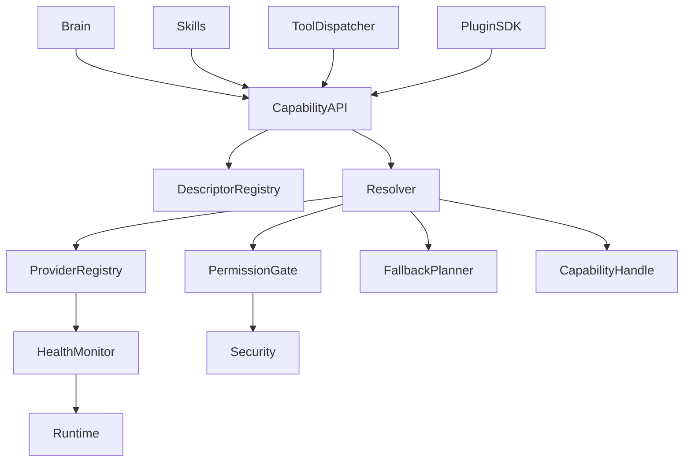
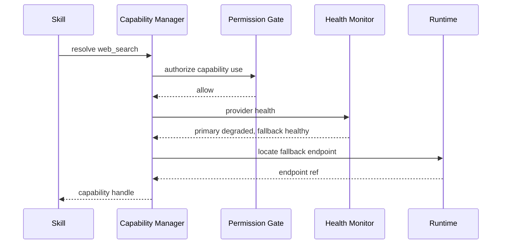

# Purpose

Define Capability Manager as the unified registry and resolver for system abilities, providers, health, permissions, and fallbacks. It allows Brain, Skills, tools, plugins, and services to request what they need by capability instead of depending on concrete implementation classes.

# Responsibilities

- Maintain a registry of capability descriptors and provider bindings.
- Support capability discovery by id, domain, input contract, output contract, permissions, and health.
- Resolve the best available provider for a request.
- Track provider health, degradation, latency, cost, locality, and permission requirements.
- Enforce permission checks before provider use.
- Select fallback providers when the preferred provider is unavailable or denied.
- Expose diagnostics for dashboard and runtime health reporting.

Brain and Skills must not depend on concrete provider classes. They request a capability by descriptor and receive an authorized provider handle or structured failure.

# Public API

- `Capability.register(descriptor) -> RegistrationResult`
- `Capability.discover(query) -> CapabilityCatalog`
- `Capability.resolve(request, context) -> CapabilityHandle`
- `Capability.health(capability_id) -> CapabilityHealth`
- `Capability.providers(capability_id) -> ProviderList`
- `Capability.disable(provider_id, reason) -> DisableReceipt`

# Internal Architecture

Capability Manager contains a descriptor registry, provider registry, resolver, permission gate, health monitor, fallback planner, and diagnostics exporter. Providers may be local services, client adapters, plugins, remote endpoints, or built-in modules. The resolver ranks providers by compatibility, authorization, health, locality, latency, and policy.

Example capabilities:

- `screen_capture`
- `ocr`
- `web_search`
- `browser_fetch`
- `memory_query`
- `gpu_status`
- `voice_tts`
- `voice_stt`
- `game_observe`
- `game_control_offline`

# Data Structures

- `CapabilityDescriptor`: id, name, domain, description, input schema, output schema, permissions, side-effect class, provider requirements, and version.
- `ProviderDescriptor`: provider id, capability ids, endpoint ref, owner, locality, priority, fallback group, health check, and limits.
- `CapabilityRequest`: capability id, caller, task id, input constraints, output requirements, permission scope, latency budget, and fallback policy.
- `CapabilityHandle`: capability id, provider id, invocation contract, endpoint ref, authorization receipt, expiry, and trace id.
- `CapabilityHealth`: capability id, provider states, aggregate state, degraded reasons, last check, and recommended fallback.

# Component Diagram

# Sequence Diagram

# Lifecycle

Capability Manager starts after Core, Security, Runtime, and Plugin SDK registries are available. Built-in capability descriptors load first, followed by module and plugin providers. Health monitoring begins after provider registration. During shutdown, provider handles are revoked, health monitors stop, and descriptor state is flushed.

# Extension Points

- Plugins may register capability descriptors and providers through Plugin SDK.
- Runtime adapters may expose remote capability providers.
- Policy packs may influence provider ranking and fallback eligibility.
- Dashboard may subscribe to capability health events.
- Tool Dispatcher may wrap capability handles as executable tools when appropriate.

# Failure Handling

Unknown capabilities return structured `not_found` errors. Unauthorized requests return deny or confirmation-required decisions. Unhealthy providers are skipped unless policy allows degraded use. If all providers fail, Capability Manager returns a failure bundle listing unavailable providers and required permissions. Provider crashes must not crash callers.

# Future Development

Future versions should support signed provider attestations, cost-aware routing, user-selectable provider preferences, distributed capability marketplaces, hardware capability benchmarking, and learned provider reliability scores.

# Coding Rules

- Brain and Skills request capabilities, not concrete provider classes.
- Provider descriptors must include permissions, schemas, and health checks.
- Fallback behavior must be explicit and auditable.
- Capability handles must expire and carry trace ids.
- Provider health must be observable without invoking user side effects.
- Capability Manager must not implement provider business logic.
