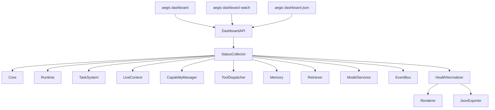
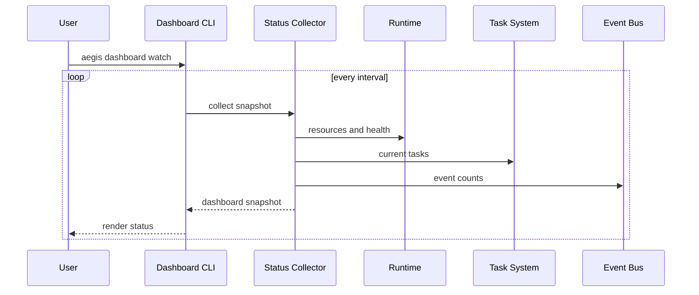

# Purpose

Define Dashboard as the operational status surface for AEGIS. The first implementation is a CLI dashboard, with a future WebUI dashboard using the same public status APIs.

# Responsibilities

- Show Daemon, Runtime, Core, Router, Memory, Retriever, Skill, model, and tool health.
- Show current workspace, current tasks, event counts, and degraded services.
- Show GPU, VRAM, RAM, CPU, disk, and network status.
- Show warnings, incidents, missing permissions, and unavailable capabilities.
- Provide human-readable watch mode and machine-readable JSON output.
- Avoid performing repairs or side effects directly.

# Public API

Dashboard is exposed through CLI commands:

- `aegis dashboard`
- `aegis dashboard watch`
- `aegis dashboard json`

Internal status API:

- `Dashboard.snapshot(scope_ref) -> DashboardSnapshot`
- `Dashboard.stream(scope_ref, interval) -> DashboardStream`
- `Dashboard.export(format, scope_ref) -> DashboardExport`

# Internal Architecture

Dashboard contains a status collector, health normalizer, warning classifier, renderer, JSON exporter, and watch loop. It consumes public APIs from Core, Runtime, Task System, Live Context, Capability Manager, Tool Dispatcher, Memory, Retriever, and model services. The future WebUI must use the same snapshot contract rather than separate status logic.

# Data Structures

- `DashboardSnapshot`: timestamp, daemon status, system status, service health, current workspace, current tasks, event counts, model status, resource usage, warnings, degraded services, and incidents.
- `ServiceStatusRow`: service id, state, health, uptime, latency, last error, restart count, and degraded reason.
- `ResourceStatus`: CPU, RAM, GPU, VRAM, disk, network, temperature if available, and pressure state.
- `TaskStatusRow`: task id, title, state, current step, owner, started time, and visible progress.
- `DashboardWarning`: severity, source, message, trace id, recommended action, and timestamp.

# Component Diagram

# Sequence Diagram

# Lifecycle

Dashboard starts on demand from CLI or future WebUI. It collects one snapshot for normal and JSON modes. Watch mode keeps a read-only stream open until interrupted, then closes subscriptions cleanly. Dashboard does not need to run as a permanent service unless WebUI requires a hosted endpoint.

# Extension Points

- Modules may contribute status panels through public status descriptors.
- Plugins may expose diagnostics if permitted by Plugin SDK.
- WebUI may add visual rendering over the same snapshot schema.
- Warning classifiers may add domain-specific severity rules.
- Exporters may add formats for CI, logs, or monitoring systems.

# Failure Handling

If a status source is unavailable, Dashboard marks that source unknown or degraded and continues rendering. Snapshot collection must be bounded by timeout. JSON output must remain valid even when some sections fail. Watch mode must handle transient failures without exiting unless the user cancels or the dashboard process cannot continue.

# Future Development

Future versions should support WebUI dashboard, trend charts, incident timelines, capability drill-downs, log links, remote node views, alert subscriptions, and one-click remediation through separate authorized commands.

# Coding Rules

- Dashboard reads status; it does not repair, restart, or mutate services directly.
- Dashboard must use public APIs only.
- JSON output must be stable and versioned.
- Watch mode must avoid unbounded memory growth.
- Warnings must be concise and user-safe.
- WebUI must reuse Dashboard snapshot contracts.
