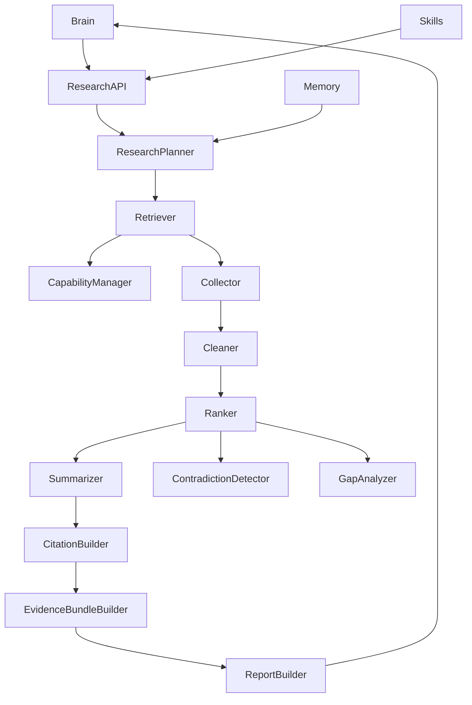
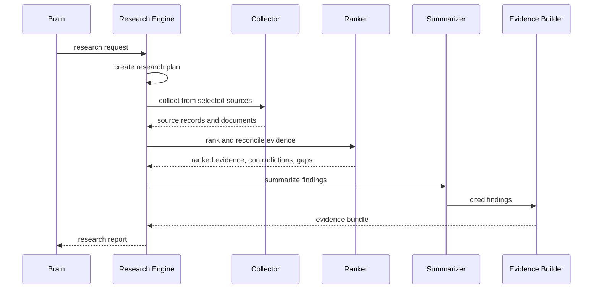

# Purpose

Define Research Engine v2 as the Deep Research-like pipeline that gathers, cleans, ranks, reconciles, cites, and packages evidence from multiple sources. It produces structured research reports for Brain or Skills and does not answer the user directly.

# Responsibilities

- Plan multi-source research for complex, current, or attribution-sensitive tasks.
- Retrieve information through approved providers and capabilities.
- Collect, clean, deduplicate, rank, summarize, and cite sources.
- Assess source freshness, authority, coverage, contradictions, and gaps.
- Build evidence bundles and final structured reports.
- Integrate with Memory for relevant prior knowledge and post-task storage candidates.
- Preserve provenance for every claim and source.

Research Engine must not respond to the user directly. It returns `ResearchReport` to Brain or a Skill.

# Public API

- `Research.plan(research_request) -> ResearchPlan`
- `Research.run(research_plan) -> ResearchReport`
- `Research.collect(source_plan) -> CollectionResult`
- `Research.evidence(report_id) -> EvidenceBundle`
- `Research.health() -> ResearchHealth`

# Internal Architecture

Research Engine v2 contains Retriever, Collector, Cleaner, Ranker, Summarizer, Citation Builder, Contradiction Detector, Gap Analyzer, Evidence Bundle Builder, and Report Builder. It uses Capability Manager to resolve source access providers and Memory API for scoped memory retrieval.

Supported sources:

- Web Search
- Browser
- GitHub
- Hugging Face
- Wikipedia
- Workspace
- Memory
- local documents

# Data Structures

- `ResearchRequest`: topic, questions, constraints, freshness requirements, source preferences, citation policy, scope, and budget.
- `ResearchPlan`: queries, source plan, freshness windows, authority rules, collection budget, ranking strategy, and report contract.
- `SourceRecord`: source id, type, title, author, URL or file ref, published time, retrieved time, license notes, and authority signals.
- `CleanDocument`: source record, normalized text, extracted metadata, content chunks, language, and quality flags.
- `EvidenceItem`: claim, supporting chunks, source refs, confidence, freshness, authority score, and contradiction refs.
- `EvidenceBundle`: report id, evidence items, source records, citations, contradictions, gaps, and provenance graph.
- `ResearchReport`: summary, findings, evidence bundle ref, citations, contradictions, gaps, confidence, freshness report, and memory candidates.

# Component Diagram

# Sequence Diagram

# Lifecycle

Research starts when Brain, Skill, or Knowledge Engine requests a structured investigation. It plans source coverage, resolves capabilities, collects documents, cleans content, ranks evidence, identifies contradictions and gaps, builds citations, produces a report, and returns it to the caller. Long-running research tasks checkpoint intermediate evidence through Task System.

# Extension Points

- New source providers may be added through Capability Manager and provider descriptors.
- Domain rankers may prioritize academic papers, official docs, repositories, package registries, or local documents.
- Citation styles may be extended without changing evidence storage.
- Memory integration may add domain-specific recall and storage policies.
- Report builders may target briefings, comparison tables, implementation notes, or audit packets.

# Failure Handling

Provider failures must be isolated and reflected in the freshness and gap reports. Contradictory sources must be surfaced instead of silently collapsed. Stale sources may be used only when labeled. Missing authority or date metadata reduces confidence. If evidence is insufficient, Research Engine returns a report with gaps rather than fabricating conclusions.

# Future Development

Future versions should support research notebooks, recurring monitors, source reputation learning, document change tracking, collaborative research agents, signed evidence bundles, and reproducible research runs.

# Coding Rules

- Research Engine does not answer users directly.
- Every finding must trace to evidence or be labeled as inference.
- External sources must retain provenance and retrieval time.
- Provider credentials must never enter report text or prompts.
- Memory writes are candidates only; durable writes go through Memory policy.
- Research must use Capability Manager for source access.
