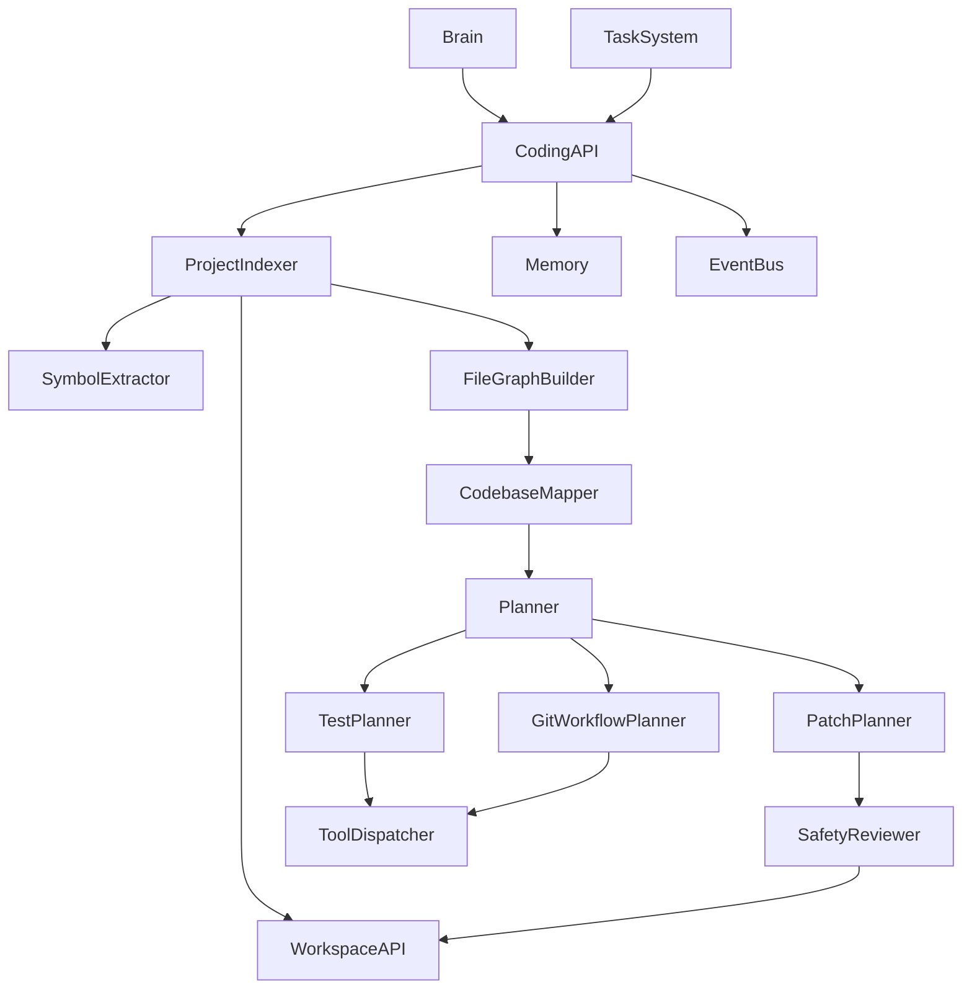
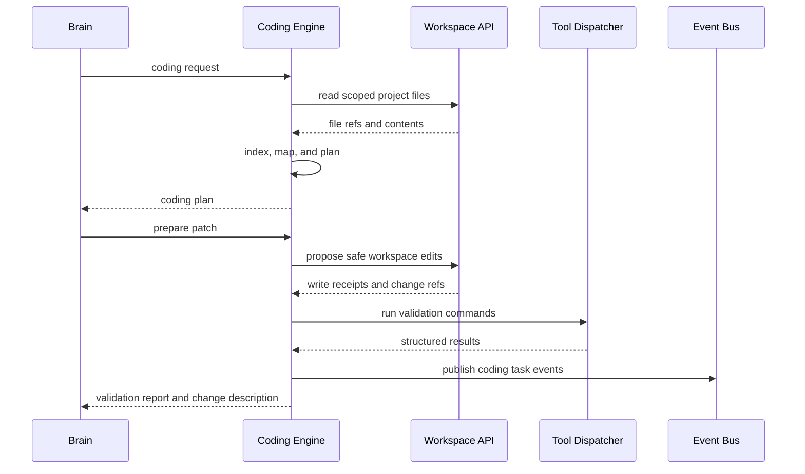

# Purpose

Define Coding Engine v2 as a full coding co-worker that understands projects, plans implementation work, proposes patches, validates changes, and coordinates safe edits through Workspace API and Tool Dispatcher.

# Responsibilities

- Build and maintain project indexes, codebase maps, file graphs, and symbol indexes.
- Understand tests, lint rules, build commands, project conventions, and architectural boundaries.
- Plan coding tasks with risk assessment, checkpoints, rollback notes, and validation steps.
- Generate patch plans, commit message drafts, and PR descriptions.
- Coordinate safe file edits, test execution, lint execution, and git workflow.
- Integrate with Workspace, Git, Tool Dispatcher, Memory, Events, Task System, and Capability Manager.
- Preserve existing APIs unless the accepted plan explicitly changes them.

Coding Engine must not directly change files. All writes, moves, deletes, test execution, lint execution, and git operations go through Workspace API and Tool Dispatcher.

# Public API

- `Coding.index(workspace_ref) -> CodebaseIndexReport`
- `Coding.map(workspace_ref, scope) -> CodebaseMap`
- `Coding.plan(coding_request) -> CodingPlan`
- `Coding.prepare_patch(coding_plan) -> PatchProposal`
- `Coding.validate(validation_plan) -> ValidationReport`
- `Coding.describe_change(change_set) -> ChangeDescription`
- `Coding.rollback(rollback_ref) -> RollbackPlan`

# Internal Architecture

Coding Engine v2 contains Project Indexer, Codebase Mapper, File Graph Builder, Symbol Extractor, Dependency Analyzer, Convention Detector, Test Planner, Lint Planner, Git Workflow Planner, Patch Planner, Safety Reviewer, Rollback Planner, and Change Describer. It delegates file access to Workspace and side effects to Tool Dispatcher.

# Data Structures

- `CodebaseIndex`: workspace ref, indexed files, symbols, dependencies, tests, build metadata, language metadata, freshness, and diagnostics.
- `CodebaseMap`: modules, ownership boundaries, public APIs, file graph, dependency graph, test graph, and risk hotspots.
- `SymbolRecord`: symbol id, name, kind, file ref, range, exports, references, and visibility.
- `CodingRequest`: goal, workspace scope, constraints, public API policy, test expectations, risk tolerance, and user instructions.
- `CodingPlan`: steps, affected files, required capabilities, validation plan, rollback notes, and approval checkpoints.
- `PatchProposal`: change set, file operations, rationale, expected behavior, risks, and validation requirements.
- `ValidationReport`: commands, results, failures, coverage notes, lint notes, compile status, and residual risk.
- `GitWorkflowPlan`: branch policy, diff summary, commit message draft, PR description draft, and review notes.

# Component Diagram

# Sequence Diagram

# Lifecycle

Coding work starts with workspace discovery and project indexing. The engine builds a codebase map, creates a plan, prepares a patch proposal, routes edits through Workspace, validates through Tool Dispatcher, updates Memory candidates, emits events, and returns a change description. Rollback plans are created before risky edits and remain available until the task is archived.

# Extension Points

- Language analyzers may add symbol extraction for new languages.
- Framework adapters may add test, lint, build, and migration conventions.
- Git providers may support local git, hosted PRs, and code review systems.
- Safety policies may add stricter rules for generated files, migrations, secrets, or destructive edits.
- Memory hooks may provide project preferences and prior architectural decisions.

# Failure Handling

Indexing failures produce partial maps with diagnostics. Unsafe edits are blocked before Workspace writes. Validation failures return structured results and suggested next steps. Tool failures are isolated by Tool Dispatcher. Git conflicts require an explicit recovery plan. Rollback must use recorded change refs and go through Workspace API, never direct filesystem mutation.

# Future Development

Future versions should support incremental semantic indexes, multi-agent review, formal API compatibility checks, generated test synthesis, patch simulation, automated PR review response, cross-repository changes, and distributed coding workers.

# Coding Rules

- Coding Engine must not directly modify files.
- All file changes go through Workspace API.
- All command execution and git operations go through Tool Dispatcher.
- Existing public APIs must not be broken without an explicit accepted plan.
- Plans must include validation and rollback notes for non-trivial changes.
- Indexes must retain freshness metadata.
- Generated commit messages and PR descriptions are drafts until user or policy approval.
