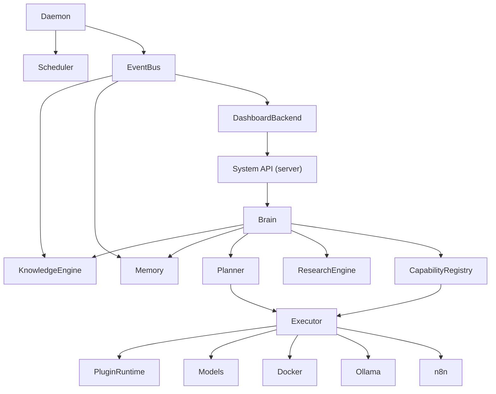
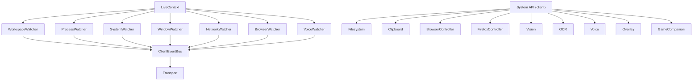
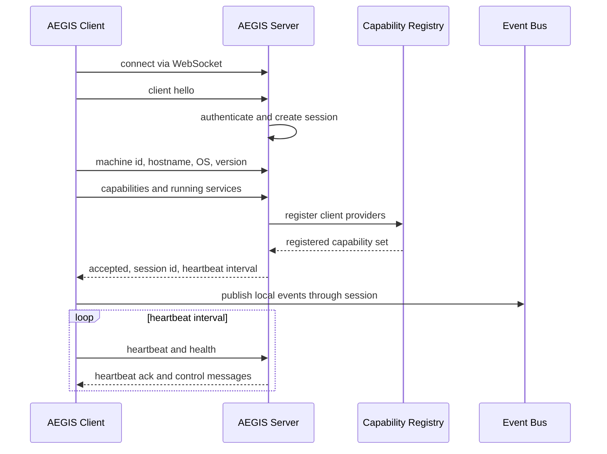
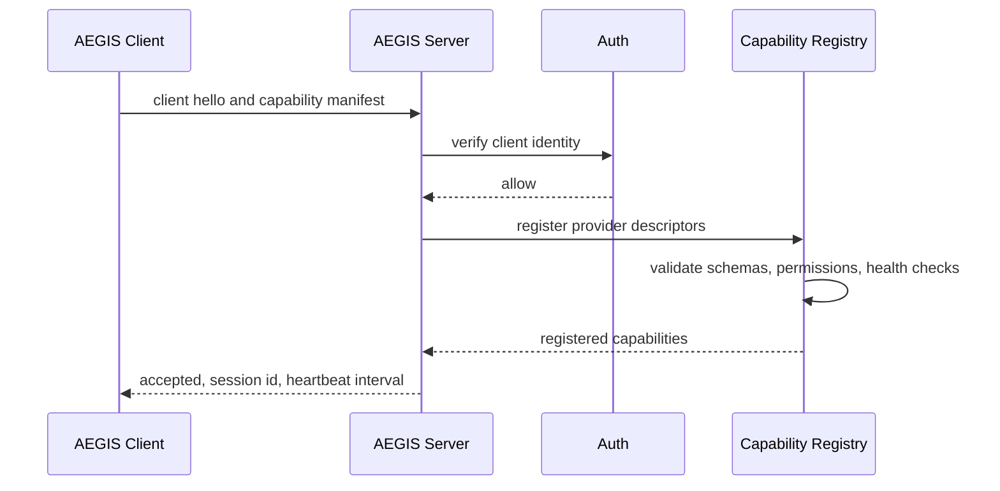
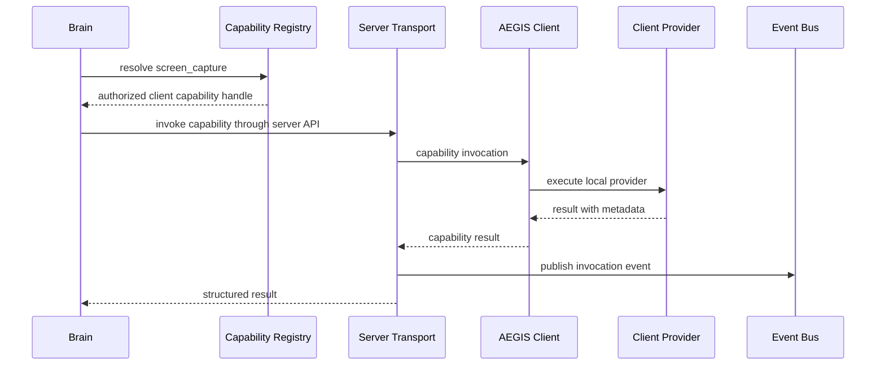

# Purpose

Define the Server/Client architecture for AEGIS as a distributed system where reasoning, planning, memory, orchestration, and AI execution live on AEGIS Server, while the Windows client exposes local environment capabilities, live context, and user-facing integrations.

AEGIS Client never contains Brain. Brain exists only on AEGIS Server.

# Motivation

AEGIS needs a clean boundary between centralized intelligence and local device integration. The server owns long-lived reasoning, knowledge, memory, planning, execution policy, model orchestration, scheduling, plugin runtime, and dashboard backend. The client owns local observation and control surfaces that cannot be reliably or safely hosted on the server, such as workspace files, clipboard, screen capture, browser control, voice, OCR, overlay, and Windows-specific APIs.

This split allows AEGIS to grow from a local assistant into a distributed AI platform without duplicating Brain across machines or creating circular dependencies between context watchers and reasoning systems.

# Responsibilities

AEGIS Server is responsible for:

- Hosting Brain as the only reasoning authority.
- Maintaining Knowledge Engine, Research Engine, Memory, Planner, Executor, Daemon, Scheduler, Event Bus, Plugin Runtime, Capability Registry, Models, Docker, Ollama, n8n, System API, and Dashboard backend.
- Accepting authenticated client sessions.
- Registering client capabilities and service health.
- Resolving capability requests through Capability Registry.
- Receiving normalized context, events, and capability results from clients.
- Coordinating distributed task execution without exposing Brain to clients.

AEGIS Client is responsible for:

- Managing Workspace, Filesystem, Clipboard, Browser Controller, Firefox Controller, Vision, OCR, Voice, Overlay, Game Companion, System API, Live Context, and Watchers.
- Observing local environment state and publishing normalized events.
- Exposing authorized capabilities to the server.
- Executing server-approved capability calls within local permission boundaries.
- Maintaining heartbeat, reconnect, and session state.

Client watchers never call Brain directly. They publish events through the client Event Bus or transport layer.

# Components

## AEGIS Server

- Brain
- Knowledge Engine
- Research Engine
- Memory
- Planner
- Executor
- Daemon
- Scheduler
- Event Bus
- Plugin Runtime
- Capability Registry
- Models
- Docker
- Ollama
- n8n
- System API (server)
- Dashboard backend

## AEGIS Client

- Workspace
- Filesystem
- Clipboard
- Browser Controller
- Firefox Controller
- Vision
- OCR
- Voice
- Overlay
- Game Companion
- System API (client)
- Live Context
- Watchers

## Server Diagram

## Client Diagram

# Public API

Server public API:

- `Server.connect(client_hello) -> ConnectResult`
- `Server.register_capabilities(session_id, capabilities) -> CapabilityRegistrationResult`
- `Server.heartbeat(session_id, status) -> HeartbeatResult`
- `Server.publish_event(session_id, event) -> EventReceipt`
- `Server.request_capability(session_id, capability_request) -> CapabilityInvocation`
- `Server.close_session(session_id, reason) -> SessionCloseReceipt`

Client public API:

- `Client.start(config) -> ClientHandle`
- `Client.connect(server_ref) -> ConnectResult`
- `Client.capabilities() -> ClientCapabilityManifest`
- `Client.health() -> ClientHealth`
- `Client.invoke(invocation) -> CapabilityResult`
- `Client.publish(event) -> EventReceipt`
- `Client.stop(reason) -> ClientStopReport`

# Communication

AEGIS Server and AEGIS Client communicate through:

- WebSocket for long-lived bidirectional sessions, event streams, capability invocation, heartbeat, and reconnect.
- REST API for bootstrapping, health checks, downloads, diagnostics, and explicit request/response operations.
- Event Bus semantics for normalized event envelopes across the transport boundary.
- Heartbeat for liveness, latency, service health, and degraded state.
- Reconnect for transient network loss, server restart, client restart, and session recovery.
- Capability Exchange during connection and whenever local services change.

## Connection Diagram

# Authentication

Client connections must authenticate before capability registration. Authentication should support local development tokens first and later signed device identity.

Authentication requirements:

- Each client has a stable Machine ID.
- Each session receives a server-issued session id.
- Client identity, hostname, OS, version, and service list are recorded with session metadata.
- Capability invocation requires an authenticated session and authorization check.
- Session tokens must be revocable.
- Secrets must not be published through events, context snapshots, or capability manifests.

# Capability Exchange

After connection, the client sends:

- Machine ID
- Hostname
- OS
- Version
- Capabilities
- Running services

Example client capabilities:

- `filesystem`
- `workspace`
- `screen_capture`
- `ocr`
- `voice`
- `browser`
- `firefox`
- `clipboard`
- `game_overlay`
- `windows_api`

Server response:

- `accepted`
- `session_id`
- `heartbeat_interval`
- `registered_capabilities`

## Capability Registration Diagram

# Lifecycle

Server lifecycle:

- Start Daemon, Event Bus, Capability Registry, Memory, Knowledge Engine, Research Engine, Planner, Executor, model services, System API, and Dashboard backend.
- Accept authenticated client sessions.
- Register and monitor client capability providers.
- Route Brain requests through Capability Registry instead of direct client calls.
- Retire session capabilities when a client disconnects or becomes unhealthy.

Client lifecycle:

- Start local System API, Live Context, watchers, and capability providers.
- Connect to AEGIS Server.
- Send client hello, machine metadata, capability manifest, and running service list.
- Receive session id, heartbeat interval, and registered capability set.
- Publish watcher events and respond to authorized capability invocations.
- Reconnect with previous session metadata when possible.
- Stop watchers and revoke local capability handles during shutdown.

# Failure Handling

- Client disconnect marks its capabilities degraded or unavailable in Capability Registry.
- Heartbeat timeout closes the active session after the configured grace period.
- Reconnect attempts use exponential backoff and include last known session id.
- Watcher failure degrades only the affected local observation domain.
- Capability invocation timeout returns structured failure to the server caller.
- Event delivery failures are retried where safe and summarized in session diagnostics.
- Server restart requires clients to re-authenticate and re-register capabilities.
- Client restart requires the server to expire stale provider handles.

# Security

- Brain never runs on the client.
- Watchers never call Brain directly.
- Client capabilities are least-privilege providers, not trusted reasoning modules.
- Server must authorize every capability invocation.
- Sensitive local data must be classified before storage or transmission.
- Clipboard, screen capture, OCR, voice, browser, and filesystem capabilities require explicit permission policy.
- Capability manifests must describe side effects, permissions, schemas, and health checks.
- Events must carry source, timestamp, trace id, schema version, and sensitivity metadata.
- Client-side secrets must never be sent as context unless explicitly authorized by policy.
- Dashboard views must distinguish server-owned state from client-reported state.

# Request Flow

Brain receives knowledge through Knowledge Engine, Memory, Context Store, and Capability Registry. It does not consume raw watcher calls and does not connect directly to client internals.

# Watcher Architecture

Client watchers include:

- `WorkspaceWatcher`
- `ProcessWatcher`
- `SystemWatcher`
- `WindowWatcher`
- `NetworkWatcher`
- `BrowserWatcher`
- `VoiceWatcher`

All watchers publish events. They never call Brain directly.

Watcher events may update Live Context, Context Store, Knowledge Engine ingestion pipelines, Dashboard backend, and Capability Registry health. Brain receives only mediated inputs from:

- Knowledge
- Memory
- Context Store
- Capability Registry

# Migration Plan

## Stage 1: Current Local Architecture

AEGIS runs primarily on one machine. Brain, local tools, workspace access, context collection, and execution live in the same local runtime. The immediate goal is to identify implicit boundaries and ensure local modules already communicate through public APIs where possible.

Required direction:

- Keep existing public APIs stable.
- Route new context observation through Live Context and Event Bus.
- Avoid direct Brain calls from watchers or providers.
- Prepare capability descriptors for local services.

## Stage 2: Hybrid

AEGIS Server starts to own Brain, Memory, Knowledge Engine, Planner, Executor, Capability Registry, and Dashboard backend. AEGIS Client continues to run local workspace, filesystem, browser, clipboard, OCR, voice, overlay, and watchers.

Required direction:

- Add authenticated client sessions.
- Add WebSocket event transport and heartbeat.
- Register Windows client capabilities in server Capability Registry.
- Preserve local fallback for development where policy allows.

## Stage 3: Server-first

Server becomes the default authority for reasoning, task planning, memory, research, model orchestration, and plugin runtime. Clients become capability providers and live context publishers.

Required direction:

- Remove Brain from client distributions.
- Make server Capability Registry the source of truth.
- Route all client side effects through authorized capability invocations.
- Move dashboard status aggregation to the server backend.

## Stage 4: Distributed AI Platform

AEGIS supports multiple clients, remote workers, specialized capability nodes, shared event streams, distributed scheduling, and policy-driven capability routing.

Required direction:

- Support multi-client sessions and per-device capability health.
- Add signed device identity and provider attestations.
- Support distributed context stores and replayable event logs.
- Add policy-aware routing by locality, latency, permission, cost, and trust.

# Future Development

Future versions should support multi-device context synchronization, signed capability attestations, distributed model workers, remote browser nodes, per-device privacy policies, cross-client task handoff, offline client queues, event replay, server-side capability simulation, and a unified Dashboard for server and client topology.
