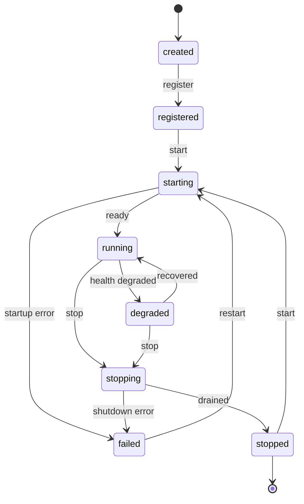
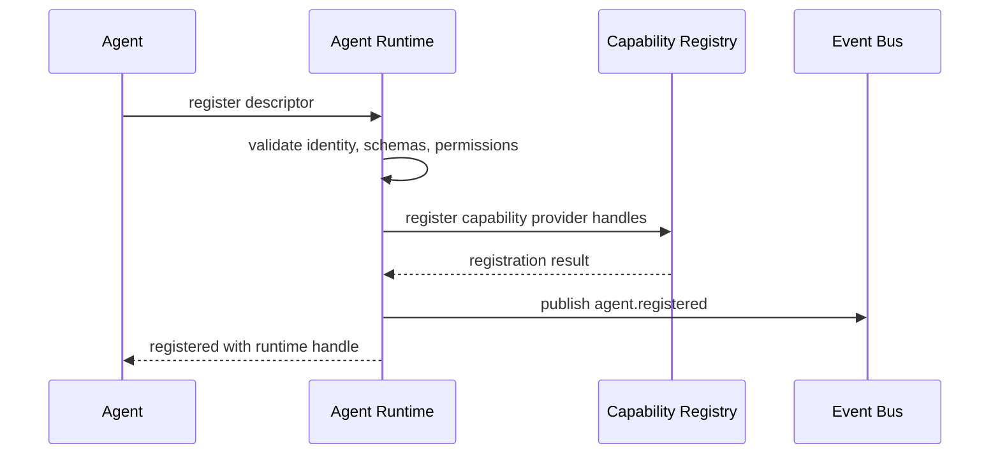
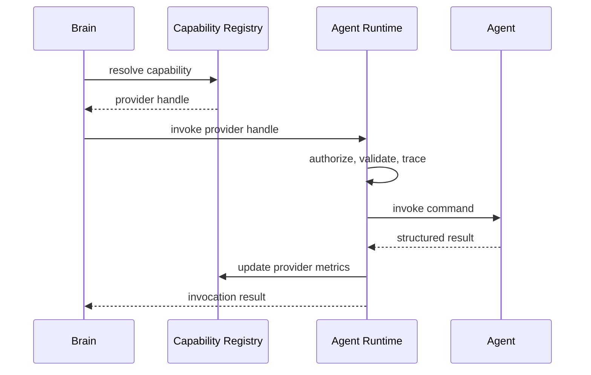
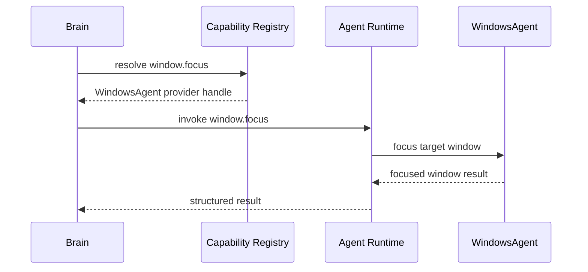
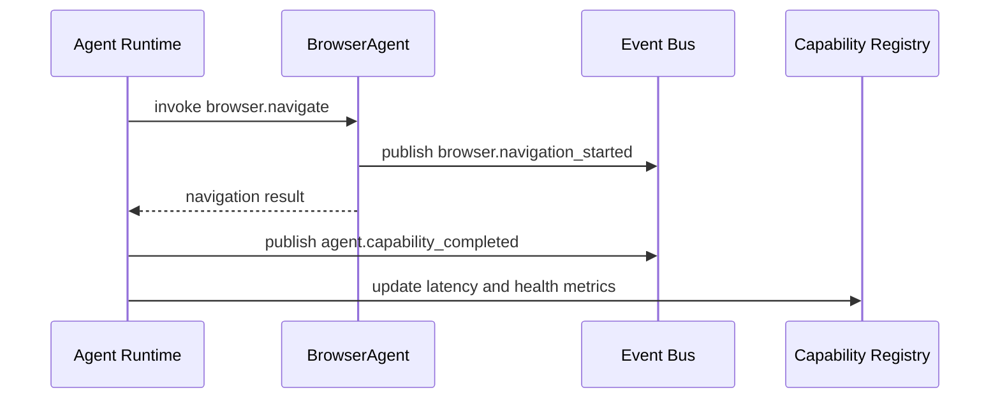
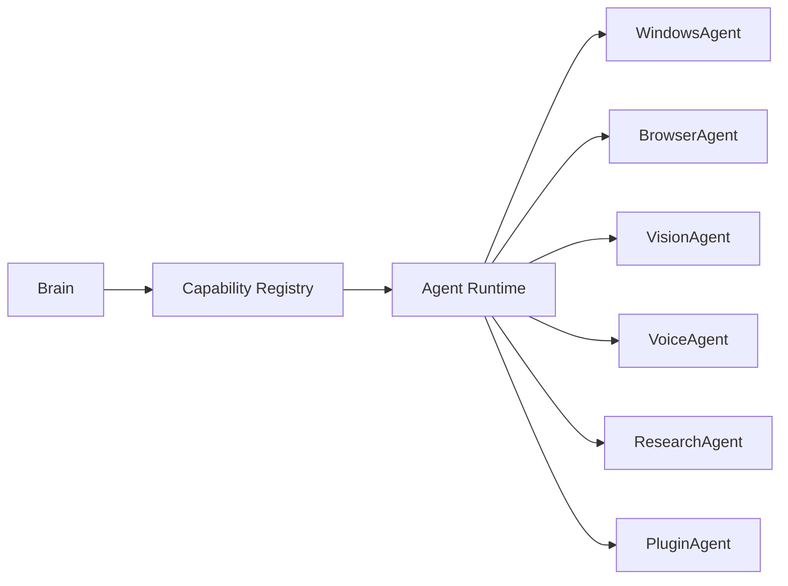

# Purpose

Define Agent Runtime as the standard execution layer for AEGIS capabilities. An Agent is the standard unit of execution in AEGIS. It exposes one or more capabilities, reports health, receives authorized commands, publishes events, and returns structured results.

Agent never contains Brain. Agent executes commands. Brain makes decisions.

# Motivation

AEGIS needs a stable way to run local, remote, plugin, browser, vision, voice, research, and operating system capabilities without coupling those execution surfaces to reasoning. The Server/Client architecture already separates Brain from local device integration. Agent Runtime makes that separation explicit by defining a common lifecycle, registration model, health contract, event model, and invocation API for all executable capability providers.

This allows AEGIS to add new execution surfaces without creating circular dependencies between Brain, Capability Registry, plugins, Live Context, and client services. Brain resolves intent through Capability Registry. Capability Registry selects an Agent. Agent Runtime starts, monitors, invokes, and stops Agents.

# Agent Model

An Agent is a managed execution unit with identity, capabilities, lifecycle state, health state, metadata, and a public invocation surface.

Every Agent has:

- `id`
- `name`
- `version`
- `machine_id`
- `capabilities`
- `status`
- `health`
- `metadata`

Agent fields:

- `id`: Stable runtime identity for one Agent instance.
- `name`: Human-readable and registry-visible Agent name.
- `version`: Agent implementation version.
- `machine_id`: Machine or node where the Agent is running.
- `capabilities`: Versioned capability descriptors exposed by the Agent.
- `status`: Current lifecycle status.
- `health`: Current health report and readiness metadata.
- `metadata`: Non-authoritative descriptive data such as provider, runtime type, OS, process id, endpoint, labels, and policy tags.

Agents are not planners, reasoners, or autonomous decision makers. They may validate inputs, enforce local policy, transform data, and execute commands, but they must not decide user goals or task strategy.

Agent types include:

- `WindowsAgent`: Exposes Windows-specific capabilities such as process control, window management, filesystem operations, clipboard, notifications, and OS integration.
- `BrowserAgent`: Exposes browser automation, tab control, navigation, DOM inspection, screenshots, downloads, and browser events.
- `VisionAgent`: Exposes screenshot analysis, OCR, image understanding, visual grounding, and screen region detection.
- `VoiceAgent`: Exposes speech input, transcription, text-to-speech, audio device status, and voice session events.
- `ResearchAgent`: Exposes web research, source collection, retrieval, summarization, citation metadata, and freshness checks.
- `PluginAgent`: Exposes capabilities implemented by installed plugins through the same lifecycle, health, and invocation model as built-in Agents.

# Agent Lifecycle

Agent lifecycle states:

- `created`
- `registered`
- `starting`
- `running`
- `degraded`
- `stopping`
- `stopped`
- `failed`

Lifecycle rules:

- `created`: Agent descriptor exists but is not registered with Agent Runtime.
- `registered`: Agent is known to Agent Runtime and may be advertised to Capability Registry.
- `starting`: Agent Runtime is starting the Agent and validating readiness.
- `running`: Agent is ready to accept authorized invocations.
- `degraded`: Agent is partially available, unhealthy, overloaded, missing a dependency, or serving reduced capability.
- `stopping`: Agent Runtime is draining invocations and shutting the Agent down.
- `stopped`: Agent is intentionally stopped and must not accept invocations.
- `failed`: Agent stopped unexpectedly or cannot satisfy its minimum health contract.

# Agent Registration

Agent registration publishes Agent identity, machine location, capabilities, permissions, event schemas, health checks, and invocation endpoints to Agent Runtime. Agent Runtime validates the descriptor and registers provider handles in Capability Registry.

Registration must not imply authorization to invoke. It only makes capabilities discoverable. Authorization is checked for each invocation.

Registration descriptor includes:

- Agent identity: `id`, `name`, `version`, `machine_id`
- Runtime metadata: process, endpoint, transport, labels, and owner
- Capability descriptors: capability id, version, input schema, output schema, side effects, permissions, timeout, and sensitivity
- Health contract: readiness check, liveness check, dependency checks, and heartbeat interval
- Event contract: event types, schema versions, source id, and sensitivity metadata

# Capability Provider

An Agent is a Capability Provider when it exposes one or more callable capabilities through Agent Runtime. Capability Registry does not call Agent internals directly. It resolves capability requests to provider handles and routes invocation through the runtime boundary.

Capability descriptors must define:

- `capability_id`
- `version`
- `agent_id`
- `machine_id`
- input schema
- output schema
- required permissions
- side effects
- timeout policy
- retry policy
- health requirements
- sensitivity classification

Capability Provider rules:

- Providers execute commands only after authorization.
- Providers return structured results, errors, and trace metadata.
- Providers must not mutate Brain, Memory, Planner, or Knowledge Engine directly.
- Providers may publish events through Agent Runtime.
- Providers may subscribe to authorized event streams needed for execution.
- Providers must fail closed when permission, schema validation, or health checks fail.

# Service Runtime

Service Runtime owns the operational execution of Agents. It starts Agents, tracks lifecycle state, supervises health, drains work during shutdown, and reports availability to Capability Registry.

Responsibilities:

- Load Agent descriptors.
- Register Agents with Agent Runtime.
- Start and stop Agents in dependency order.
- Maintain invocation queues and concurrency limits.
- Route events between Agents and Event Bus.
- Enforce timeout, retry, cancellation, and backpressure policy.
- Update Capability Registry when Agent health or status changes.
- Preserve API stability across Agent implementation changes.

Service Runtime may run on AEGIS Server, AEGIS Client, or a specialized worker node. The same Agent contract applies in all placements.

# Event Model

Agents publish normalized events through Agent Runtime. They do not send ad hoc messages directly to Brain.

Agent events include:

- `agent.created`
- `agent.registered`
- `agent.starting`
- `agent.running`
- `agent.degraded`
- `agent.stopping`
- `agent.stopped`
- `agent.failed`
- `agent.health_changed`
- `agent.capability_registered`
- `agent.capability_invoked`
- `agent.capability_completed`
- `agent.capability_failed`

Event envelope fields:

- `event_type`
- `schema_version`
- `agent_id`
- `machine_id`
- `capability_id`
- `timestamp`
- `trace_id`
- `causality_refs`
- `payload`
- `sensitivity`

Events are observable by Live Context, Capability Registry, Dashboard backend, Memory ingestion, and operational monitoring according to policy. Brain consumes mediated state through Knowledge, Memory, Context Store, and Capability Registry, not direct Agent event streams.

# Health Monitoring

Agent health reports liveness, readiness, dependency state, error rate, latency, queue depth, resource usage, and degraded reasons.

Health states:

- `healthy`
- `degraded`
- `unhealthy`
- `unknown`

Health checks include:

- Liveness: Agent process or endpoint is reachable.
- Readiness: Agent can accept new invocations.
- Capability readiness: Individual capabilities are available.
- Dependency status: Required services, devices, credentials, or network access are available.
- Performance status: Latency, queue depth, timeout rate, and resource use remain within policy.

Health changes must update Agent status and Capability Registry availability. A degraded Agent may keep serving capabilities that remain healthy. An unhealthy Agent must not receive new invocations unless an explicit recovery policy allows diagnostic calls.

# Failure Recovery

Agent Runtime handles failures without escalating them into Brain ownership. Brain may choose a new strategy after receiving a structured failure, but runtime recovery remains operational.

Failure recovery rules:

- Startup failure moves Agent to `failed` and publishes `agent.failed`.
- Invocation failure returns structured error data and publishes `agent.capability_failed`.
- Timeout cancels or marks the invocation according to capability policy.
- Dependency loss moves affected capabilities or the whole Agent to `degraded`.
- Unexpected process exit moves Agent to `failed` and triggers restart policy if configured.
- Reconnect restores Agent registration when `machine_id`, `agent_id`, and version policy allow it.
- Capability Registry retires provider handles when Agent is stopped, failed, disconnected, or unhealthy beyond grace period.

Recovery policies may include restart, exponential backoff, circuit breaker, queue draining, fallback provider selection, degraded mode, and manual intervention.

# Public API

Agent public API:

- `start() -> AgentStartResult`
- `stop(reason) -> AgentStopReport`
- `health() -> AgentHealth`
- `capabilities() -> AgentCapabilityManifest`
- `invoke(invocation) -> AgentInvocationResult`
- `publish(event) -> EventReceipt`
- `subscribe(event_filter, handler_ref) -> Subscription`

API rules:

- `start()` transitions an Agent from `registered` or `stopped` to `starting`, then `running` or `failed`.
- `stop()` drains active work when possible, unregisters or marks provider handles unavailable, and transitions to `stopped` or `failed`.
- `health()` returns current health, dependency status, readiness, and degraded reasons.
- `capabilities()` returns the current capability manifest and per-capability health.
- `invoke()` executes an authorized command and returns a structured result.
- `publish()` emits a normalized event through Agent Runtime.
- `subscribe()` attaches the Agent to authorized event streams.

Brain-facing flow:

# Examples

Windows command execution:

Agent invocation with event publication:

Brain to Agent through registry:

Example Agent manifests:

- `WindowsAgent`: `windows.process.list`, `windows.window.focus`, `clipboard.read`, `clipboard.write`, `filesystem.open`.
- `BrowserAgent`: `browser.navigate`, `browser.click`, `browser.type`, `browser.screenshot`, `browser.dom.query`.
- `VisionAgent`: `vision.ocr`, `vision.describe_image`, `vision.locate_element`, `screen.region_detect`.
- `VoiceAgent`: `voice.transcribe`, `voice.speak`, `voice.device_status`, `voice.session_start`.
- `ResearchAgent`: `research.search`, `research.fetch_source`, `research.summarize`, `research.verify_freshness`.
- `PluginAgent`: Plugin-defined capabilities with versioned schemas, permissions, and health contracts.

# Future Development

Future versions should support distributed Agent placement, signed Agent identity, provider attestation, remote worker pools, per-capability sandboxing, capability simulation, policy-aware routing by latency and locality, replayable invocation logs, richer dependency graphs, hot Agent upgrades, cross-machine failover, and dashboard topology views for Agent health and capability coverage.

