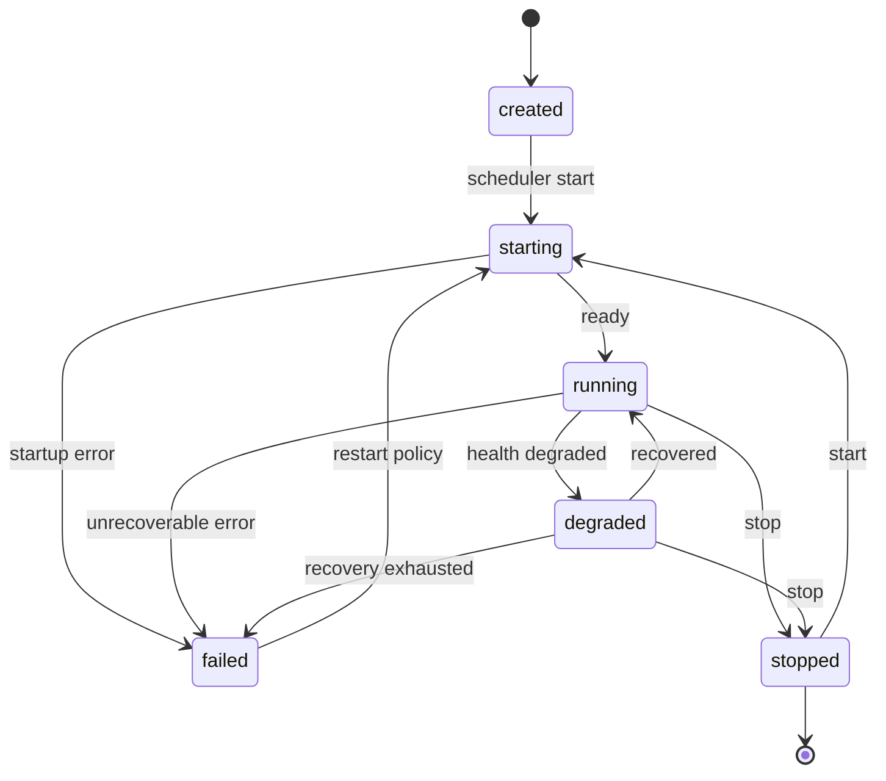
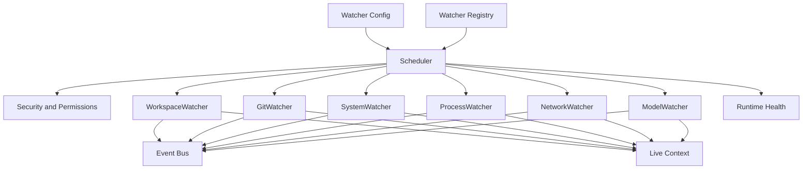
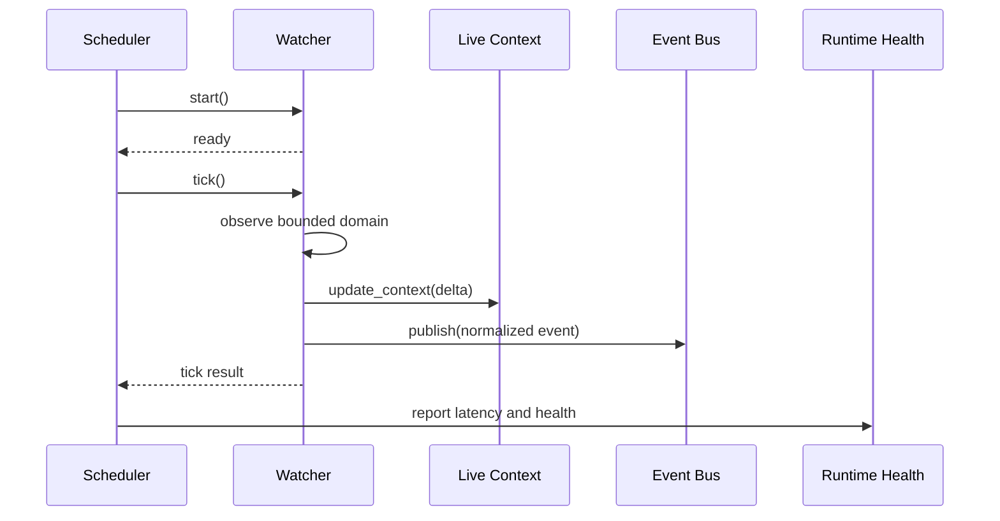
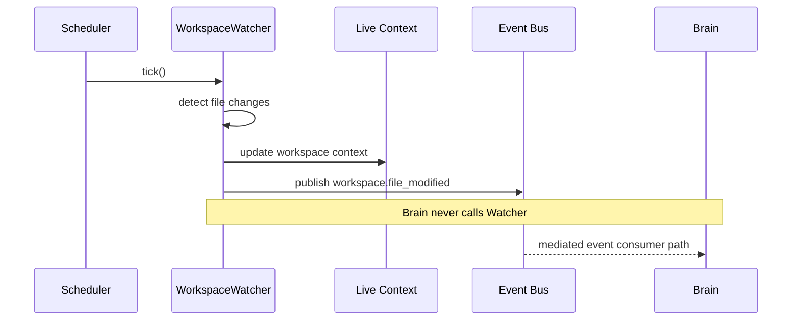
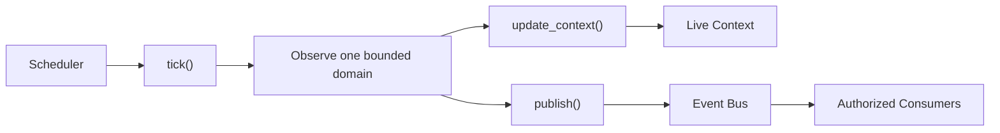

# Purpose

Define the Watcher Framework as the standard observation layer for AEGIS. A Watcher observes one bounded domain, converts detected changes into normalized events, updates Live Context through approved context APIs, and reports health to the runtime.

Watchers are passive observers. They do not plan, reason, execute user goals, or directly invoke Brain.

# Motivation

AEGIS needs continuous awareness of workspace, process, system, browser, model, network, and task state without turning observation code into autonomous control loops. A common Watcher Framework keeps environmental sensing modular, testable, schedulable, and safe to extend through built-in modules or plugins.

The framework exists to prevent ad hoc background loops, circular dependencies, and direct component coupling. Brain never calls a Watcher. A Watcher never calls Brain. Communication happens only through the Event Bus and Live Context APIs.

# BaseWatcher

`BaseWatcher` is the common contract for all Watcher implementations. It defines identity, scheduling metadata, lifecycle behavior, event publication, context updates, and health reporting.

Watcher API:

- `id`
- `name`
- `interval`
- `enabled`
- `start()`
- `stop()`
- `tick()`
- `publish()`
- `update_context()`
- `health()`

Watcher fields:

- `id`: Stable runtime identity for this Watcher instance.
- `name`: Human-readable Watcher name used in diagnostics, dashboards, and logs.
- `interval`: Scheduler-owned cadence for calling `tick()`.
- `enabled`: Configuration flag that determines whether the Scheduler may run the Watcher.

Watcher methods:

- `start()`: Prepare resources, validate permissions, and transition toward `running`.
- `stop()`: Release resources and transition to `stopped`.
- `tick()`: Perform one bounded observation pass. It must return promptly and must not contain an internal infinite loop.
- `publish()`: Publish normalized events through the Event Bus.
- `update_context()`: Update Live Context with snapshots, deltas, freshness metadata, and provenance.
- `health()`: Return liveness, readiness, degradation reason, error count, last successful tick, and last publication state.

BaseWatcher must not import Brain, Planner, Executor, Prompt Compiler, or model-facing orchestration internals. It may depend on public Event Bus, Scheduler, Security, Runtime health, and Live Context interfaces.

# Lifecycle

Watcher lifecycle states:

- `created`
- `starting`
- `running`
- `degraded`
- `stopped`
- `failed`

Lifecycle rules:

- `created`: Watcher descriptor exists but the Watcher has not been started.
- `starting`: Scheduler is preparing the Watcher and calling `start()`.
- `running`: Watcher is healthy enough for scheduled `tick()` execution.
- `degraded`: Watcher is partially available, delayed, permission-limited, overloaded, or experiencing recoverable errors.
- `stopped`: Watcher was intentionally stopped and must not receive scheduled ticks.
- `failed`: Watcher cannot satisfy its minimum health contract and must not receive normal ticks until recovery policy restarts it.

# Scheduler Integration

All Watchers run only through Scheduler.

No Watcher may own a `while True` loop, sleep loop, timer thread, recursive self-scheduling callback, or hidden background loop. The Scheduler owns cadence, jitter, concurrency, timeout, retry, cancellation, backpressure, and shutdown ordering.

Scheduler responsibilities:

- Load enabled Watcher descriptors.
- Validate Watcher permissions and intervals.
- Call `start()` when a Watcher becomes active.
- Call `tick()` according to the configured interval and policy.
- Enforce timeouts and prevent overlapping ticks unless explicitly allowed by policy.
- Track latency, missed ticks, error rate, and backpressure.
- Move Watchers between lifecycle states based on health and execution results.
- Call `stop()` during shutdown or disablement.

# Event Publication

Watchers publish typed events to the Event Bus. They must not send direct messages to Brain, Planner, Executor, Memory internals, or UI components.

Event envelope fields:

- `event_type`
- `schema_version`
- `watcher_id`
- `timestamp`
- `trace_id`
- `causality_refs`
- `scope`
- `payload`
- `sensitivity`
- `freshness`

Publication rules:

- Events must be normalized and versioned.
- Events must include watcher provenance.
- Sensitive payloads must pass security classification before publication.
- Duplicate or noisy events should be debounced by Scheduler or Watcher policy.
- Publication failure must be reported through Watcher health and retried according to Event Bus policy.
- Brain may observe downstream state produced from Event Bus consumers, but Brain never calls Watchers directly.

# Live Context

Watchers update Live Context with current environmental state, snapshots, and deltas. Live Context is the queryable state layer; Watchers are only the observation inputs.

Context update rules:

- `update_context()` writes through Live Context APIs only.
- Updates must include scope, source Watcher, timestamp, freshness, and sensitivity.
- Watchers may replace stale state for their own domain but must not mutate unrelated context domains.
- Context Builder, Brain, Dashboard, Memory ingestion, and monitoring read mediated state from Live Context or events, not Watcher internals.
- If a Watcher is degraded or failed, Live Context may keep serving stale data with explicit freshness metadata.

# Error Handling

Watcher errors must be contained to the failing Watcher whenever possible. A failed Watcher must not take down Brain, Scheduler, Event Bus, or Live Context.

Error handling rules:

- Startup errors move the Watcher to `failed` and publish a lifecycle event when possible.
- Tick errors increment error counters and may move the Watcher to `degraded`.
- Timeout errors are controlled by Scheduler policy.
- Permission errors disable or degrade the affected observation scope.
- Event publication errors are retried according to Event Bus policy.
- Context update errors are reported in health and may preserve the previous context snapshot.
- Repeated failures may trigger restart, backoff, circuit breaker, or manual intervention policy.

Health states:

- `healthy`
- `degraded`
- `unhealthy`
- `unknown`

# Examples

Watcher execution:

Workspace change observation:

Scheduler-only execution:

Example Watcher types:

- `WorkspaceWatcher`: Observes file creation, modification, deletion, and workspace root changes.
- `GitWatcher`: Observes branch, status, index, and repository metadata changes.
- `SystemWatcher`: Observes CPU, memory, disk, GPU, battery, and device state.
- `ProcessWatcher`: Observes process lifecycle and resource usage.
- `NetworkWatcher`: Observes connectivity, interface changes, latency, and degraded network state.
- `ModelWatcher`: Observes model availability, endpoint readiness, and model resource usage.
- `TaskWatcher`: Observes task status changes through public task APIs and publishes task state events.

# Future Development

Future versions should support plugin-registered Watchers, distributed Watcher placement, signed Watcher descriptors, per-domain privacy controls, adaptive intervals, event coalescing, replayable observation logs, Watcher simulation for tests, dashboard topology views, and policy-aware sampling for high-volume domains.

The framework should also define compatibility rules for Watcher descriptor versions, cross-machine Watcher identity, and migration paths for existing Live Context watchers into Scheduler-managed execution.
