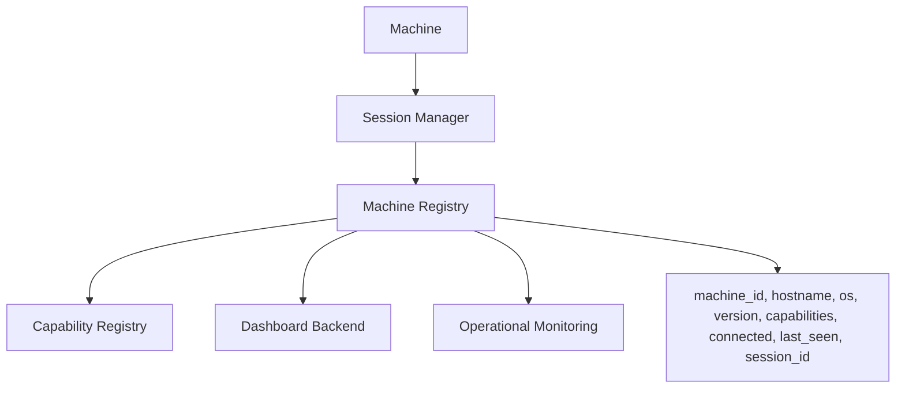
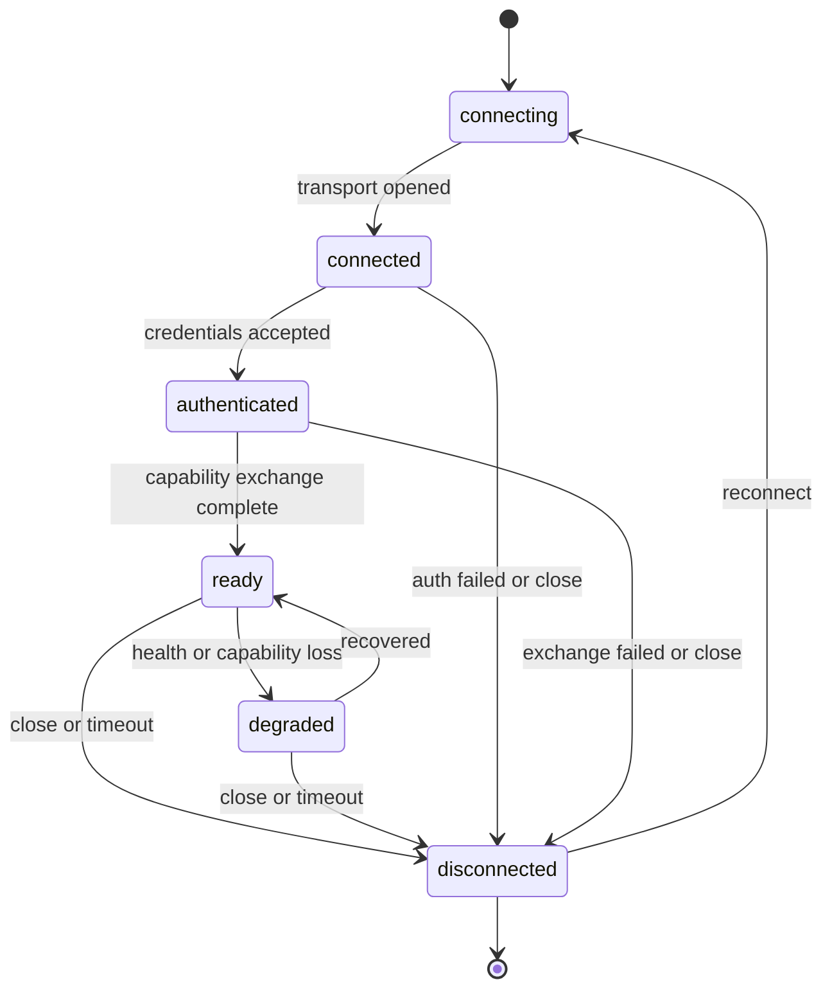
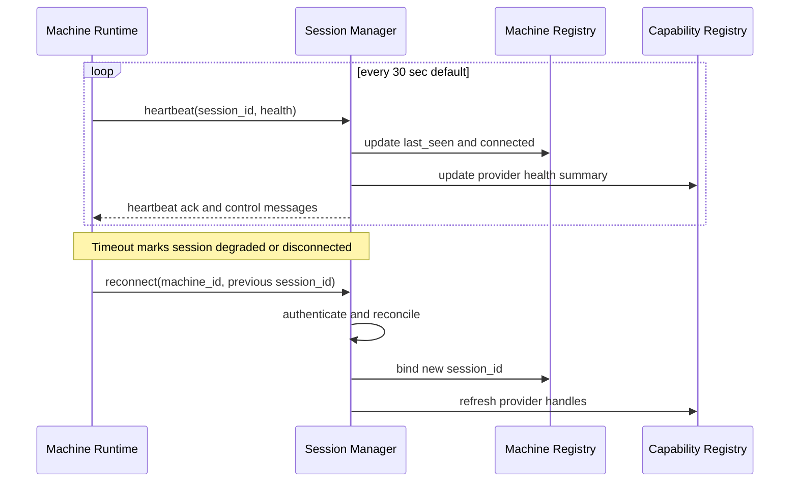
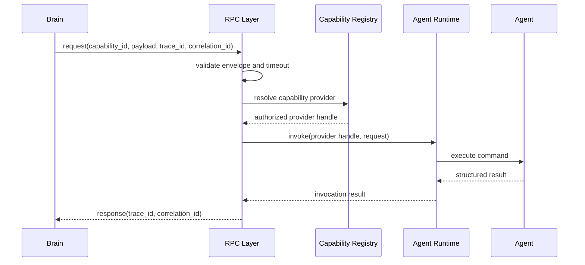
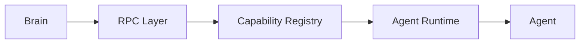
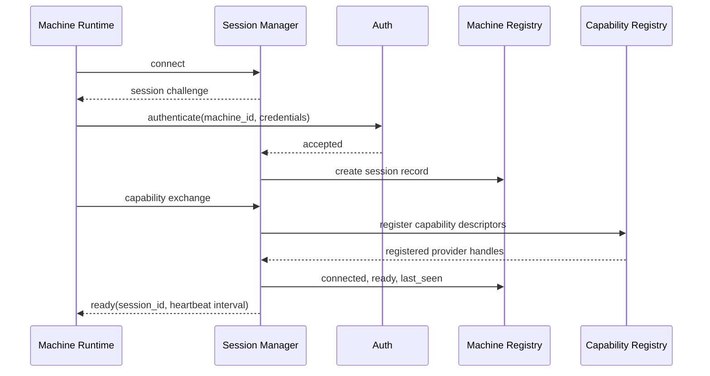
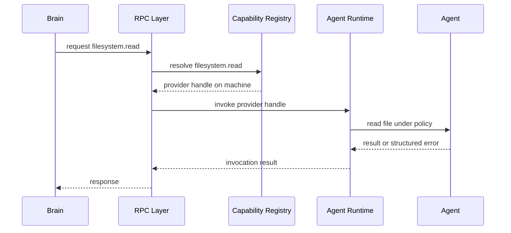
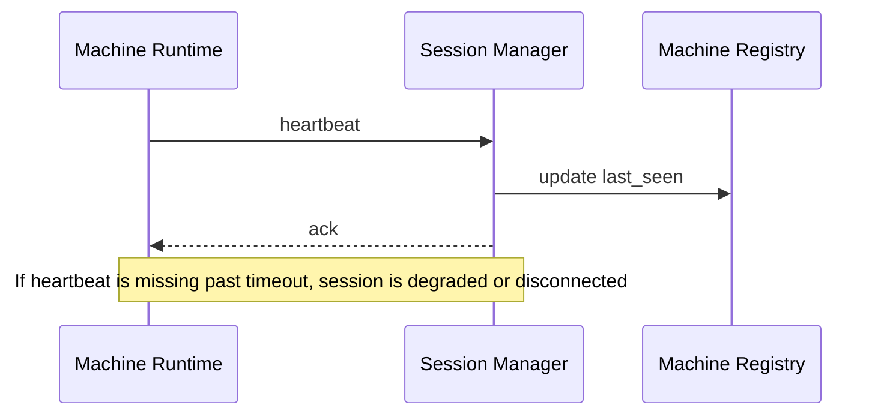
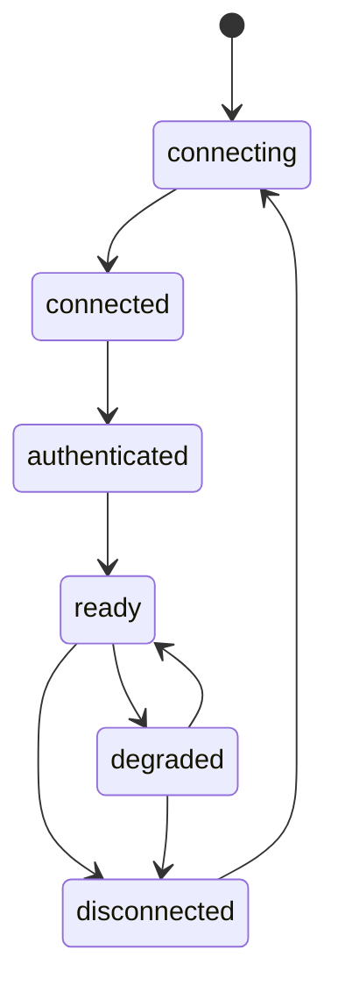
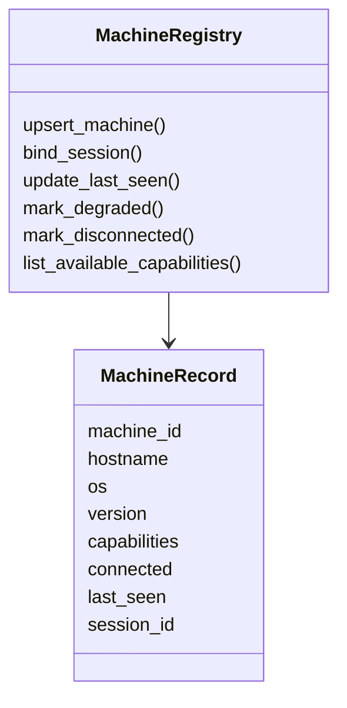

# Purpose

Define the Distributed Runtime for AEGIS: a multi-machine execution layer where AEGIS Server keeps Brain, policy, orchestration, memory, and routing authority, while connected machines provide authenticated capabilities through sessions, heartbeat, RPC, Capability Registry, and Agent Runtime.

Brain never calls an Agent directly.

Brain calls RPC. RPC calls Capability Registry. Capability Registry calls Agent Runtime. Agent Runtime calls the selected Agent.

# Motivation

AEGIS needs to run capabilities across local clients, remote machines, server-side workers, plugin hosts, model nodes, browser nodes, and specialized operating system integrations without coupling Brain to any specific execution process.

The Distributed Runtime provides a stable architecture for:

- Discovering machines and their capabilities.
- Tracking session state and machine health.
- Routing commands by capability, locality, policy, latency, and availability.
- Preserving the existing Brain, Capability Registry, and Agent Runtime boundaries.
- Recovering from network loss, machine restarts, runtime crashes, and degraded providers.
- Supporting future multi-client and remote worker topologies without breaking current APIs.

The core architectural rule is that reasoning and execution remain separate. Brain chooses intent and strategy. RPC carries structured requests. Capability Registry resolves providers. Agent Runtime supervises Agents. Agents execute commands and return structured results.

# Machine Registry

Machine Registry is the authoritative runtime view of connected and recently seen machines. It does not execute commands and does not decide task strategy. It stores machine identity, session ownership, capability availability, and liveness metadata for routing and diagnostics.

Machine record fields:

- `machine_id`: Stable machine identity across sessions and reconnects.
- `hostname`: Human-readable host name reported by the machine.
- `os`: Operating system family and relevant distribution.
- `version`: AEGIS runtime or client version running on the machine.
- `capabilities`: Current capability descriptors advertised by the machine.
- `connected`: Boolean connection state derived from session and heartbeat status.
- `last_seen`: Last trusted timestamp for heartbeat, reconnect, or session activity.
- `session_id`: Current active session, if connected.

Machine Registry responsibilities:

- Create or update records during capability exchange.
- Bind active `session_id` values to stable `machine_id` values.
- Mark machines disconnected when heartbeat timeout expires.
- Preserve recently seen machines for reconnect and diagnostics.
- Expose machine state to Capability Registry, Session Manager, Dashboard backend, and operational monitoring.
- Avoid importing Brain, Agent internals, or provider-specific runtime code.

Machine Registry must treat machine-reported state as advisory until authenticated, validated, and reconciled with Session Manager.



# Session Manager

Session Manager owns the lifecycle of connections between AEGIS Server and distributed machines. A session represents an authenticated transport relationship, not a machine identity. A single machine may create many sessions over time, but only one active session should own live capability handles unless an explicit multi-session policy allows otherwise.

Session lifecycle states:

- `connecting`
- `connected`
- `authenticated`
- `ready`
- `degraded`
- `disconnected`

Lifecycle rules:

- `connecting`: Transport handshake is in progress.
- `connected`: Transport is open, but identity and authorization are not complete.
- `authenticated`: Machine identity and session credentials are accepted.
- `ready`: Capability exchange is complete and the machine may receive authorized RPC calls.
- `degraded`: Session is alive but unhealthy, delayed, partially available, or missing required capabilities.
- `disconnected`: Transport is closed, heartbeat timed out, or session was revoked.

Session Manager responsibilities:

- Accept WebSocket or equivalent long-lived connections.
- Create `session_id` values.
- Authenticate machine identity before readiness.
- Coordinate capability exchange.
- Configure heartbeat interval and timeout policy.
- Update Machine Registry on lifecycle changes.
- Retire or degrade provider handles when a session becomes unhealthy.



# Heartbeat

Heartbeat provides liveness, latency, health, and session freshness for distributed machines.

The default heartbeat interval is 30 seconds. Server policy may override this per machine type, capability class, transport, or operational mode.

Heartbeat fields should include:

- `session_id`
- `machine_id`
- timestamp
- sequence number
- runtime health
- capability health summary
- queue depth or load summary
- last processed RPC marker
- optional diagnostic metadata

Heartbeat rules:

- A ready session sends heartbeat every 30 seconds by default.
- Session Manager records each valid heartbeat as `last_seen`.
- Missing heartbeat beyond timeout moves the session to `degraded` or `disconnected` according to policy.
- Timeout must retire or suspend capability handles exposed through the lost session.
- Reconnect must include `machine_id`, previous `session_id` when available, runtime version, and capability digest.
- Reconnect may restore continuity only after authentication and capability reconciliation.



# Capability Exchange

Capability Exchange is the process by which a machine advertises executable capability providers to the server after authentication and before the session becomes `ready`.

Capability Exchange includes:

- Stable `machine_id`
- `hostname`
- `os`
- AEGIS runtime `version`
- Capability descriptors
- Agent Runtime status
- Runtime health summary
- Permission and policy metadata

Capability descriptors must include:

- capability id
- version
- input schema
- output schema
- side effects
- required permissions
- timeout policy
- retry policy
- sensitivity classification
- health requirements
- owning Agent or provider handle

Capability Exchange rules:

- Registration makes capabilities discoverable; it does not authorize invocation.
- Capability Registry validates descriptors before exposing provider handles.
- Session readiness requires successful capability reconciliation.
- Capability changes after readiness must be sent as incremental updates.
- Degraded capabilities may remain registered with explicit health and routing metadata.

# RPC Layer

RPC is the only command invocation boundary used by Brain for distributed execution. Brain does not call Agent Runtime, Agent processes, client transports, or machine-specific APIs directly.

RPC message types:

- `request`
- `response`
- `timeout`

Required RPC metadata:

- `trace_id`: End-to-end trace across Brain, RPC, registry, runtime, Agent, and events.
- `correlation_id`: Request/response pairing identifier for one RPC operation.
- `session_id`: Target or source session when applicable.
- `machine_id`: Target or source machine when applicable.
- `capability_id`: Requested capability.
- timeout deadline
- caller identity or service principal
- authorization context
- payload schema version

RPC request rules:

- Every request must be validated against the selected capability input schema.
- Every request must include timeout policy.
- Every request must include `trace_id` and `correlation_id`.
- RPC must call Capability Registry to resolve the provider handle.
- RPC must not bypass Capability Registry or invoke Agent Runtime by private reference.

RPC response rules:

- Every response must include `trace_id` and `correlation_id`.
- Responses must distinguish success, structured failure, timeout, cancellation, and provider unavailable.
- Agent output must be normalized before returning to Brain.
- Sensitive payloads must retain sensitivity metadata.



# Command Routing

Command Routing selects where and how an RPC request should execute. Routing happens through Capability Registry and runtime policy, not through direct Brain-to-Agent references.

Routing inputs:

- capability id and version
- authorization context
- machine availability
- session lifecycle state
- provider health
- capability health
- locality requirements
- latency and timeout budget
- sensitivity and data residency policy
- side effect policy
- retry and fallback policy

Routing rules:

- Brain expresses intent as a capability request, not a concrete Agent call.
- RPC resolves the request through Capability Registry.
- Capability Registry selects an eligible provider handle.
- Agent Runtime executes the request against the selected Agent.
- If no provider is eligible, RPC returns structured `provider_unavailable`.
- If the selected session degrades before invocation, routing may retry with another provider when policy allows.

Canonical command path:



# Authentication

Authentication establishes trusted machine identity and authorized session ownership before capability registration or RPC invocation.

Authentication requirements:

- Every machine has a stable `machine_id`.
- Every connection receives a server-issued `session_id`.
- Capability Exchange is accepted only after authentication.
- RPC invocation requires an authenticated session and per-request authorization.
- Session credentials must be revocable.
- Machine identity must be bound to hostname, OS, version, and policy metadata.
- Secrets must not appear in capability descriptors, heartbeat payloads, context events, or diagnostic snapshots.

Authentication should start with local development tokens and evolve toward signed device identity, certificate-based trust, provider attestation, and policy-managed enrollment.

# Failure Recovery

Distributed Runtime failures must be contained at the smallest responsible boundary.

Failure recovery rules:

- Transport loss moves the session to `degraded`, then `disconnected` after timeout.
- Heartbeat timeout retires or suspends provider handles for the affected session.
- Machine reconnect creates a new session or reconciles with the previous session after authentication.
- Capability Registry must remove stale handles when a machine disconnects.
- In-flight RPC calls fail with structured timeout, cancellation, or provider unavailable responses.
- Agent Runtime may restart failed Agents according to local policy.
- Brain may choose a new strategy after receiving structured failure, but it does not own runtime recovery.
- Repeated failures may trigger exponential backoff, circuit breaker, degraded mode, or manual intervention.

Recovery policy should preserve traceability. Failed and retried requests must keep `trace_id` continuity while assigning new `correlation_id` values for each attempt.

# Examples

Connection:



RPC Flow:



Heartbeat:



Session lifecycle:



Machine Registry:



Example machine record:

```json
{
  "machine_id": "machine_win_01",
  "hostname": "workstation-01",
  "os": "windows",
  "version": "0.47.0",
  "capabilities": ["filesystem.read", "clipboard.write", "browser.navigate"],
  "connected": true,
  "last_seen": "2026-07-09T00:00:00Z",
  "session_id": "session_abc123"
}
```

Example RPC envelope:

```json
{
  "type": "request",
  "trace_id": "trace_001",
  "correlation_id": "rpc_001",
  "capability_id": "browser.navigate",
  "timeout_ms": 10000,
  "payload": {
    "url": "https://example.com"
  }
}
```

# Future Development

Future versions should support signed machine identity, provider attestation, multi-session policy, cross-machine failover, offline queues, replayable RPC logs, distributed tracing, capability simulation, policy-aware routing by cost and trust, remote model workers, remote browser pools, dashboard topology views, hot runtime upgrades, and federated Machine Registries for larger deployments.

The Distributed Runtime should also define compatibility guarantees for machine records, session lifecycle transitions, capability descriptor versions, RPC envelope schemas, and recovery behavior across mixed AEGIS versions.
