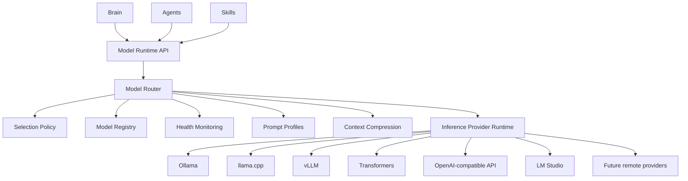
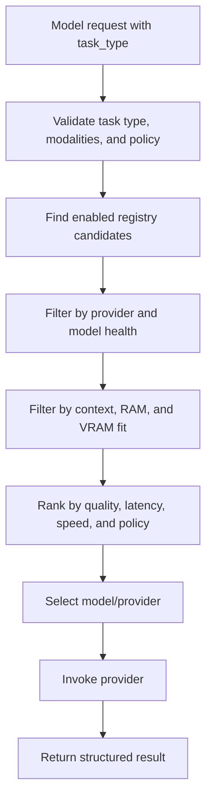
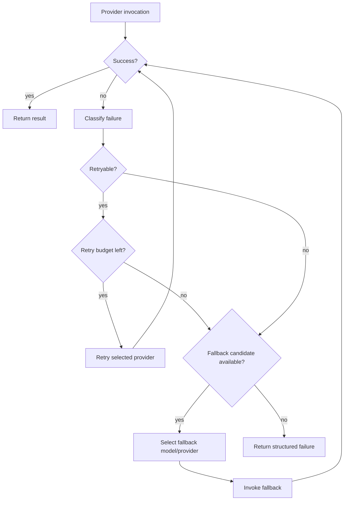
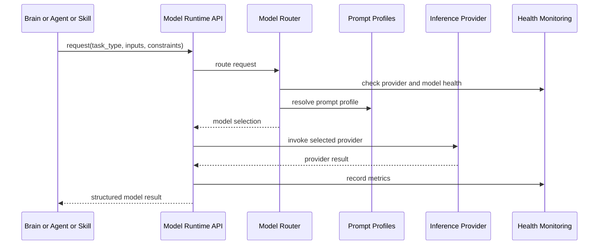
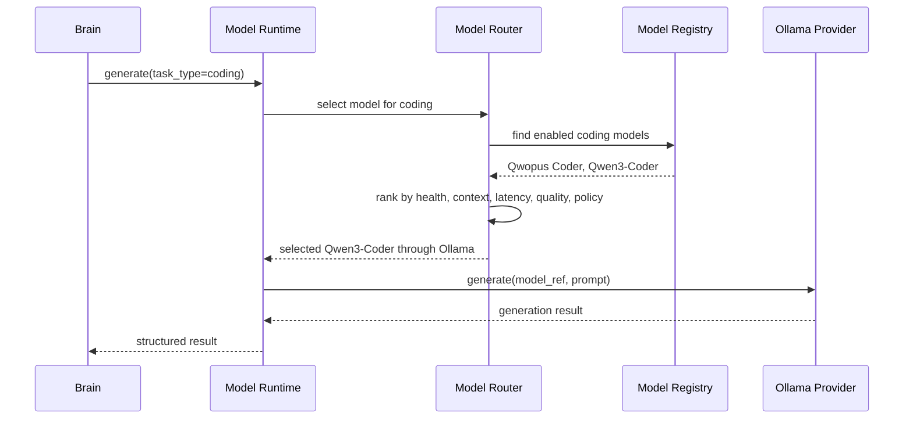
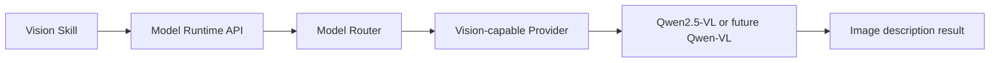

# Purpose

Define Model Runtime as the AEGIS layer that hides concrete model names, providers, serving engines, and deployment details from Brain, Agents, and Skills.

Brain, Agents, and Skills request model work by task type. Model Runtime resolves the request to an eligible model and provider, invokes inference, applies fallback policy, and returns structured results.

Brain must not know model names.

# Motivation

AEGIS needs a stable model boundary because local and remote models will change frequently. Coding models, general assistants, routers, embeddings, rerankers, speech models, and vision models may move between Ollama, llama.cpp, vLLM, Transformers, LM Studio, OpenAI-compatible APIs, and future remote providers.

Without Model Runtime, Brain and execution code would accumulate hardcoded model names, provider-specific options, context-window assumptions, and fallback logic. That would make model replacement risky and would couple reasoning policy to infrastructure.

Model Runtime keeps those concerns separate:

- Brain decides intent and task strategy.
- Agents and Skills request task types.
- Model Router selects the model and provider.
- Inference Provider executes inference.
- Durable model selection policies live in configuration, not hardcoded call sites.

# Responsibilities

Model Runtime is responsible for:

- Maintaining Model Registry records for available models.
- Tracking provider health, model availability, latency, load, and resource fit.
- Resolving task types to model/provider selections through Model Router.
- Applying prompt profiles without exposing model-specific prompts to callers.
- Managing context compression when requests exceed selected model limits.
- Providing embeddings, reranking, speech, vision, routing, and generation through one runtime boundary.
- Enforcing selection policy, fallback policy, security policy, and provider permissions.
- Returning structured inference results, errors, trace metadata, and usage metadata.

Model Runtime is not responsible for:

- Deciding user goals.
- Replacing Brain's intent or planning authority.
- Executing tools or side effects outside inference.
- Mutating Memory, Knowledge Engine, Workspace, or Agent state directly.
- Requiring Brain, Agents, or Skills to name concrete models.

Core rules:

- Brain decides intent.
- Model Runtime must not decide user goals.
- Model Router selects model and provider.
- Inference Provider executes inference.
- Models are replaceable without changing Brain.
- Agent and Skill code must request task type, not model name.
- Durable model selection policies must be stored in config, not hardcoded.



# Model Registry

Model Registry is the authoritative catalog of models known to AEGIS. It stores model capabilities, provider bindings, resource requirements, quality metadata, licensing, availability, and policy labels.

Registry records describe what a model can do. They do not make task decisions and do not invoke inference.

Model fields:

- `id`: Stable AEGIS model identifier.
- `name`: Human-readable model name.
- `provider`: Provider family or provider instance.
- `model_ref`: Provider-specific reference, such as a model tag, path, endpoint name, or repository id.
- `task_types`: Supported task types.
- `context_window`: Maximum supported context window.
- `input_modalities`: Accepted inputs such as text, audio, image, or embeddings.
- `output_modalities`: Produced outputs such as text, audio, labels, scores, or embeddings.
- `quantization`: Quantization format or precision when relevant.
- `ram_required_gb`: Estimated minimum RAM requirement.
- `vram_required_gb`: Estimated minimum VRAM requirement.
- `quality_tier`: Policy-facing quality tier.
- `speed_tier`: Policy-facing speed tier.
- `license`: License or usage restriction metadata.
- `enabled`: Whether the model is eligible for routing.
- `metadata`: Extensible provider, deployment, benchmark, and policy metadata.

Initial candidate models to represent in the registry:

- `openai/whisper-large-v3` for `speech.asr`.
- `Jackrong/Qwopus3.6-35B-A3B-Coder-MTP-GGUF` for `coding`.
- `SupraLabs/Supra-Router-51M` for `router` and intent routing.
- `Qwen3-Coder` for `coding`.
- `Qwen3` or the current local model for `general`.
- `Qwen2.5-VL` or future Qwen-VL models for `vision`.
- `Qwen3-Embedding` for `embeddings`.
- `Qwen3-Reranker` for `reranking`.
- `CosyVoice`, `Qwen-TTS`, or `Fish Speech` for `speech.tts`.

# Inference Providers

Inference Providers adapt concrete serving backends to the Model Runtime provider API. Providers execute inference but do not choose user goals or long-term task strategy.

Supported provider families:

- Ollama
- llama.cpp
- vLLM
- Transformers
- OpenAI-compatible API
- LM Studio
- Future remote providers

Provider responsibilities:

- Load, expose, or connect to models.
- Report health and model availability.
- Execute supported inference operations.
- Normalize provider-specific outputs into Model Runtime result schemas.
- Report latency, failures, usage, and resource metadata.
- Fail closed when credentials, permissions, model availability, or health checks fail.

Provider API:

- `generate(request) -> GenerationResult`
- `embed(request) -> EmbeddingResult`
- `rerank(request) -> RerankResult`
- `transcribe(request) -> TranscriptionResult`
- `synthesize(request) -> SpeechSynthesisResult`
- `describe_image(request) -> ImageDescriptionResult`
- `health() -> ProviderHealth`
- `list_models() -> ProviderModelList`

# Model Router

Model Router selects the best eligible model and provider for a model request. It is policy-driven and must not depend on hardcoded model names in Brain, Agent, or Skill code.

Routing inputs:

- task type
- provider availability
- model availability
- provider health
- observed latency
- context size
- RAM and VRAM availability
- quality tier
- speed tier
- input and output modality requirements
- license and security policy
- caller policy
- fallback policy

Routing output:

- selected model id
- selected provider id
- prompt profile
- context compression plan, if needed
- timeout and retry policy
- fallback candidates
- trace metadata



# Task Types

Task types are the stable caller-facing contract. They describe the kind of model work requested, not the model that should perform it.

Required task types:

- `general`: General assistant generation and reasoning support.
- `coding`: Code understanding, patch planning, implementation assistance, review, and validation support.
- `research`: Evidence synthesis, source summarization, and research report support.
- `planning`: Step planning, decomposition, sequencing, and operational reasoning support.
- `speech.asr`: Speech-to-text transcription.
- `speech.tts`: Text-to-speech synthesis.
- `vision`: Image, screenshot, and visual context understanding.
- `embeddings`: Dense vector generation for retrieval and memory.
- `reranking`: Query-document or candidate reranking.
- `router`: Lightweight classification, intent routing, or model/task routing support.

Task type rules:

- Brain may request `task_type` values through Model Runtime.
- Agents and Skills may request `task_type` values through Model Runtime.
- Callers must not request provider-specific model names.
- Task type expansion must preserve backward compatibility.
- Deprecated task types must remain aliased until callers migrate.

# Prompt Profiles

Prompt Profiles define reusable prompting behavior for task families. They let Model Runtime apply consistent prompt structure without leaking model-specific templates into Brain, Agents, or Skills.

Required prompt profiles:

- `general`
- `coding`
- `research`
- `concise`
- `longform`
- `tool_use`
- `no_reasoning`
- `companion`
- `game_companion`

Prompt Profile responsibilities:

- Define system and developer prompt fragments appropriate for task type and policy.
- Define response shape expectations.
- Define reasoning visibility and verbosity policy.
- Define tool-use framing where applicable.
- Define safety and privacy reminders.
- Adapt to provider and model quirks through configuration.

Prompt Profiles must not decide user goals. Brain decides the goal and supplies the request. Prompt Profiles shape how the selected model should perform the requested model task.

# Context Compression

Context Compression prepares large inputs for models with limited context windows. It is selected by Model Router when the input does not fit the selected model or when policy prefers a smaller model with compression over a larger model.

Compression strategies may include:

- truncation with explicit loss reporting
- hierarchical summarization
- retrieval-based context selection
- code-aware chunk selection
- research evidence condensation
- conversation state distillation
- memory-backed recall and summary references

Compression rules:

- Compression must preserve trace metadata and input provenance where available.
- Lossy compression must be reflected in result metadata.
- Security labels must survive compression.
- Coding and research compression should preserve citations, file references, line references, and evidence boundaries.
- Compression must not silently invent context.

# Embeddings and Reranking

Embeddings and reranking are first-class Model Runtime tasks because retrieval quality affects Memory, Knowledge Engine, Research Engine, Coding Engine, and routing decisions.

Embedding responsibilities:

- Generate vectors for text, code, documents, and memory records.
- Expose embedding model dimensions and normalization behavior.
- Track model version for index compatibility.
- Support migration between embedding models without corrupting existing indexes.

Reranking responsibilities:

- Score query-candidate relevance.
- Support document, code, source, memory, and search-result reranking.
- Return stable score metadata and model version.
- Preserve provenance for ranked candidates.

Embedding and reranking models must be replaceable through registry and policy updates. Indexes must store enough model metadata to detect incompatible embedding changes.

# Speech and Vision Models

Speech and vision models use the same Model Runtime boundary as text models.

Speech ASR:

- Task type: `speech.asr`.
- Initial candidate: `openai/whisper-large-v3`.
- Inputs: audio streams or audio files.
- Outputs: transcripts, timestamps, language detection, confidence metadata.

Speech TTS:

- Task type: `speech.tts`.
- Initial candidates: `CosyVoice`, `Qwen-TTS`, `Fish Speech`.
- Inputs: text plus voice, style, speed, and language policy.
- Outputs: audio plus synthesis metadata.

Vision:

- Task type: `vision`.
- Initial candidates: `Qwen2.5-VL` or future Qwen-VL models.
- Inputs: images, screenshots, screen regions, or multimodal text/image prompts.
- Outputs: descriptions, OCR-like extracted text where supported, visual grounding metadata, and confidence metadata.

Speech and vision requests may originate from Brain, Agents, Skills, or client capabilities, but model selection still goes through Model Router.

# Health Monitoring

Model Runtime health monitoring tracks providers, models, resource pressure, and inference quality signals.

Health states:

- `healthy`
- `degraded`
- `unhealthy`
- `unknown`

Health inputs:

- provider liveness and readiness
- model availability
- model load status
- request latency
- timeout rate
- error rate
- queue depth
- RAM and VRAM pressure
- context overflow frequency
- fallback frequency
- credential or endpoint validity

Health monitoring rules:

- Unhealthy providers must not receive normal inference requests.
- Degraded providers may receive requests only when policy allows.
- Model health changes must update routing eligibility.
- Health reports must be visible to Dashboard backend and operational monitoring.
- Health checks must not expose provider secrets.

# Selection Policy

Selection Policy defines how Model Router chooses among eligible models. It must be stored in durable configuration and may vary by task type, deployment mode, privacy mode, caller, and resource constraints.

Policy dimensions:

- required task type
- allowed providers
- preferred providers
- minimum quality tier
- preferred speed tier
- maximum latency
- maximum cost, for remote providers
- minimum context window
- local-only or remote-allowed mode
- required input and output modalities
- license restrictions
- privacy and data residency requirements
- resource limits
- fallback order

Selection Policy rules:

- Policy is configuration, not caller code.
- Brain may request a task type and constraints, but it must not hardcode model names.
- Agents and Skills must request task type and modality needs.
- Provider-specific overrides must remain behind Model Runtime.
- Policy changes should not require Brain, Agent, or Skill changes.

# Fallback Policy

Fallback Policy defines what happens when the preferred model or provider is unavailable, degraded, too slow, too small for context, or fails during inference.

Fallback triggers:

- provider unavailable
- model unavailable
- failed health check
- timeout
- overload or queue saturation
- insufficient RAM or VRAM
- insufficient context window
- unsupported modality
- policy rejection
- structured provider error

Fallback actions:

- retry the same provider when safe
- select another provider for the same model
- select another model for the same task type
- compress context and retry
- downgrade quality tier when policy allows
- return structured `model_unavailable`
- request Brain to choose a different strategy only after runtime options are exhausted



# Public API

Model Runtime public API:

- `ModelRuntime.generate(request) -> GenerationResult`
- `ModelRuntime.embed(request) -> EmbeddingResult`
- `ModelRuntime.rerank(request) -> RerankResult`
- `ModelRuntime.transcribe(request) -> TranscriptionResult`
- `ModelRuntime.synthesize(request) -> SpeechSynthesisResult`
- `ModelRuntime.describe_image(request) -> ImageDescriptionResult`
- `ModelRuntime.route(route_request) -> ModelSelection`
- `ModelRuntime.list_models(filter) -> ModelList`
- `ModelRuntime.health() -> ModelRuntimeHealth`

API rules:

- Requests must include `task_type`.
- Requests may include constraints such as latency budget, context requirement, modality, privacy mode, and quality preference.
- Requests must not require concrete model names.
- Results must include selected model id, provider id, trace id, latency, fallback metadata, and usage metadata where available.
- Provider errors must be normalized into structured runtime errors.

Provider invocation flow:



# Data Structures

`ModelRecord`:

- `id`
- `name`
- `provider`
- `model_ref`
- `task_types`
- `context_window`
- `input_modalities`
- `output_modalities`
- `quantization`
- `ram_required_gb`
- `vram_required_gb`
- `quality_tier`
- `speed_tier`
- `license`
- `enabled`
- `metadata`

`ModelRequest`:

- `request_id`
- `trace_id`
- `caller`
- `task_type`
- `prompt_profile`
- `input`
- `constraints`
- `policy_context`
- `timeout_ms`
- `sensitivity`

`ModelSelection`:

- `selection_id`
- `task_type`
- `model_id`
- `provider_id`
- `model_ref`
- `prompt_profile`
- `context_plan`
- `fallback_candidates`
- `policy_reasons`
- `trace_id`

`ProviderHealth`:

- `provider_id`
- `status`
- `available_models`
- `latency_ms`
- `error_rate`
- `timeout_rate`
- `queue_depth`
- `ram_available_gb`
- `vram_available_gb`
- `degraded_reasons`
- `last_checked`

`InferenceResult`:

- `request_id`
- `trace_id`
- `task_type`
- `model_id`
- `provider_id`
- `output`
- `usage`
- `latency_ms`
- `fallback_used`
- `compression_used`
- `warnings`
- `error`

# Security

Security requirements:

- Model Runtime must enforce provider permissions and privacy policy before invocation.
- Secret values must not appear in prompts, registry metadata, health payloads, traces, or model outputs unless explicitly authorized by policy.
- Remote providers require explicit policy allowance for the task, data sensitivity, and caller.
- Local-only mode must prevent remote model invocation.
- Registry metadata from providers must be validated before use.
- Model licenses and usage restrictions must be represented in policy.
- Prompt Profiles must include safety and data handling rules appropriate to task type.
- Health checks must not leak API keys, local paths containing secrets, or sensitive prompt content.
- Logs must redact prompts and outputs according to sensitivity classification.

Model Runtime must preserve the architectural boundary that Brain owns reasoning policy and user intent, while Model Runtime owns model execution policy.

# Examples

General request:

```json
{
  "task_type": "general",
  "prompt_profile": "general",
  "input": {
    "messages": [
      {"role": "user", "content": "Summarize the current plan."}
    ]
  },
  "constraints": {
    "quality_tier": "balanced",
    "privacy": "local_preferred"
  }
}
```

Coding request:

```json
{
  "task_type": "coding",
  "prompt_profile": "coding",
  "input": {
    "workspace_ref": "workspace_current",
    "request": "Explain the likely impact of this patch."
  },
  "constraints": {
    "minimum_context_window": 32768,
    "quality_tier": "high"
  }
}
```

Embedding request:

```json
{
  "task_type": "embeddings",
  "input": {
    "texts": ["Model Runtime hides concrete models from Brain."]
  },
  "constraints": {
    "index_compatibility": "knowledge_v2"
  }
}
```

Model selection example:



Vision request example:



# Future Development

Future versions should support:

- distributed model workers registered through Distributed Runtime
- signed model manifests and provider attestations
- automatic benchmark collection by task type
- cost-aware remote provider routing
- per-user and per-workspace model policy
- hot model replacement without restarting Brain
- model compatibility tests for prompt profiles
- embedding index migration tooling
- multimodal streaming across speech, vision, and text
- speculative routing through small router models
- dashboard topology views for model availability, health, latency, and fallback activity
- policy simulation for model selection before deployment

