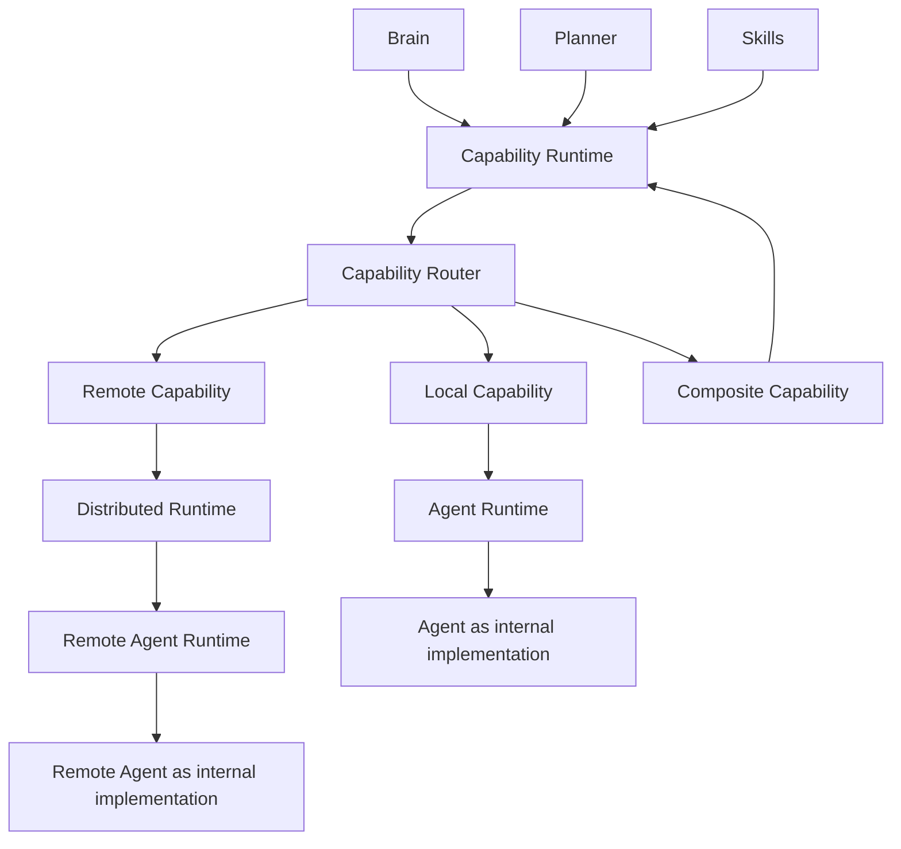
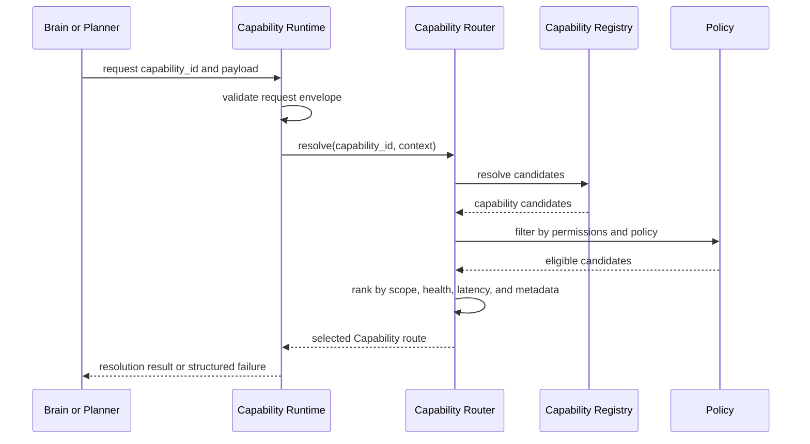
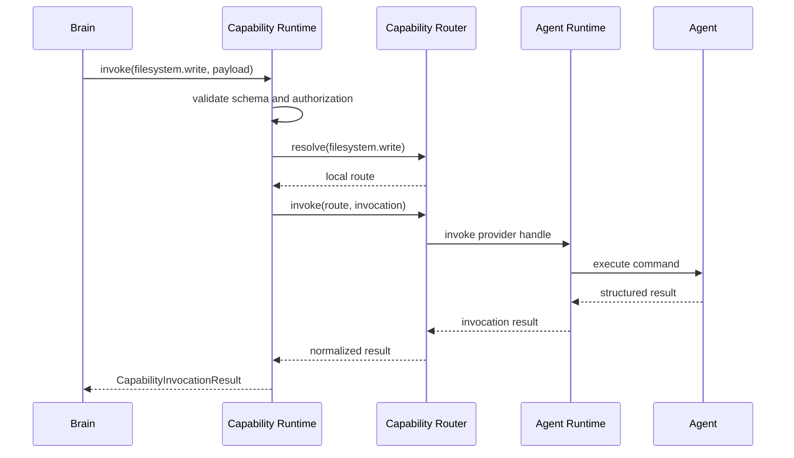
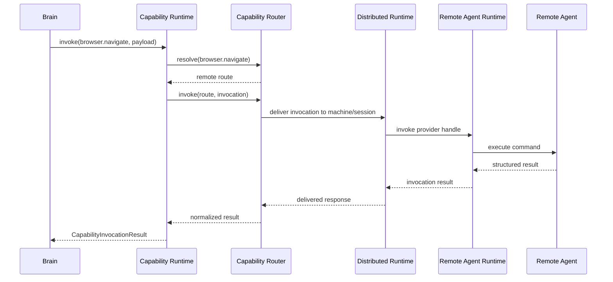
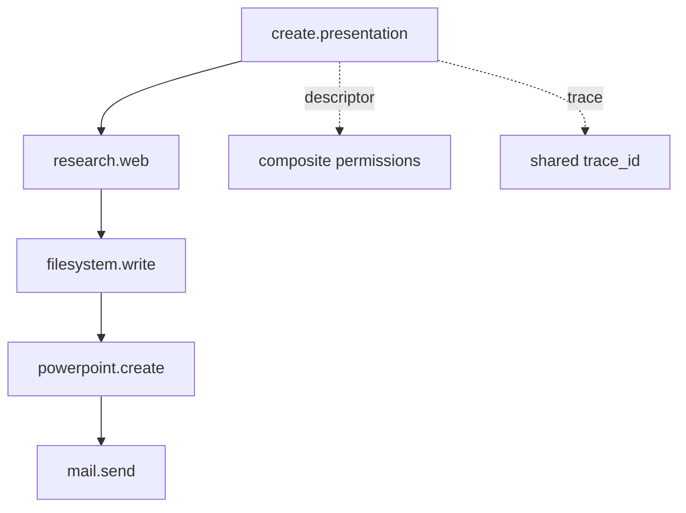
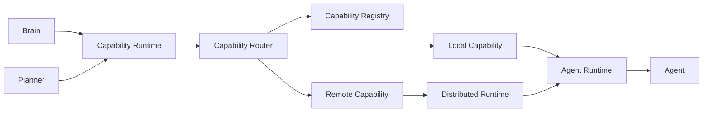
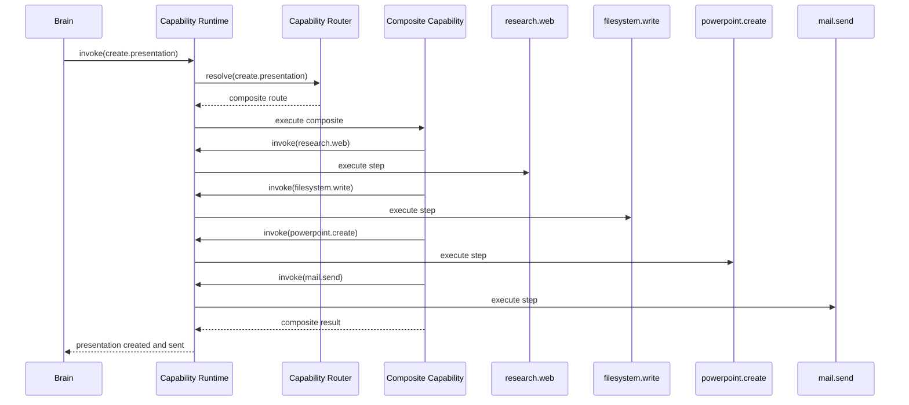
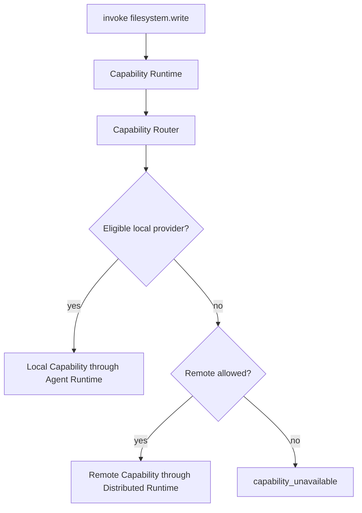

# Purpose

Define Capability Runtime as the single public execution boundary for actions in AEGIS. Capability Runtime receives capability requests from Brain, Planner, Skills, and other authorized callers, resolves them through Capability Router, and invokes the selected local, remote, or composite Capability.

Capability is the only public point for executing actions.

Agent is an internal implementation detail of a Capability.

Brain never knows Agent.

Planner never knows Agent.

# Motivation

AEGIS needs a stable action boundary that keeps reasoning, planning, routing, transport, and execution separate. Earlier runtime layers define how Agents execute commands, how distributed machines deliver requests, and how models are selected. Capability Runtime sits above those layers and gives callers one consistent way to perform work.

Without this boundary, Brain and Planner would accumulate direct knowledge of Agents, machines, transports, provider handles, plugin hosts, and operating system integrations. That would create circular dependencies and make local-to-remote execution changes visible to reasoning code.

Capability Runtime keeps the contract simple:

- Brain decides intent.
- Planner decomposes work.
- Capability Runtime receives action requests.
- Capability Router selects the best Capability provider.
- Distributed Runtime delivers remote invocations when needed.
- Agent Runtime executes through an internal Agent when the provider is Agent-backed.

Core rules:

- Capability is the only public point of execution for actions.
- Brain never invokes Agent.
- Planner never invokes Agent.
- Brain and Planner invoke only Capability Runtime.
- Capability Runtime invokes Capability Router.
- Capability Router chooses a local, remote, or composite Capability.
- Distributed Runtime is responsible for remote delivery.
- Agent Runtime is responsible for execution.
- Agent is an internal implementation of Capability, not a public caller-facing API.

# Capability Model

A Capability is a versioned, permissioned, schema-described action that AEGIS can invoke. It represents what can be done, not how it is implemented.

Examples:

- `research.web`
- `filesystem.write`
- `browser.navigate`
- `powerpoint.create`
- `mail.send`
- `create.presentation`

A Capability may be implemented by:

- a local Agent through Agent Runtime
- a remote Agent through Distributed Runtime and Agent Runtime
- a plugin provider
- a service provider
- a model-backed operation
- a composite workflow made of multiple Capabilities

Capability rules:

- Capabilities expose stable public contracts.
- Capability callers must not depend on provider implementation details.
- Capability descriptors must be versioned.
- Capability inputs and outputs must be schema validated.
- Capability permissions are declared by the Capability and enforced before invocation.
- Capability health and availability affect routing eligibility.
- Capability implementation may change without changing Brain or Planner.



# Capability Registry

Capability Registry is the authoritative catalog of registered Capability descriptors and provider handles. It stores what Capabilities exist, where they may run, what permissions they require, what schemas they accept, and what metadata is available for routing.

Capability Registry does not decide user goals and does not execute commands.

Registry API:

- `register(descriptor, provider_handle) -> CapabilityRegistration`
- `unregister(capability_id, provider_handle) -> CapabilityUnregistration`
- `resolve(capability_id, context) -> CapabilityCandidateList`
- `list(filter) -> CapabilityDescriptorList`
- `find_by_tag(tag, filter) -> CapabilityDescriptorList`

Registry responsibilities:

- Validate Capability descriptors before registration.
- Store Capability identity, version, schemas, permissions, tags, metadata, and provider handles.
- Track provider availability, locality, machine scope, health, and compatibility.
- Support lookup by id, version, tag, owner Agent, and machine scope.
- Retire provider handles when Agents, sessions, plugins, or services become unavailable.
- Preserve backward-compatible descriptor lookup for existing callers.

Registration rules:

- Registration makes a Capability discoverable.
- Registration does not authorize invocation.
- Invalid schemas, missing permissions, duplicate incompatible ids, or unavailable providers must fail closed.
- Multiple providers may register the same Capability id when version and policy allow routing among them.

# Capability Router

Capability Router selects the provider or composition plan for a Capability request. It is called by Capability Runtime, not directly by Brain or Planner.

Router API:

- `resolve(capability_id, context) -> CapabilityRoute`
- `resolve_best(request, candidates, context) -> CapabilityRoute`
- `invoke(route, invocation) -> CapabilityInvocationResult`

Routing inputs:

- capability id and optional version
- caller identity
- authorization context
- requested machine scope
- required locality
- input schema compatibility
- permission grants
- provider health
- runtime availability
- latency and timeout budget
- side effect policy
- data sensitivity
- tags and metadata
- fallback policy

Routing rules:

- Router must resolve through Capability Registry.
- Router must not call Agent directly.
- Router may select local providers, remote providers, or composite plans.
- Router may prefer locality, health, latency, trust, or policy depending on request context.
- Router must return structured `capability_unavailable` when no eligible provider exists.
- Router must preserve trace metadata across local, remote, and composite invocations.

# Capability Descriptor

A Capability Descriptor is the public contract for a Capability.

Required fields:

- `id`
- `name`
- `version`
- `owner_agent`
- `machine_scope`
- `permissions`
- `input_schema`
- `output_schema`
- `tags`
- `metadata`

Field definitions:

- `id`: Stable public Capability identifier, such as `filesystem.write`.
- `name`: Human-readable Capability name.
- `version`: Capability contract version.
- `owner_agent`: Internal Agent or provider owner that implements the Capability. This is registry and runtime metadata, not a Brain-facing dependency.
- `machine_scope`: Where the Capability may execute, such as `local`, `remote`, `any`, or a specific machine policy scope.
- `permissions`: Permissions published by the Capability and required for invocation.
- `input_schema`: Schema used to validate invocation payloads.
- `output_schema`: Schema used to validate successful outputs.
- `tags`: Searchable labels for discovery, grouping, routing, and UI.
- `metadata`: Extensible non-authoritative metadata such as provider type, side effects, timeout policy, sensitivity, health requirements, cost, and compatibility notes.

Descriptor rules:

- Descriptors must not contain secrets.
- Descriptors must be validated before registration.
- Descriptor changes that break input or output compatibility require a version change.
- `owner_agent` must not be exposed as an invocation target to Brain or Planner.
- Permissions must be explicit and machine-readable.

# Capability Resolution

Capability Resolution turns a requested Capability id into an executable route. Resolution is policy-aware and may return a local route, remote route, composite route, fallback route, or structured failure.

Resolution steps:

1. Capability Runtime receives a request.
2. Capability Runtime validates the request envelope.
3. Capability Runtime asks Capability Router to resolve the Capability id.
4. Capability Router queries Capability Registry.
5. Capability Router filters candidates by schema, permission, machine scope, health, sensitivity, and policy.
6. Capability Router selects the best eligible route.
7. Capability Runtime returns or invokes the route according to the public API call.



# Capability Invocation

Capability Invocation executes a resolved Capability route and returns a structured result.

Invocation rules:

- Brain invokes Capability Runtime, never Agent.
- Planner invokes Capability Runtime, never Agent.
- Capability Runtime validates input schema before routing or invocation.
- Capability Runtime enforces permission checks before execution.
- Capability Runtime calls Capability Router.
- Router invokes the selected local, remote, or composite Capability through runtime boundaries.
- Local Agent-backed execution goes through Agent Runtime.
- Remote execution goes through Distributed Runtime for delivery and Agent Runtime for execution.
- Outputs are validated against `output_schema`.
- Errors are normalized before returning to the caller.



# Local Capabilities

Local Capabilities execute on the same machine or runtime boundary as the caller's authorized local environment. They are usually backed by local Agents, plugin providers, or service adapters.

Local Capability examples:

- `filesystem.read`
- `filesystem.write`
- `clipboard.read`
- `browser.screenshot`
- `window.focus`

Local execution rules:

- Locality does not bypass authorization.
- Local Capabilities still publish permissions and schemas.
- Local Agent-backed Capabilities execute through Agent Runtime.
- Capability Runtime must not expose local Agent handles to Brain or Planner.
- Local provider health must update Capability Registry availability.

# Remote Capabilities

Remote Capabilities execute on another machine, worker, plugin host, browser node, or service node. Capability Runtime and Capability Router choose the route; Distributed Runtime delivers the request.

Remote execution rules:

- Capability Router selects a remote route only when policy allows remote execution.
- Distributed Runtime handles session lookup, transport, heartbeat state, request delivery, timeout, and remote response.
- Agent Runtime on the target machine executes Agent-backed Capabilities.
- Sensitive payloads must respect data residency and privacy policy.
- Remote failures must return structured errors such as `remote_unavailable`, `session_disconnected`, `timeout`, or `capability_unavailable`.



# Composite Capabilities

A Composite Capability is a Capability implemented as an ordered or conditional plan of other Capabilities. It has its own descriptor, permissions, input schema, output schema, tags, and metadata.

Composite Capability rules:

- A Composite Capability is still invoked through Capability Runtime.
- Each internal step is another Capability invocation.
- Composite execution must not call Agents directly.
- Composite permissions must include or derive the required permissions of its internal steps.
- Composite execution must preserve trace and causality metadata across steps.
- Partial failure must return structured step-level error information.
- Compensation or rollback policy should be explicit when side effects are involved.

Example:

```text
create.presentation
  -> research.web
  -> filesystem.write
  -> powerpoint.create
  -> mail.send
```



# Permissions

Capabilities publish the permissions required to invoke them. Brain does not hold direct execution rights and does not bypass Capability Runtime permission checks.

Permission rules:

- Capability publishes its required permissions in the descriptor.
- Brain has no direct permissions to Agents.
- Planner has no direct permissions to Agents.
- Caller authorization is evaluated at Capability Runtime.
- Capability Runtime passes authorization context to Capability Router.
- Router filters providers by permission, policy, and scope.
- Agent Runtime may enforce provider-local policy as a second line of defense.
- Permission failure must return structured `permission_denied`.

Permission examples:

- `filesystem.read`
- `filesystem.write`
- `network.web.search`
- `browser.control`
- `presentation.create`
- `mail.send`
- `clipboard.read`
- `clipboard.write`

Composite permissions:

- A Composite Capability must publish the permissions it requires as a public contract.
- Composite permission evaluation must account for every internal Capability step.
- A caller authorized for one internal step is not automatically authorized for the composite.
- A caller authorized for the composite is authorized only for the declared composite behavior, not arbitrary internal Capability calls.

# Discovery

Discovery allows AEGIS components and user interfaces to inspect available Capabilities without invoking them.

Discovery surfaces:

- list all Capabilities
- filter by tag
- filter by machine scope
- filter by permission
- filter by provider health
- filter by owner Agent or provider metadata
- inspect input and output schemas
- inspect composite step metadata when policy allows

Discovery rules:

- Discovery must not expose secrets.
- Discovery does not grant invocation rights.
- Discovery may hide Capabilities that the caller is not allowed to know exist.
- Discovery should distinguish unavailable, degraded, and healthy Capabilities.
- Discovery should support UI grouping through tags and metadata.

# Public API

Capability Runtime public API:

- `CapabilityRuntime.resolve(capability_id, context) -> CapabilityResolution`
- `CapabilityRuntime.invoke(request) -> CapabilityInvocationResult`
- `CapabilityRuntime.list(filter) -> CapabilityDescriptorList`
- `CapabilityRuntime.find_by_tag(tag, filter) -> CapabilityDescriptorList`
- `CapabilityRuntime.register(descriptor, provider_handle) -> CapabilityRegistration`
- `CapabilityRuntime.unregister(capability_id, provider_handle) -> CapabilityUnregistration`
- `CapabilityRuntime.health() -> CapabilityRuntimeHealth`

API rules:

- Public callers use Capability Runtime, not Capability Router, Capability Registry, Distributed Runtime, Agent Runtime, or Agent.
- `invoke()` must validate schema, permission, policy, timeout, trace metadata, and route availability.
- `resolve()` returns route metadata appropriate for the caller and must not expose private Agent handles.
- `register()` and `unregister()` are runtime/provider operations, not Brain actions.
- Results must include structured success, structured error, trace metadata, selected route metadata, and warnings where applicable.

Canonical public action path:



# Data Structures

`CapabilityDescriptor`:

- `id`
- `name`
- `version`
- `owner_agent`
- `machine_scope`
- `permissions`
- `input_schema`
- `output_schema`
- `tags`
- `metadata`

`CapabilityInvocationRequest`:

- `request_id`
- `trace_id`
- `caller`
- `capability_id`
- `capability_version`
- `payload`
- `authorization_context`
- `policy_context`
- `timeout_ms`
- `machine_scope`
- `sensitivity`
- `metadata`

`CapabilityResolution`:

- `resolution_id`
- `trace_id`
- `capability_id`
- `selected_route`
- `candidate_count`
- `policy_reasons`
- `fallback_routes`
- `warnings`
- `error`

`CapabilityRoute`:

- `route_id`
- `capability_id`
- `provider_type`
- `provider_handle`
- `machine_id`
- `session_id`
- `owner_agent`
- `runtime`
- `health`
- `latency_ms`
- `permissions`
- `metadata`

`CapabilityInvocationResult`:

- `request_id`
- `trace_id`
- `capability_id`
- `status`
- `output`
- `error`
- `selected_route`
- `started_at`
- `completed_at`
- `latency_ms`
- `events`
- `warnings`
- `metadata`

`CapabilityRegistryRecord`:

- `descriptor`
- `provider_handles`
- `health`
- `registered_at`
- `updated_at`
- `availability`
- `metadata`

# Examples

Capability descriptor:

```json
{
  "id": "powerpoint.create",
  "name": "Create PowerPoint Presentation",
  "version": "1.0.0",
  "owner_agent": "presentation_agent",
  "machine_scope": "any",
  "permissions": ["presentation.create", "filesystem.write"],
  "input_schema": {
    "type": "object",
    "required": ["title", "slides"],
    "properties": {
      "title": { "type": "string" },
      "slides": { "type": "array" }
    }
  },
  "output_schema": {
    "type": "object",
    "required": ["file_ref"],
    "properties": {
      "file_ref": { "type": "string" }
    }
  },
  "tags": ["presentation", "office", "document"],
  "metadata": {
    "side_effects": ["filesystem.write"],
    "timeout_ms": 60000,
    "sensitivity": "workspace"
  }
}
```

Capability invocation request:

```json
{
  "request_id": "cap_req_001",
  "trace_id": "trace_001",
  "caller": "brain",
  "capability_id": "research.web",
  "payload": {
    "query": "current project references for distributed capability routing"
  },
  "authorization_context": {
    "principal": "user_current"
  },
  "timeout_ms": 30000,
  "machine_scope": "any",
  "sensitivity": "normal"
}
```

Composite invocation:



Local versus remote routing:



# Future Development

Future versions should define:

- signed Capability descriptors
- provider attestation for Agent-backed Capabilities
- richer composite orchestration with rollback and compensation
- policy simulation before invoking side-effecting Capabilities
- capability-level sandboxing
- capability marketplace metadata
- cross-machine fallback and replication policy
- capability cost and quota accounting
- replayable invocation logs
- typed SDKs for Capability providers
- dashboard topology views for Capability coverage and health
- migration rules for descriptor version compatibility
- streaming Capability invocation results
- human approval gates for sensitive permissions
