# Purpose

Define Task Planning Runtime as the AEGIS layer that turns a user or system Task into an executable Plan, validates step results, and coordinates graph execution through Capability Runtime.

Task Planning Runtime separates decomposition from execution:

- Task describes the goal.
- Planner creates a Plan and Execution Graph.
- Plan Executor executes the graph.
- Validator checks each step result.
- Capability Runtime is the only public action execution boundary.

Planner never calls Agent.

Planner never calls Capability.

Only Executor calls Capability Runtime.

# Motivation

AEGIS needs a stable planning boundary because complex work often requires multiple ordered, parallel, conditional, or retryable actions. Without a dedicated Task Planning Runtime, Brain, Planner, Skills, or ad hoc workflow code would accumulate direct knowledge of Capabilities, Agents, provider handles, remote machines, retry loops, validation rules, and recovery behavior.

Task Planning Runtime keeps responsibilities separate:

- Brain decides user intent and may create or request a Task.
- Planner decomposes a Task into a Plan.
- Planner creates an Execution Graph but performs no side effects.
- Plan Executor executes graph nodes through Capability Runtime.
- Validator checks outputs against declared expectations.
- Retry and Recovery policies contain runtime failure handling.

This preserves the architectural rules defined by Distributed Runtime, Model Runtime, and Capability Runtime. Brain and Planner never know Agent. Planner never invokes Capability. Execution happens only through Executor and Capability Runtime.

# Task Model

A Task is the durable description of work to be planned. It captures the requested goal, priority, constraints, and metadata, but it does not contain execution results or provider-specific handles.

Task fields:

- `id`: Stable task identifier.
- `goal`: Natural language or structured goal statement.
- `priority`: Scheduling priority relative to other Tasks.
- `constraints`: Time, policy, resource, locality, permission, quality, and safety constraints.
- `metadata`: Extensible caller, trace, provenance, workspace, sensitivity, and UI metadata.

Task rules:

- A Task must be understandable without referencing Planner internals.
- A Task may be created by Brain, UI, Scheduler, external API, or another authorized runtime component.
- A Task must not contain Agent references.
- A Task should express desired outcome, not implementation details.
- Task constraints must be preserved into Plan and PlanStep metadata where relevant.

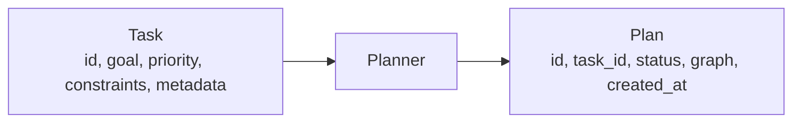

# Plan Model

A Plan is the Planner-produced representation of how a Task should be executed. It contains an Execution Graph made of PlanSteps and dependency edges.

Plan fields:

- `id`: Stable plan identifier.
- `task_id`: Identifier of the Task this Plan satisfies.
- `status`: Current lifecycle state.
- `graph`: Execution Graph containing PlanSteps and dependencies.
- `created_at`: Creation timestamp.

Plan status values:

- `created`
- `validated`
- `scheduled`
- `running`
- `partially_failed`
- `failed`
- `completed`
- `cancelled`

Plan rules:

- A Plan is declarative until executed by Plan Executor.
- A Plan may include parallel branches when dependencies allow.
- A Plan must not contain direct Agent handles.
- A PlanStep references a public `capability_id`, not an Agent.
- Plan compatibility must be preserved when new optional fields are added.

PlanStep fields:

- `id`: Stable step identifier within the Plan.
- `capability_id`: Public Capability identifier to invoke during execution.
- `inputs`: Step inputs or input bindings.
- `outputs`: Expected output names, schemas, or bindings.
- `dependencies`: Step ids that must complete successfully before this step can run.
- `retry_policy`: Step retry behavior.
- `timeout`: Step timeout deadline or duration.
- `metadata`: Extensible policy, validation, trace, sensitivity, and scheduling metadata.

# Execution Graph

The Execution Graph is a directed acyclic graph of PlanSteps. Edges represent dependencies. A step may run only after all required dependencies have completed and passed validation.

Execution Graph requirements:

- The graph is a DAG.
- Cycles are invalid.
- Independent branches may execute in parallel.
- Dependencies must be tracked at step level.
- Step state must be durable enough to support retry and recovery.
- Graph execution must preserve trace and causality metadata.

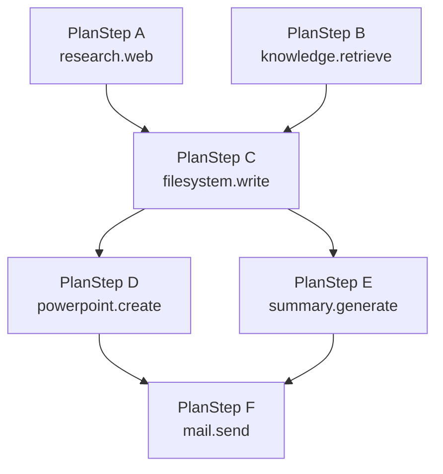

Parallel execution:

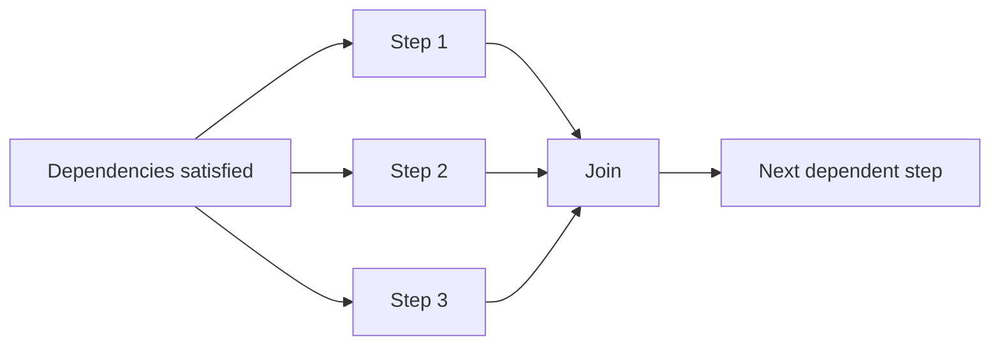

# Planner

Planner creates Plans from Tasks. It is responsible for decomposition, step selection, dependency construction, and static graph validation before execution.

Planner responsibilities:

- Read Task goal, constraints, priority, and metadata.
- Select public Capability ids needed to satisfy the Task.
- Create PlanSteps with inputs, expected outputs, dependencies, retry policy, timeout, and metadata.
- Build a DAG for ordered and parallel work.
- Validate that the graph is structurally executable.
- Return a Plan to the caller or Task Planning Runtime.

Planner rules:

- Planner never calls Agent.
- Planner never calls Capability.
- Planner never calls Capability Runtime `invoke()`.
- Planner may inspect public Capability descriptors through discovery APIs when authorized.
- Planner must not depend on provider handles, machine sessions, Agent Runtime, or Distributed Runtime.
- Planner must produce plans that can be executed later by Plan Executor.

Planner output should be deterministic enough for review, simulation, and replay when given the same Task, capability catalog, and policy context.

# Plan Executor

Plan Executor is the only Task Planning Runtime component that executes PlanSteps. It walks the Execution Graph, schedules ready nodes, invokes Capability Runtime, records step state, and sends step outputs to Validator.

Executor responsibilities:

- Load a validated Plan.
- Track step states and dependency readiness.
- Schedule independent ready steps for parallel execution.
- Invoke Capability Runtime for each executable PlanStep.
- Enforce step timeout and cancellation policy.
- Pass each result to Validator.
- Persist outputs, errors, attempts, timing, and trace metadata.
- Apply Retry Policy and Recovery Policy.
- Mark Plan status as completed, failed, partially failed, or cancelled.

Executor rules:

- Only Executor calls Capability Runtime.
- Executor invokes Capability Runtime, never Agent.
- Executor must not bypass Capability Runtime with direct provider handles.
- Executor must preserve `trace_id` across the Plan and assign step-level correlation metadata.
- Executor must validate dependencies before starting a step.
- Executor must not rerun completed valid steps during failure recovery unless policy explicitly marks them invalidated.

Capability invocation:

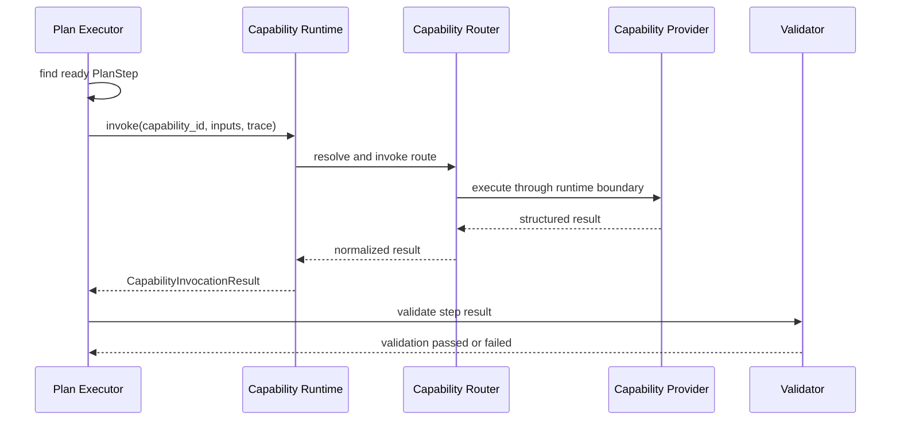

# Validator

Validator checks the result of every PlanStep before dependent steps may run. Validation is step-scoped and must be based on declared outputs, schemas, policy, and metadata.

Validator responsibilities:

- Validate CapabilityInvocationResult status.
- Validate output schema and required fields.
- Validate semantic expectations declared by the PlanStep where possible.
- Validate sensitivity, provenance, and policy metadata.
- Report structured validation errors.
- Mark outputs usable only after validation passes.

Validator rules:

- Validator must run after each step attempt.
- Failed validation is a step failure.
- Dependent steps must not consume invalid outputs.
- Validator must not call Agent.
- Validator must not invoke Capability Runtime for corrective action.
- Recovery and retry decisions belong to Executor policy, not Validator.

# Retry Policy

Retry Policy defines how a failed PlanStep may be attempted again before recovery or final failure.

Default retry strategy:

- Exponential backoff.
- Bounded attempt count.
- Jitter to avoid synchronized retries.
- Retry only failures classified as retryable.
- Preserve Plan and step trace continuity.
- Use a new correlation id for each Capability invocation attempt.

Retryable failures may include:

- timeout
- transient provider unavailable
- remote session degradation
- rate limit
- temporary validation dependency failure
- recoverable runtime error

Non-retryable failures may include:

- permission denied
- invalid input schema
- invalid Plan graph
- unsupported Capability
- policy rejection
- deterministic validation failure

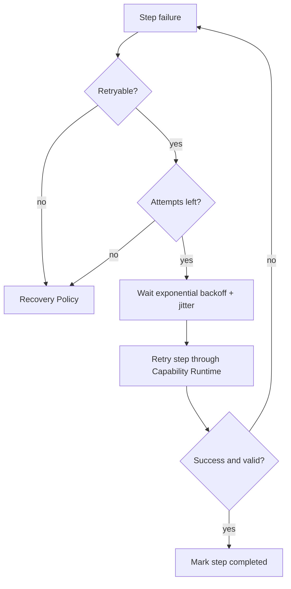

# Recovery Policy

Recovery Policy defines how Plan Executor resumes execution after one or more step failures. Recovery must be scoped to the smallest affected part of the graph.

Recovery rules:

- Restart only failed nodes.
- Do not rerun completed valid nodes unless they are explicitly invalidated.
- Do not rerun unaffected parallel branches.
- Keep dependency outputs from completed valid steps.
- Block dependent nodes until failed dependencies recover.
- Preserve original Plan id and trace metadata.
- Record each recovery attempt.

Failure Recovery:

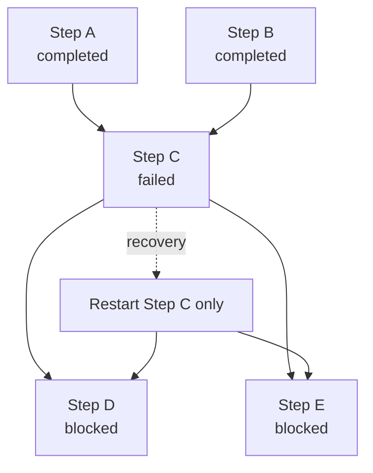

Recovery outcomes:

- `recovered`: Failed nodes completed and execution continued.
- `partially_recovered`: Some failed nodes recovered, but non-critical branches remain failed.
- `unrecoverable`: Required failed nodes cannot complete under policy.
- `cancelled`: Recovery stopped by caller, policy, or shutdown.

# Scheduling

Scheduling determines when Plans and ready PlanSteps run. Scheduling must account for Task priority, dependency readiness, resource constraints, timeouts, concurrency limits, and Capability availability.

Scheduling responsibilities:

- Prioritize Plans by Task priority and policy.
- Respect PlanStep dependencies.
- Run independent ready steps in parallel when capacity allows.
- Enforce per-Plan and per-Capability concurrency limits.
- Account for timeout budgets.
- Support cancellation and graceful shutdown.
- Avoid starvation of lower-priority Plans.
- Surface queued, running, blocked, and delayed states.

Scheduling rules:

- A step is ready only when all dependencies are completed and validated.
- A blocked step must name the dependency or policy reason blocking it.
- Scheduler must not invoke Capability directly; execution still happens through Executor.
- Scheduling metadata must be visible for diagnostics and Dashboard views.

# Capability Integration

Task Planning Runtime integrates with Capability Runtime through public APIs only.

Integration rules:

- PlanStep uses `capability_id` as its public execution reference.
- Planner may inspect Capability descriptors for planning, but must not invoke them.
- Executor invokes Capability Runtime for each PlanStep.
- Capability Runtime validates schema, permission, policy, routing, and provider availability.
- Capability Runtime may route to local, remote, or composite Capabilities.
- Agent remains an internal implementation detail of Capability.
- Distributed Runtime remains responsible for remote delivery.

Canonical execution boundary:

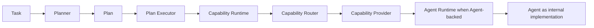

# Public API

Task Planning Runtime public API:

- `TaskPlanningRuntime.create_task(request) -> Task`
- `TaskPlanningRuntime.create_plan(task_id, context) -> Plan`
- `TaskPlanningRuntime.validate_plan(plan_id) -> PlanValidationResult`
- `TaskPlanningRuntime.execute_plan(plan_id, context) -> PlanExecution`
- `TaskPlanningRuntime.cancel_plan(plan_id, reason) -> PlanCancellation`
- `TaskPlanningRuntime.get_task(task_id) -> Task`
- `TaskPlanningRuntime.get_plan(plan_id) -> Plan`
- `TaskPlanningRuntime.get_plan_status(plan_id) -> PlanStatus`
- `TaskPlanningRuntime.list_tasks(filter) -> TaskList`
- `TaskPlanningRuntime.list_plans(filter) -> PlanList`
- `TaskPlanningRuntime.health() -> TaskPlanningRuntimeHealth`

API rules:

- Public APIs must not expose Agent handles.
- `create_plan()` must not execute Capabilities.
- `validate_plan()` must validate graph structure and static policy.
- `execute_plan()` starts Executor-managed graph execution.
- Results must include structured status, trace metadata, errors, warnings, and step summaries.
- APIs must preserve backward-compatible Task, Plan, and PlanStep fields.

# Data Structures

`Task`:

- `id`
- `goal`
- `priority`
- `constraints`
- `metadata`

`Plan`:

- `id`
- `task_id`
- `status`
- `graph`
- `created_at`

`PlanStep`:

- `id`
- `capability_id`
- `inputs`
- `outputs`
- `dependencies`
- `retry_policy`
- `timeout`
- `metadata`

`ExecutionGraph`:

- `nodes`
- `edges`
- `root_nodes`
- `terminal_nodes`
- `parallel_groups`
- `dependency_index`
- `metadata`

`StepExecutionState`:

- `step_id`
- `status`
- `attempt`
- `started_at`
- `completed_at`
- `input_snapshot`
- `output`
- `error`
- `validation`
- `next_retry_at`
- `metadata`

`PlanExecution`:

- `execution_id`
- `plan_id`
- `task_id`
- `status`
- `started_at`
- `completed_at`
- `step_states`
- `trace_id`
- `warnings`
- `error`
- `metadata`

# Examples

Task:

```json
{
  "id": "task_001",
  "goal": "Create a short research brief and save it to the workspace.",
  "priority": 50,
  "constraints": {
    "max_duration_ms": 120000,
    "sensitivity": "workspace",
    "allowed_capabilities": ["research.web", "filesystem.write"]
  },
  "metadata": {
    "trace_id": "trace_001",
    "caller": "brain"
  }
}
```

Plan:

```json
{
  "id": "plan_001",
  "task_id": "task_001",
  "status": "created",
  "created_at": "2026-07-09T00:00:00Z",
  "graph": {
    "nodes": [
      {
        "id": "step_research",
        "capability_id": "research.web",
        "inputs": {
          "query": "AEGIS distributed runtime planning boundaries"
        },
        "outputs": {
          "brief_notes": "object"
        },
        "dependencies": [],
        "retry_policy": {
          "strategy": "exponential_backoff",
          "max_attempts": 3,
          "base_delay_ms": 1000
        },
        "timeout": {
          "timeout_ms": 30000
        },
        "metadata": {
          "validation": "schema_and_sources"
        }
      },
      {
        "id": "step_write",
        "capability_id": "filesystem.write",
        "inputs": {
          "path": "docs/generated/brief.md",
          "content_from": "step_research.brief_notes"
        },
        "outputs": {
          "file_ref": "string"
        },
        "dependencies": ["step_research"],
        "retry_policy": {
          "strategy": "exponential_backoff",
          "max_attempts": 2,
          "base_delay_ms": 500
        },
        "timeout": {
          "timeout_ms": 10000
        },
        "metadata": {
          "side_effects": ["filesystem.write"]
        }
      }
    ],
    "edges": [
      ["step_research", "step_write"]
    ]
  }
}
```

Execution Graph:

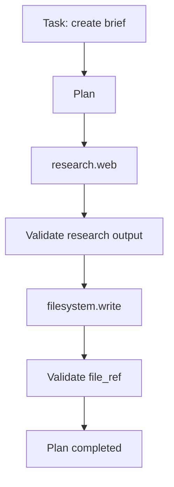

Parallel Execution:

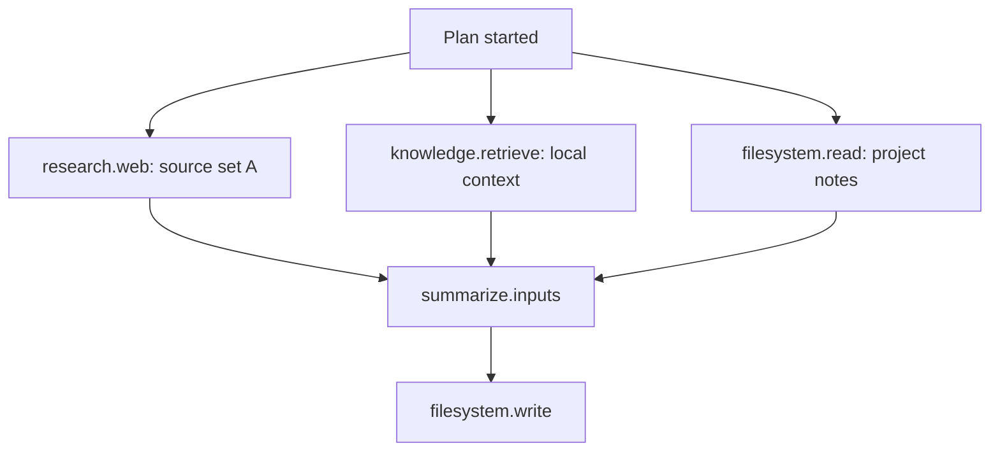

Failure Recovery:

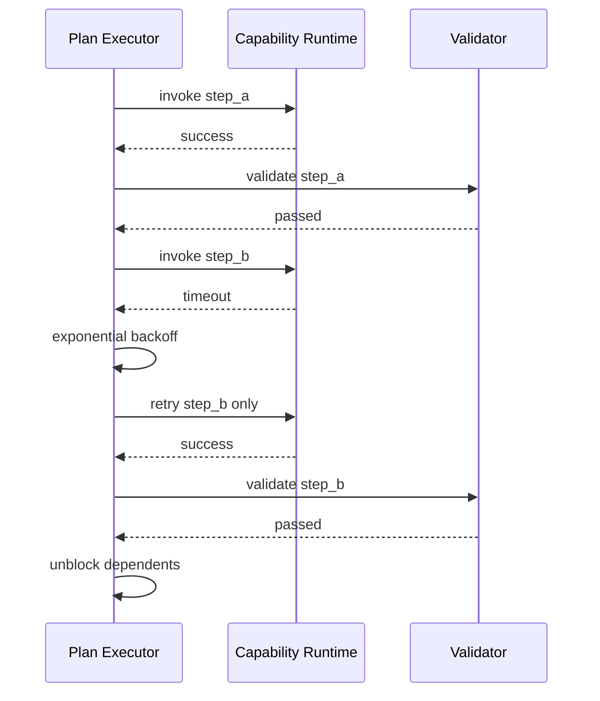

Capability Invocation:

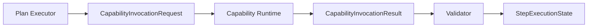

# Future Development

Future versions should define:

- conditional branches and dynamic graph expansion
- human approval gates for sensitive PlanSteps
- compensation and rollback for side-effecting steps
- plan simulation before execution
- plan templates and reusable workflow fragments
- typed SDKs for Task and Plan creation
- streaming Plan execution events
- distributed Plan Executor placement
- cost-aware scheduling
- richer semantic validation
- partial result delivery to UI
- plan versioning and migration rules
- replayable execution logs
- dashboard topology views for Plan graphs and recovery state
- policy simulation for retry, recovery, and scheduling decisions
